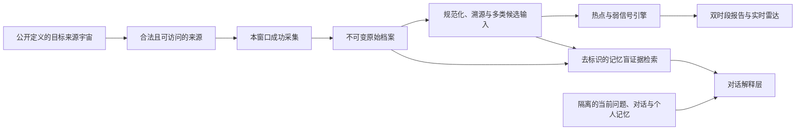

# 个人全球信息知识库：需求基线与实施路线

- 版本：v0.1-m0-baseline
- 日期：2026-08-05
- 状态：M0 有条件冻结的需求基线；M1 实施中

## 1. 产品使命

建立一个不受用户既有兴趣驱动的全球变化雷达，持续保存可追溯的世界原始记录，发现热点、弱信号、讨论迁移和现实行动变化，并让用户基于完整历史与自己的长期记忆同 AI 对话。

系统的首要价值不是预测未来，而是扩大用户接触世界的广度与新颖度，提高其发现“世界可能正在改变”的概率。

系统不承诺没有偏差；它承诺偏差被显式建模、持续测量、可追溯，并且全球雷达不受个人兴趣驱动。

## 2. 已确认需求

### 2.1 核心问题

用户容易长期生活在由既有兴趣、平台推荐算法、语言和地理位置共同形成的信息茧房中。系统需要主动提供认知边界之外的材料，而不是只更高效地总结用户已经关注的内容。

### 2.2 核心使用任务

1. 每日 08:00 查看北京时间前一日 19:00 至当日 08:00 期间进入系统的全球资讯。
2. 每日 19:00 查看北京时间当日 08:00 至 19:00 期间进入系统的全球资讯。
3. 在阅读原始资料前，先获取一份区分事实、推断与不确定性的 AI 报告。
4. 进入原始资料、关键段落和来源链路，验证 AI 的表述。
5. 在实时窗口分别查看热点、升温、异常、弱信号和认知探索内容。
6. 在对话窗口中联合检索原始档案、AI 分析、信号历史和用户个人记忆。
7. 持续观察某个信号从首次出现到增强、扩散、消退或被证伪的全过程。

### 2.3 优先成功标准

按优先级排序：

1. 覆盖广度：不能长期由少数语言、地区、平台或头部媒体垄断。
2. 认知新颖度：稳定提供用户既有关注范围之外、但有证据基础的信息。
3. 证据可追溯：所有事实陈述和信号判断都能回到原始资料。
4. 变化敏感度：能够识别低基数增长、跨圈层扩散和现实行动变化。
5. 及时性：在约定报告窗口内稳定交付，并处理迟到资料。

预测命中率不是最高目标。早期阶段允许较多误报，但误报必须被记录、解释和复盘。

## 3. 非目标

以下内容不属于系统承诺：

- 穷尽互联网中的全部信息；
- 保证没有任何采集或排序权重；
- 稳定预测真正不可预知的黑天鹅；
- 用单一“重要性总分”替用户决定什么值得看；
- 用用户点击、兴趣或历史观点改变全球基础雷达；
- 把 AI 摘要当成原始资料的替代品；
- 在缺少传播或保存权利时无条件永久保存受限制的全文。

“全球”“无预设权重”和“发现黑天鹅”分别转化为可测量的全球覆盖、公开的系统权重以及弱信号探测能力。

系统只能陈述“在当前可观察来源中，某种讨论或行动发生变化”。除非存在有代表性的总体分母，不得把抓取资料的变化外推为“全世界的人都在更多或更少地讨论”。

## 4. 架构级不变量

### 4.1 全球雷达与个人记忆隔离

- 全球雷达只读取全球语料、来源注册表和公开的系统配置。
- 当前问题、query plan、对话原文和个人记忆都属于个人域，只允许被私有对话编排器读取；全球检索只接收去标识、剥离立场的临时查询。
- 采集器、覆盖控制器、热点排序器、弱信号引擎和基础日报服务没有读取个人记忆的权限。
- 用户对某条内容的兴趣可以进入私人工作区，但不得反馈为全球雷达的隐式排序特征；同样不得经离线训练、评估集构建、策略调参或 champion/challenger 晋升间接改变下一版全球采集、覆盖、detector、model 或 ranking 配置。
- 隔离需要通过独立存储、独立服务凭据、用途级供应商授权、保留/删除生命周期和自动化权限测试实现，不能只依靠提示词。
- 内部服务凭据本身也必须有可执行的生命周期：ServicePrincipalCredentialVersion 绑定 audience/scope/有效期，active→revoked/compromised 只通过 expected-head 状态事件推进；轮换不能只新增 C2 而让 C1 继续有效。每次 RLS、缓存、导出、恢复和 provider egress 前检查当前 credential head，撤销高水位进入独立 recovery checkpoint。
- 所有私有对象、embedding、缓存、任务、备份、供应商作业和 capability 必须复合绑定 PersonalScope、owner principal 与 authz epoch；公共纠错、训练、评估和模型任务只能消费经验证的 PublicOnlyInputSnapshot，不能把私人附件或提议洗成公共输入。
- 每个发送到外部供应商的 payload、thread/file/vector/cache/batch handle 都必须在首个出站字节前产生可枚举的保留与擦除义务；撤权或删除不能只令本地 epoch 失效，还要以唯一终态、期限、供应商 receipt 和远端复核闭合全部副本。删除终态还必须绑定 provider generation fence：先取消并 drain 全部可继续派生副本的 job/retry，再证明 fence 后没有 thread/result/vector/cache 等迟到重物化；任何迟到资源都自动阻断或重新打开原义务。无法提供可验证删除、不保留和 generation-fence 能力的供应商不得接收会产生该义务的数据。

### 4.2 原始层不可被派生层覆盖

- 每次抓取生成独立捕获记录、内容哈希和抓取时间。
- 原始快照采用追加式版本保存；正文清洗、翻译、摘要和结构化结果属于派生对象。
- 每次 AI 分析记录模型、提示模板、参数、代码版本和生成时间。
- 新模型重新分析历史资料时生成新版本，不覆盖旧分析。
- 若法律、许可或来源方要求删除内容，使用删除事件和审计记录处理；“不可变”不等于违反删除义务。
- 合规删除必须覆盖正文、文本分块、向量、缓存、搜索索引、派生引用和备份生命周期，仅保留不含受限内容的审计墓碑。

### 4.3 证据优先

- 报告中的事实必须关联一个或多个原始证据定位。
- AI 推断必须显式标注为推断，并列出前提、支持证据、反证、替代解释和未知项；它接受 premise-support 门禁，不伪造“原文蕴含结论”。
- 来源的因果说法只能证明“来源这样声称”；AI 因果推断还需时序、混杂、机制及干预/准实验依据，只有同期相关时不得写成“A 导致 B”。
- 多篇转载同一消息不能被统计为多个独立证据。
- 对话回答优先召回原始证据，再联合派生分析和个人记忆。
- 外部模型请求必须经过冻结任务 manifest、逐字节 outbound payload manifest 和唯一 egress proxy；同步响应、callback、poll 和结果下载统一生成不可变 ProviderResponseReceipt 并共享 invocation terminal CAS，任何外部 ModelOutputArtifact 都不能绕过 ingress receipt 直接落库。统一 receipt 不能抹平 mode-specific authenticity：sync/poll/download 必须绑定预期 endpoint/request、TLS/transport peer、HTTP status/header/body/encoding/redirect chain 与确定性 decode，callback 另验 provider signature/nonce；分页、分片、多文件和 batch 结果还要冻结完整 member universe、逐 member terminal 与集合相等，不能只接收或落库有利的一部分。
- 网页与模型输出都视为 tainted data；typed validator 只证明字段结构与业务约束，不会自动令字符串安全。任何进入 HTML/Markdown/SVG/URL/ARIA/通知/CSV 或表格导出的字段还必须通过按 sink context 冻结的编码、净化和主动内容门禁，不能以 render hash 自洽替代执行安全。HTTP status/header value 同样是 sink：Content-Disposition/Location/CSP/CORS/cache/cookie 等必须按 header context、代理协议和浏览器语义通过 policy validation；一个危险但自洽的 envelope hash 不构成安全证明。

### 4.4 多通道展示

热点、快速升温、弱信号、衰退信号、跨圈层扩散和认知探索分别产生候选集，不压缩成一个不可解释的总榜。

系统还必须分离两种统计视图：

- 流行度视图：尽量保留来源纳入概率和可观测分母，用于估计已覆盖世界中的讨论规模；
- 探索视图：有意提高低覆盖地区、语言和领域的曝光，用于扩大认知边界。

探索配额不能反过来被解释为全球流行度，流行度规模也不能挤占探索槽位。

探索还必须包含 detector 前的开放世界随机子池：合格 unknown/OOD 材料即使所有 detector 都返回 no-candidate，仍可按冻结随机框以“未解释探索材料”获得用户无关曝光，但不得冒充弱信号。选择配额必须进一步由 AttentionBudgetManifest 和实际 layout/首屏/通知 placement 证明可达，不能把探索项全部埋在折叠区或深分页。

### 4.5 逻辑边界

个人记忆不存在通向采集、证据池、候选、评分、全球报告、全局离线训练/评估或版本晋升的路径。

## 5. 产品表面

### 5.1 双时段报告

上午报告计划在 08:00 发布，晚间报告计划在 19:00 发布，统一以 Asia/Shanghai 调度，以 UTC 保存全部时间。两个报告的目标业务窗口分别为 `[前一日 19:00, 当日 08:00)` 与 `[当日 08:00, 当日 19:00)`。

08:00 准时发布与完整处理到 08:00 不能同时保证：07:59:59 出现的资料没有足够时间完成采集、翻译和聚类。每份报告因此必须显示实际 `data_cutoff`、各来源最后成功采集机会、`processing_watermarks{}` 和用于跨层比较的 `comparison_watermark`。水位表示输入 `information_arrival_at` 的连续完成前沿，不是最后任务完成时间或最大 `system_available_at`；全局热点与扩散只能使用共同比较终点，较新的分层数据只能进入局部快讯。水位之后的资料进入实时流及下一期处理补录。

初次内容以 `item_first_seen_at` 决定逻辑窗口；旧内容凡 RevisionAssessment 判为 `reportable|unknown`，均以 `version_observed_at` 决定新信息窗口，包含可能改变时间线的 metadata update。后续重分类创建新 assessment version，并以 decision available time 进入更正流，不改 RawItemVersion。来源发布时间只用于叙事，不得回填系统时间；discovery delay、processing backfill、内容更正和判断更正不得混成一个“迟到”字段。

日报使用《规范验收测试计划》中唯一的 `provisional_slo_v1`：首版发布宽限 5 分钟、单期 cutoff lag 硬上限 60 分钟、滚动 30 天 cutoff lag P95 不超过 45 分钟、准时率 99%、关键分层水位落后不超过 60 分钟，并同时满足计划采集机会、解析和 provenance 完整度门槛。每个计划时点先有 ReportScheduleSlot；漏发只有 failed slot/attempt，不伪造 ReportEdition。实际 `data_cutoff=min(configured cutoff, required processing frontier, selection completeness frontier)`。单期 hard limits 决定 edition，滚动指标只决定服务声明；不能用聚合 P95 或虚报 cutoff 掩盖陈旧。M0 冻结 shadow provisional 版本，M1 只能通过变更门禁产生 production 版本。

每份报告至少包含：

1. 世界概览；
2. 全球热点；
3. 快速升温与衰退主题；
4. 弱信号候选；
5. 跨地区、跨语言或跨群体扩散；
6. 认知探索样本；
7. 支持证据、反证和不确定性；
8. 原始资料入口；
9. 下一阶段需要观察的验证条件。

世界概览中的每一个事实、来源主张和 AI 推断都必须形成独立 `ReportClaim`，逐句绑定证据范围、冲突、覆盖范围、生成版本和推断类型；事实/来源主张通过蕴含门禁，AI 推断通过前提支持与反证门禁，不能因为下方卡片有链接就认为概览自然可信。每个栏目/卡片先按冻结 claim-slot schema 的 min/max/ordinal 物化 ClaimGenerationUnit/Decision；空栏目也必须用绑定完整性/覆盖/rights 状态的 required claim 解释原因。每个 locale/channel/无障碍表达通过 ClaimExpressionVariant 语义等价门禁，来源标题/引文通过 ClaimCitation 声明与 claim 的 entails/source-asserts/context/contradicts/raw-listing 关系。最终标题、正文、caption、tooltip、alt/ARIA、通知和导出只能来自这些 typed references 或无动态语义变量的受控模板，并由 PresentationRenderPlan 与最终输出双向对账。

用户可以切换到“仅原始标题与证据”模式，避免 AI 摘要本身成为新的唯一叙事框架。有限篇幅产生的展示权重通过固定探索槽、覆盖债务和跨期轮换管理，并以月度暴露覆盖衡量，而不是宣称单日报覆盖全部世界。

### 5.2 实时全球雷达

“实时”指基于可访问来源的滚动更新，不等于互联网全量实时流。界面分别展示绝对讨论量、相对增速、扩散范围、来源独立性和异常程度，并公开数据更新延迟。

实时界面不得把“每张表最新一行”拼成当前世界。每个公共 RadarSurface 由 RadarPipelineManifest 冻结 scope/method epoch、required stages、选择与 claim/render 规则；一次刷新生成完整 GlobalRadarSnapshot、RadarCardPlacement、ReportClaim 和 PresentationRenderPlan，再由 RADAR_PUBLICATION 以 expected-head CAS 原子切换 current head。旧 worker、预览/孤儿快照、部分卡片或跨 snapshot feature/selection 均不可见。同一 epoch 的水位、cutoff、rights epoch 和冻结时间只能前进；不可比较的方法/范围变化显式断序并重新暖机。

实时读取绑定一个带 `head_revision + snapshot_id + presentation_event_id + revocation_epoch + render_plan_hash + query_shape_hash` 的短期 view token。view、continuation、export、restore 与私人 capability token 必须使用用途隔离的 TokenSigningKeyVersion，签名域包含 token type、issuer、audience、kid/algorithm、签发/生效/过期、nonce/jti、scope/owner/action/resource 和完整撤权依赖；密钥轮换、撤销与 compromised 状态只追加且在验签时 fail closed。每种 token type 还必须由冻结策略声明 `single_use|reusable`、允许操作、使用预算和 continuation 单调规则；single-use export/restore/action capability 在产生首字节或副作用前以 `jti` 做数据库唯一、expected-head CAS 核销，并发请求至多一个 winner，reusable view token 不能被错误套用一次性 replay 语义。single-use TokenUse 的消费高水位必须进入业务备份之外的单调 ledger；恢复若不能证明包含最新消费 head，就 fail closed 或原子推进 token-use/signing epoch 使备份前 token 全失效，不能让已核销 `jti` 随数据库回滚重新可用。续页 cursor 还签名绑定同 snapshot/event/query shape，详情/导出成员必须通过复合 membership 检查；仅有合法 token 签名不够。撤权 epoch 变化会使旧 head 整体失去展示资格，先返回 recomputing/unavailable，待最新 epoch 全量重算后原子替换；不能保留旧排序再逐卡红删。分页、详情、导出和缓存失配时整体重取，保证一个响应只来自一个可线性化的快照。

日报和雷达交付默认采用完整物化的有限响应。每个 PresentationRepresentation 从 committed snapshot/render plan、query、audience 和 serializer 确定性生成 expected bytes，PresentationDelivery 的 hash/length 必须与之相等，并绑定全部 RevocationDependencySnapshot，而不是调用方自报任意 payload。交付 attestation 还必须冻结 status 与完整安全响应 envelope，包括 Content-Type/Encoding/Disposition、Cache-Control/Pragma/Expires/Vary、CSP、CORS 和 `X-Content-Type-Options`；body 相同但 header 不同不是同一 representation。envelope 的完整性检查之前还必须按 DeliveryPolicyManifest 对 exact canonical header values、重复/合并语义及 HTTP/2→HTTP/1 代理降级执行 HeaderSinkSafetyValidation，危险但自洽的 header set 不得出首字节。未建模的 Range、公共 CDN、304、stale-if-error、流式导出和长连接默认拒绝；撤权后不能由边缘缓存、resume 或后续 chunk 继续交付旧内容。

### 5.3 对话与长期判断

对话采用两阶段检索。当前问题先在个人域拆成 `private_query_context` 与去标识、剥离立场的临时 `neutral_query`；全球检索不得接收历史聊天、用户 ID、个人记忆、直接标识符、秘密或个性缓存，并分别检索支持、反驳、替代解释和数据不足。完整 query plan 与证据 IDs 留在个人域，全球服务只保留短期无身份执行状态。第二阶段才读取个人记忆，用于解释、对照和指出观点变化。用户可以随时查看未经个人化的基础回答。

对话回答必须区分：

- 原始资料确认的事实；
- 来源自身提出的主张；
- AI 的综合推断；
- 存在争议或证据不足的内容；
- 用户过去记录的判断；
- 当前证据对该判断的支持、削弱或无关状态。

AI 默认只生成尚未生效的 `MemoryCandidate`；用户确认或明确启用自动记忆规则后，个人判断才采用追加式版本记录，至少包含判断正文、创建时间、适用范围、依据、反证条件和后续复核结果。个人域提供逐项查看、更正、导出、保留期和级联删除，公共语料的模型许可不能自动授权个人数据传输。

用户纠错先成为个人域 `CorrectionProposal`。只有依据公共证据、按照对所有用户一致的审核规则被接受后，才能生成只含公共命题和公共证据的全局 correction event；用户身份、立场和私有附件不得进入全球特征或日志。

所有外部内容均视为不可信数据。网页、文档或转录文本中出现的指令不得改变工具调用、评分规则、系统配置或个人记忆访问权限。

## 6. 逻辑数据对象

第一阶段应遵循《统一数据、时间与决策契约》，而不是先追求完整知识图谱：

| 对象 | 作用 | 最低要求 |
|---|---|---|
| Connector/SourceEndpoint/PublisherAccount/OwnerGroup 及其 Version | 采集实现与来源身份快照 | 地区、角色、所有权和描述性 source cadence 不回填过去；执行 cadence 只由 CollectionPlanManifest 拥有 |
| CollectionPlanManifest / CollectionOpportunity / ContentCursorCheckpoint | 采集计划、SLO 与内容完整性 | 计划机会是成功率分母；降采频不能美化健康度；游标推进只追加 checkpoint，断裂不能被 HTTP 成功掩盖 |
| RawArtifact / RawItemVersion / CanonicalItem / CanonicalItemVersion | 原始对象、版本、规范身份和内容快照 | 许可与隐私到 artifact/version；稳定身份不承载可变文本 |
| StorageBlob / ArtifactBlobBindingVersion / PreservationManifestVersion | 物理字节、法律绑定与保存快照 | 物理去重不合并 provenance；撤权、校验、修复、密钥和迁移均用事件 |
| SourceLineage / SourceLineageVersion | 同源传播身份与成员快照 | 原稿、转载、PR 和翻译链；不等同于独立事实支持 |
| EventCluster / EventClusterVersion / CoverageItem | 事件身份、版本与联合候选输入 | CoverageItem 还可为序列、概念变化、主张关系或行动；规范 projection key+UUIDv5+唯一键防止同义复制膨胀分母 |
| EvidenceUnit / EvidenceScope | 独立证据与精确支持范围 | 传播谱系不能替代证据；事实引用必须定位且语义支持 |
| RightsGrantVersion / AuthorizedContentScope / PurposeAuthorization | 授权依据、获准内容范围与一次用途决定 | 区分全文内部处理、200 字展示、transform、derivative、provider 与 retention；EvidenceScope 不承担许可 |
| Entity/ConceptCluster 及其 Version | 稳定知识身份与可消歧快照 | 别名、主题和映射具有 `system_available_at`，不能泄漏到过去 |
| ClaimRelation/ActorAction/Observation 及其 Version | 主张、行动与测量快照 | 区分提及、立场、意图、行动及不同因果语义；阶段变化新增版本 |
| RevisionAssessment / RevisionAssessmentVersion | 版本差异与可报告性判断 | decision available time、规则/模型和重分类只追加，不改 raw version |
| PropositionFamily / CandidateGenerationUnit / CandidateGenerationDecision / SignalCandidate | 命题族、预期检测义务、唯一终态与高召回触发 | 先按 scope×pipeline×item×detector version 物化 unit；冻结 emission key；重试和后续证据只追加 CandidateTriggerEvent，不改候选 commitment |
| Signal / SignalVersion | 稳定命题与版本快照 | 与候选、证据关系和生命周期事件分离 |
| SignalEvidenceLink / SignalStateEvent | 证据与状态历史 | 支持、反驳、合并、拆分、复活和降级只追加 |
| CandidateSelectionUnit / SelectionDecision | 预期选择义务与展示/未展示唯一终态 | 先按 run/slot×candidate×surface/allocation 物化 unit；`signal_types[]`、单一 `allocation_lane`、展示区和排序规则分离 |
| PreDetectionExplorationEligibilityUnit/Decision / ExplorationUnit/Decision / Placement | detector 前全量资格、开放世界随机探索与展示 | 每个 CoverageItem 先有资格终态；不能先看内容只为赢家建 unit；selected 只标“未解释材料” |
| SourceDiscoveryDecision / RecruitmentCohort / ConditioningAncestryClosure | 来源为何被招募及其条件化因果闭包 | candidate-conditioned 来源不能跨 candidate/family 确认或制造后继扩散 |
| SequentialTestingUniverseManifest / HypothesisTestOpportunity / Family/Ledger | 被评分机会、全局 alpha 父预算、连续检验族与账本 | 评分机会=生成终态=ledger 终态；禁止只记赢家、拆 sibling family 或每窗重置 |
| ClaimGenerationUnit / ClaimGenerationDecision | 预期原子主张义务与唯一终态 | 按 presentation context×container×claim slot 确定性物化；required slot、空清单和自由文本不能真空通过 |
| AnalysisRun / EventBase / EventTypeDefinition / EventStateTransitionDefinition / EventApiAlias / SupersessionEvent | 派生运行、typed event、状态门禁与追加式闭合 | 交易闭合与业务生效时间分离；合法 from/to/guard 可生成 SQL，API ID alias 等于同一 EventBase.event_id，旧版本不回写结束字段 |
| ServicePrincipal / ServicePrincipalCredentialVersion / CredentialStateEvent | 内部服务身份、受限凭据与当前授权状态 | audience/scope/期限与网络身份复合绑定；active→revoked/compromised 使用 expected-head CAS，旧 credential 在 RLS/cache/export/recovery/provider 前拒绝且撤销进入 recovery checkpoint |
| ReportScheduleManifest / ReportPipelineManifest / ReportScheduleSlot / PublicationEvent / ReportEdition / ReportableArrival / ReportItemPlacement / ReportCardPlacement | 计划、流水线、发布与两类放置 | manifest 预先确定 slot/required-stage 分母；空跑 detector 不算完成；每 slot 只有一次初始发布；原始资讯首发/补录与候选卡片展示分表并同事务对账 |
| ReportClaim / ClaimExpressionVariant / ClaimCitation / RawSourceListingReference / PresentationRenderPlan / PresentationContentUnit / SinkSafetyValidationUnit / HeaderSinkSafetyValidationUnit | 原子主张、多渠道表达、证据引用、原始资料列示与最终呈现 | claim slots、locale/channel 等价、citation role、raw listing 非 claim XOR、kind-specific typed child、body/header-context 编码净化、最终 DOM 与代理/浏览器 header 语义闭合 |
| ComposedPresentationSnapshot | 初版或 amendment 后的完整累计当前呈现 | 每次 head CAS 物化全量 placements/claims/variants/citations/content units；读取不并行拼 base 与 deltas |
| RadarSurface / RadarPipelineManifest / GlobalRadarSnapshot / RadarCardPlacement / RadarPublicationEvent | 稳定实时表面、完整快照与原子 current-head | public head 只由 RADAR_PUBLICATION CAS 前移；快照、卡片、claims、render plan、watermarks、cutoff 与 rights epoch 属于同一视图 |
| AttentionBudgetManifest / AttentionPlacement / AttentionDeliveryOpportunity | 位置预算、可交付机会与实际交付分母 | placement 不等于 delivered exposure；无阅读行为时不能宣称实际阅读/认知曝光 |
| PresentationRepresentation / PresentationDeliveryEnvelope / PresentationDelivery | committed render 到 expected bytes、安全响应 envelope 与线性化交付 | delivery 复合绑定 query/audience/serializer/content units/status/headers/全部撤权域；envelope 先通过 policy+header-context safety 再 attestation，禁止审计 A 交付 B、body A 搭配未审计 header 或忠实交付危险 header |
| OutcomeFrameManifest / OutcomeGenerationUnit/Decision / OutcomeUnit/Cluster / CandidateOutcomeLink | 独立现实结果框、生成分母与共享结果 | outcome recall 读取独立 frame 全分母；共享结果按 cluster 计算 n_eff |
| EvaluationObligation / SnapshotDecision / EvaluationResult / CapabilityClaimFamily/Unit/Decision | 每 horizon 唯一复核终态及能力声明 family | snapshot/missed 与正式结果分别唯一；多协议/指标/子群不能只发布幸运声明 |
| PersonalScope / PrivateQueryContext / UserMemory / CorrectionProposal / PublicOnlyInputSnapshot / TokenSigningKeyVersion / TokenUseDecision / TokenUseLedgerCheckpoint | 租户根、隔离的当前问题、个人认知、纠错提议、公共输入闸门与 capability 信任域 | 私有对象/任务/缓存/备份复合绑定 owner+epoch；token 用途/audience/key state fail closed，type-specific reuse policy 与 single-use `jti` CAS 防并发双花；消费 head 防恢复回滚，无法证明最新时失效旧 token；不能反向写入全球雷达 |
| ModelTask/OutboundPayload/ProviderContext/Invocation/ProviderResponseReceipt/ProviderResponseSetManifest/ResponseMemberUnit/Decision/Validation Units / ProviderErasureObligation | 外部模型有效上下文、出站、统一结果入口、tainted 输出与供应商擦除门禁 | sync/callback/poll/download 共用唯一 terminal receipt 但分别证明 mode authenticity；分页/分片/多文件/batch 先冻结 response set/member universe，每个 member 唯一 terminal，声明集、页/分片 closure、artifacts 与 erasure obligations 四方相等；remote handle 递归 lineage；required validators、全部撤权域和带 generation fence 的远端删除终态均闭合 |

任何事实或信号都必须沿 `EvidenceScope -> EvidenceUnit -> CanonicalItem/RawItemVersion -> Capture/RawArtifact` 回溯，并同时通过引用存在性和语义支持门禁。

派生记录的时间形态逐对象服从统一契约的 archetype registry：只有明确登记的 bitemporal version 保存业务/系统起点并由 EventBase 投影结束时间；immutable record、standalone snapshot 与 manifest 各用自己的系统可用、冻结或生效时间，不得从 `*Version/*Snapshot` 名称猜 schema。关键系统时间按冻结 ClockPolicyManifest 验证来源 quorum、5 秒偏移边界、TTL、回拨和恢复，并保存单调序列。`ObservationSeries` 必须记录可观测分母、采样策略版本、纳入概率、活跃发布者/账号、计划采集机会和健康状态，否则其计数不得用于流行度或趋势判断。

## 7. 实施路线与阶段门槛

### M0：规范与评估基线

交付：

- 全球信息覆盖矩阵；
- 弱信号定义与评分规范；
- 统一数据、时间与决策契约；
- 来源注册表数据契约；
- 原始资料与派生分析数据契约；
- 运行模式、冷启动与前瞻评估协议；
- collection、clock、coverage、detector、candidate-emission 与 ranking rule manifests；
- 标注指南、双标一致性与裁决流程；
- 权限隔离测试设计；
- 明确声明的目标宇宙、按处理目的的可观察集合及不可观察区域；
- 覆盖可行性试验：逐地区/语言验证真实来源、许可、采集节奏、处理成本和评审能力；
- 双时段 provisional SLO、单期/滚动门槛与正常版/降级版规则；
- 从统一契约生成的 JSON Schema、SQL DDL、状态/原因码注册表和跨文档 identifier linter；
- TestDefinition 的签名、introduced-phase 继承和 fail-closed applicability；P0 永远 `always`，确保后续阶段不会漏跑早期不变量。
- TestCatalogManifest、TestRun/TestResult/GateDecision 与 TestGovernancePolicy；合法签名也不能把 phase、severity、blocking、oracle 或 fixture 静默降级；历史阻断失败继续阻断未来阶段。
- CoverageItem projection、EventCausalParent DAG、PersonalScope/PublicOnlyInput、ServicePrincipalCredential expected-head lifecycle、模型 effective context/统一 response receipt 的 mode authenticity+response-set/member totality/validation/provider erasure generation fence、body+HTTP-header sink safety、完整 delivery envelope、用途隔离 token signing、type-specific consumption CAS 与不可回滚 TokenUse ledger、复合撤权/恢复 fence、authority-epoch anti-rollback root 与 serving-lease 在线失效、全量检验机会、条件化闭包、独立 outcome frame、能力声明 family、交付机会与 detector 前全量资格的可执行合同。

退出条件：不同开发者能够依据统一词汇独立得出一致的对象、时间、采集分类、信号阶段和验收结论；覆盖数字经过可行性试验后由“目标假设”升级为版本化门槛；CTR 契约自检通过，所有阻断型 P0 测试已有可执行 oracle 或明确 blocked 状态，测试清单不能为空。

### M1：可追溯原始档案垂直切片

交付：

- 少量但分层代表性的来源适配器；
- ConnectorVersion、SourceEndpointVersion、PublisherAccountVersion、`source_declared_update_cadence`、唯一执行性 `planned_poll_cadence`、CollectionPlanManifest、确定性计划机会和 ContentCursorCheckpoint；
- 原始快照、四种 storage_mode、内部内容寻址、ClockPolicyManifest、item/version 时间及 artifact 级许可/隐私/训练用途；
- PreservationPolicyManifest、PreservationManifestVersion、ArtifactBlobBindingVersion、加密密钥轮换、独立副本、fixity/repair、格式迁移和恢复事件；
- 独立 ComplianceRevocationLedgerCheckpoint、TokenUseLedgerCheckpoint 与启动前 RecoveryFence；删除前备份不能在缺少最新撤权高水位时开放读取，single-use token 也不能在缺少最新消费 head 时恢复为未使用；ServicePrincipalCredential 的 revoke/compromise 同样进入 checkpoint。ComplianceCheckpointAuthority 的 current epoch 位于业务备份之外，authority 轮换由 old+new quorum 交叉批准并形成可验证的外部单调链，恢复旧 manifest/旧 key 时必须 deny-all；ComplianceServingLease 必须绑定 authority epoch/root 与 ledger term/sequence，外部 current pointer 一旦前移即在线失效全部旧 epoch lease，不能等旧 lease TTL 到期后才停服；
- 正文提取、语言识别、段落定位和精确去重；
- 来源注册表与覆盖健康面板；
- 按权限提供全文、许可片段或元数据/链接检索，并以 revocation epoch 取消或 taint 在途任务。

退出条件：随机抽样资料能够完整回溯来源与具体版本；端点拆分/合并、静默降低采频都不能美化覆盖；来源角色/所有权变化不回填历史；分页游标与时钟边界异常能被发现并降级；位翻转可检测恢复，最后 blob binding 的并发删除安全，metadata/external pointer 不夸大可恢复性；推理许可不自动成为训练许可。

### M2：结构化理解与双时段报告

交付：

- 近重复聚类和传播来源追踪；
- 实体、事件、非事件序列、主张、行动和证据范围抽取；
- 08:00 与 19:00 报告；
- 热点、升温、衰退和认知探索分栏；
- discovery delay、processing backfill、版本更正及不可静默改版机制；
- RevisionAssessment 重分类与追加式判断更正；
- 逐句 ReportClaim、按 assertion type 的事实蕴含/推断支持门禁、仅原始资料视图、来源分歧与摘要遗漏抽检；
- 对所有来源/模型派生文本执行 channel/sink 专用 contextual encoding、sanitization 与主动内容验证，最终浏览器/导出工件不得执行 tainted payload；
- 预冻结 ReportScheduleManifest/ReportPipelineManifest、CandidateGenerationDecision、ClaimGenerationUnit/Decision、确定性 ReportScheduleSlot、PublicationAttempt、单 slot 唯一原子 PublicationEvent、ReportableArrival/ReportItemPlacement/ReportCardPlacement、完整 ReportClaim/ClaimExpressionVariant/ClaimCitation/PresentationRenderPlan/ComposedPresentationSnapshot、effective cutoff 和发布前最新 revocation epoch 检查；
- 正常版/降级版、单期/服务 SLO、水位可比性和准时状态。
- AttentionBudgetManifest/AttentionPlacement 与 PresentationDelivery；body 与完整 status/header envelope 同时 attested，首屏、折叠、通知和日报—实时重复预算可对账，未建模 CDN/Range/stream 默认拒绝。

退出条件：报告事实通过定位与语义蕴含，AI 推断通过前提/反证门禁且不冒充事实；时间窗口无重叠、无静默遗漏；单一来源转载可增加传播量但不能制造独立事实支持；单期 SLO 失败只产生明确降级版，聚合指标不能掩盖陈旧 edition；在途撤权不会重新发布已删除内容。

### M3：弱信号引擎

交付：

- 多时间尺度基线；
- 新颖性、增速、扩散、独立性、现实行动和反证特征；
- 由 detector manifest 控制的候选生成和信号生命周期；
- operational_replay、archive_replay 与 retrospective_reanalysis 分栏；
- 从上线之日起封存 candidate/proposition-family 双身份与 emission key 的前瞻影子评估；
- 每个 horizon 的 outcome_as_of、物化 EvaluationCorpusSnapshot、独立验证谱系、5 分钟 anchor deadline 和逐项 inclusion proof；
- 冻结 AnnotationProtocol、盲法、独立双标、评审资质、一致性门槛与追加式裁决；
- 操纵、采集故障和媒体事件的异常防御。
- SequentialTestingUniverse/HypothesisOpportunity/Family Ledger、ConditioningAncestryClosure、PreDetection eligibility/exploration，以及 OutcomeFrame/Generation/Unit/Cluster、EvaluationResult 与 CapabilityClaimFamily 的相关性稳健评估。

退出条件：系统能够解释每个候选为何出现；所有原始和派生对象遵守系统可用时间与可信时钟；30 天只验收实时/日级检测，13 周与 12 月检测器按真实观测龄解锁；重试/重叠窗口不重复发候选，合并拆分不改变分母，晚执行复核只读截止快照，整链晚锚即使验签自洽也无效。任何“发现能力提高”声明只能由规则冻结后的真实前瞻期支持。

### M4：对话与个人记忆

交付：

- 原始证据优先的混合检索；
- 个人判断、假设、问题和关注方向的版本记录；
- 事实、推断、争议和个人观点的回答分层；
- 个人域 neutralization、去标识 neutral query、记忆盲 query plan 和纠错提议审核；
- MemoryCandidate 确认机制、个人域查看/更正/导出/保留/删除、provider-specific 传输策略，以及所有远端 handle/copy 的 ProviderErasureObligation/attempt/receipt/verification 唯一终态；删除完成前必须取消并 drain 全部远端 producer，以 generation fence 阻断 job/retry 在 post-delete verification 后重建副本；
- 全球雷达与当前问题、对话、query plan、个人记忆的服务级隔离。
- PersonalScope/owner/authz epoch 复合租户边界、PublicOnlyInputSnapshot 公共输入闸门、ServicePrincipalCredential expected-head revoke/compromise、用途隔离且可撤销的 capability token signing、按 token type 冻结的 reusable/single-use policy、`jti` 核销 CAS 与恢复防回滚 ledger，以及外部模型逐字节 egress、统一 response ingress 的 mode authenticity、response-set/page/shard/batch member totality 和 tainted-output 门禁。

退出条件：在固定语料、配置与随机种子下，相反个人观点及历史对话不会改变去标识 neutral query、记忆盲证据 IDs、全球候选、分项向量和报告顺序；当前问题中的 PII/秘密不进入全球日志或未授权供应商；个人删除可级联；审计证明雷达服务没有读取个人域。回答事实通过证据蕴含，推断通过独立支持门禁。

### M5：实时雷达与扩大覆盖

交付：

- 滚动热点、增速、扩散和异常视图；
- 更多语言、地区、媒介和行动类数据；
- 数据延迟、覆盖缺口和来源失效可视化；
- RadarSurface/RadarPipelineManifest、完整 GlobalRadarSnapshot、RADAR_PUBLICATION expected-head CAS、view token 与撤权 epoch 整体失效；
- 实时 RadarCardPlacement、empty-state claim、claim expression/citation、PresentationRenderPlan 与最终输出双向对账；
- 签名 RadarContinuation 与 snapshot/event/query-shape/member 复合约束；
- view/continuation/export token 的独立 signing-key lifecycle，以及 status/header/body 完整 delivery-envelope attestation；
- 成本与质量约束下的动态采集能力。

退出条件：用户能够看到公开声明的可观察范围、当前覆盖缺口、真实延迟及其原因；流重放/乱序/断线不会制造重复到达或伪趋势；并发刷新、任意提交阶段崩溃、旧 worker 重放与撤权竞态只能交付一个完整旧/新 snapshot 或明确 unavailable，不能产生回退、部分/跨 epoch 视图或未经审计文本；M0–M4 的全部适用 P0 在实时共享编排器上继续通过。

## 8. 评估体系

### 8.1 广度

- 地区、语言、领域、媒介和社会角色的最低覆盖达标率；
- 单一国家、语言、平台、媒体集团和转载源的集中度；
- 有效独立来源数，而非原始文档数量；
- 覆盖缺失的公开率与持续时间。

### 8.2 新颖度

- 首次出现的新实体、关系和概念比例；
- 与近期主流语料的语义距离；
- 从低覆盖领域进入报告的比例；
- 认知探索样本中被证明值得持续观察的比例。

新颖度不能仅以用户历史为参照，否则会把个人记忆引入全球排序。全球雷达使用语料历史作为主要参照；用户层面的“对我新颖”只能在对话中说明。

### 8.3 信号质量

- 候选产生到首次跨群体扩散之间的提前量；
- 进入增强、验证、消退和证伪阶段的比例；
- 来源独立性及证据维度数量；
- 警报负担和重复候选率；
- 候选解释与原始证据的一致性；
- candidate-level 与预注册 proposition-family-level 结果并列，生命周期合并不能改变分母；
- 每个正式 horizon 只使用 outcome_as_of 时已冻结的评价语料，并区分同源持续自述与独立验证。

### 8.4 可信性

- 事实引用准确率；
- AI 推断误标为事实的比例；
- 传播同源误判为独立证据的比例；
- 报告重放一致性；
- 个人记忆隔离测试通过率；
- 个人查询去标识、删除级联和供应商用途阻断通过率；
- 时钟异常、在途撤权和评价 ledger 篡改被阻断的比例，目标必须为 100%；
- 恶意资料对工具、评分和记忆边界的注入成功率，目标必须为零。

闭源模型可能退役，因此“重放一致性”指旧输入、输出、模型 ID、配置和证据可审计；除非模型权重和运行环境均被归档，不承诺十年后逐字节重新生成相同文本。

## 9. 迭代与“充分考虑”的停止规则

不存在可验证的“最完美”设计。设计阶段采用以下闭环代替无限思考：

1. 枚举目标、假设、失败模式和攻击方式；
2. 用历史案例和合成案例测试；
3. 由独立审查角色寻找新的失败类别；
4. 修正规范并增加验收测试；
5. 连续三轮审查没有出现新的独立失败类别时，冻结当前主版本并进入实现。

冻结不代表永久完成。上线后按固定周期复盘信号队列、覆盖偏差、来源失效和模型变化，所有规则与分析版本均可追溯。

模型、嵌入或主题体系升级必须与旧版本在同一冻结语料上双跑，记录迁移映射和输出差异，避免把分类器变化误报为世界变化。

## 10. 主要风险

| 风险 | 基本控制 |
|---|---|
| 英语和头部媒体垄断 | 分层最低配额、集中度上限、覆盖缺口公开 |
| 转载制造虚假共识 | 传播溯源与来源独立性聚类 |
| 机器人、公关和协同操纵 | 账号/来源异常、爆发形态和现实行动交叉验证 |
| 模型把新颖误认为重要 | 新颖性与证据强度分开展示 |
| AI 摘要失真 | 证据定位、事实/推断分层和抽样审计 |
| 历史回测偷看未来 | 原始输入按 `item_first_seen_at/version_observed_at` 截断，派生对象再按 `system_available_at` 截断，模型训练知识边界单独标记 |
| 数据授权与删除义务 | artifact/version 用途策略、revocation epoch、在途任务 taint、发布/读取复核和删除事件 |
| 个人观点污染全球雷达 | 存储、身份、网络和自动化测试四层隔离 |
| 数据缺失被解释为没有变化 | 显示覆盖率、采集故障和置信区间 |
| 长期成本不可控 | 分层存储、内容寻址去重和采集预算面板 |
| 外部内容实施提示注入 | 内容/指令通道隔离、最小权限和攻击样本测试 |
| 历史回测被模型参数污染 | 前瞻影子评估为主；含未来训练知识的模型回测只作诊断 |
| 探索配额扭曲全球热度 | 流行度与探索双视图、纳入概率和分母分开计算 |
| 虚假平衡 | 展示配额与证据可信度分离，弱来源可见但不获等量事实权重 |
| 公开内容包含敏感个人信息 | 独立隐私分级、最小化、展示限制、数据主体删除与模型传输控制 |
| 恶意附件或主动内容 | 隔离解析环境，不执行脚本/宏，不授予工具和生产凭据 |
| 恶意 URL、重定向或内容膨胀 | 网络目的地校验、私网阻断、大小/解压资源上限和惰性原文查看 |
| 系统时钟漂移或回拨 | 受控入口时钟、偏移上界、单调摄取序列、异常隔离和报告降级 |
| 聚合 SLO 掩盖单期陈旧 | 单期 hard max 决定 edition，滚动 P95 只决定服务状态 |
| 候选合并美化命中率 | candidate/family 双身份预注册，merge/split 不改变历史分母 |
| 复核作业晚跑偷看结果 | 固定 outcome_as_of、截止语料快照、WORM/可信时间锚与验签 |
| 当前问题泄露个人信息 | 私有域 neutralization、去标识查询、provider-specific 授权和级联删除 |
| 后续阶段漏跑早期测试 | 签名 TestDefinitionVersion、introduced-phase 自动继承、P0 applicability=always 与空清单失败 |
| 漏建或事后取消报告时点美化 SLO | 窗口前冻结 schedule manifest、确定性 slot ID、缺行对账和追加式 slot state event |
| 十年后原始档案损坏或不可读 | PreservationManifest、独立副本、fixity scrub、hash agility、格式派生迁移和恢复演练 |
| 删除前备份复活已撤权内容 | 独立单调撤权 checkpoint、恢复前 replay/redaction/key destruction 和 deny-all RecoveryFence |
| 连续扫描反复重置多重检验 | 全局 sequential hypothesis family、alpha/online-FDR ledger 和漏账阻断 |
| candidate 条件化招募伪造扩散 | SourceDiscoveryDecision/RecruitmentCohort causal lineage，条件化来源不得确认触发者 |
| 多个候选共享同一结果而虚增命中 | OutcomeUnit/OutcomeCluster 多对多链接、唯一 outcome coverage 与 cluster-robust n_eff |
| 探索项被选中却不可见 | AttentionBudgetManifest 与首屏/折叠/页深/通知实际 placement 对账 |
| unknown/OOD 被 detector 前置条件吞掉 | detector 前冻结随机探索子池，显式标为未解释材料而非信号 |
| 来源收购或角色变化回填历史 | PublisherAccountVersion/OwnerGroupVersion/SourceEndpointVersion 与 SourceRegistrySnapshot 按 system as-of 查询 |
| 版本差异判断被后续分类器改写 | RevisionAssessmentVersion 与判断更正事件，RawItemVersion 不承载可变结论 |
| 重叠窗口重复发射候选 | proposition-family emission key，重试/小版本只追加证据事件 |
| 评价链在结果揭晓后整体伪造 | protocol/candidate/snapshot 各有 anchor deadline、WORM 时间戳和 inclusion proof |
| 最后物理绑定删除竞态 | ArtifactBlobBindingVersion、revocation event 与 serializable/fenced blob/key 删除事务 |
| detector 整期未运行却产出 normal 空报告 | 非空 ReportPipelineManifest、每个 CoverageItem 的 candidate/no-candidate terminal decision 与 WatermarkGap |
| 同一 slot 并发发布两份初始版 | slot 唯一数据库约束、fenced CAS；后续更正走 ReportAmendment |
| claim 清单以零条真空通过或前端旁路事实 | ClaimGenerationUnit/Decision 分母、required slots、PresentationRenderPlan/PresentationContentUnit 与最终 DOM/序列化 hash 双向对账 |
| 多语言或无障碍文本改变否定、数值或推断强度 | ClaimExpressionVariant 按 locale/channel 冻结表达、翻译工件、semantic-equivalence 与 required semantic slots |
| 合法但无关来源被邻接为“证据” | ClaimCitation 绑定 exact source/scope/rights、citation role 与同一 ReportClaim 的证据门禁；无 claim 的原始资料只走 RawSourceListingReference |
| amendment 写入各自正确但读取时拼裂 | 每个 Publication/REPORT_AMENDMENT head 引用完整 ComposedPresentationSnapshot 与 ReportViewToken |
| 实时雷达逐表取“最新”形成撕裂视图 | 稳定 RadarSurface、RadarPipelineManifest、完整 GlobalRadarSnapshot 与 RADAR_PUBLICATION expected-head CAS |
| 撤权时旧排序与新墓碑跨 epoch 拼接 | 旧 head 整体失效、首字节前 view-token 重验，分页/详情/缓存/导出同 token；不一致时整体 unavailable |
| 有效 S2 token 请求 S1 card/cursor | RadarContinuation 与 card/export 对 token snapshot、presentation event、query shape 做复合 membership 校验 |
| 布尔许可导致全文越权展示 | RightsGrantVersion + AuthorizedContentScope 限制 span/bytes/transform/retention/derivative/provider |
| 测试被合法签名后降级 | TestGovernancePolicy、trust root/quorum、语义 floor、mutation compatibility 与 GateDecision |
| response body 合法但 MIME/缓存/安全头被替换 | PresentationDeliveryEnvelope 冻结 status 与完整安全 headers，envelope+body 原子 attestation，并用共享代理/浏览器夹具验证 |
| tainted 字符串以“已验证文本”执行脚本或导出公式 | 按 HTML/Markdown/SVG/URL/CSV 等 sink context 冻结 encoder/sanitizer 与主动内容门禁，真实客户端执行增量必须为零 |
| 同步/轮询模型结果绕过 callback receipt | 所有 sync/callback/poll/download 输出统一 ProviderResponseReceipt、raw response hash 与 invocation terminal CAS，外部 output 无 receipt 不得落库 |
| 本地撤权后供应商仍保留 thread/file/vector/cache 副本 | ProviderErasureObligation/Attempt/Receipt、远端清单复核、期限和唯一终态；不可验证删除的 provider 禁收受限数据 |
| view/capability token 使用泄漏旧 key 或跨用途重放 | 用途隔离 TokenSigningKeyVersion、issuer/audience/type/kid/algorithm/nonce/owner/action/resource 签名域及 append-only revoke/compromise 状态 |
| 恢复旧备份同时回滚 checkpoint authority 集 | 业务备份外的单调 authority epoch、old+new quorum 交叉签名轮换链；旧 manifest/旧 key 无法取得 serving lease |
| envelope hash 自洽但动态 header 值可注入 cookie/CORS/cache/导航语义 | DeliveryPolicyManifest + HeaderSinkSafetyValidation 冻结 header context、控制字符/重复合并规则和代理协议；真实代理/浏览器副作用为零后才允许 attestation |
| single-use capability 的同一 `jti` 被并发双花 | token type 冻结 reuse policy；single-use TokenUseDecision 在首字节/副作用前以数据库唯一键和 expected-head CAS 只允许一个 winner |
| provider 删除验证后迟到 job/retry 重建 result/cache | ProviderErasure generation fence、producer cancel+drain、远端 sequence 高水位与稳定枚举；fence 后新资源自动阻断或重开义务 |
| authority A→B 在线轮换后旧 A serving lease 仍未过期 | lease 绑定 authority epoch/root 与 ledger head；外部 current pointer 前移立即 fence 全部旧 epoch lease，下一 cache read/首字节前 fail closed |
| unified response receipt 有 raw hash 却把错误 transport/page/member 当成完整结果 | sync/poll/download 绑定 endpoint/TLS/HTTP envelope/redirect/decode，callback 验签 nonce；分页/分片/member universe 全量 terminal 与 artifact 集合相等 |
| single-use token 已核销但恢复旧业务备份后再次可用 | TokenUse 消费 head 写入业务备份外单调 ledger；RecoveryFence 必须取最新 head，否则 deny-all 或推进 token-use/signing epoch 失效全部旧 token |
| ServicePrincipal 凭据轮换后旧 credential 仍能通过 RLS/缓存/egress | CredentialStateEvent 以 expected-head CAS 撤销/compromise，所有内部访问前检查 current head；撤销高水位纳入 recovery checkpoint |
| provider 多页/分片/批次只物化部分结果并漏掉远端副本 | ProviderResponseSetManifest 预期 member universe、逐 member terminal 与 page/shard closure；声明成员、artifacts、remote handles/erasure obligations 四方集合相等 |

## 11. 当前决策与待后置决策

已确定：

- 全球基础雷达不个性化；
- 个人记忆仅服务对话；
- 接受较高的早期误报；
- 广度与新颖度优先于预测命中率；
- 热点与弱信号同时存在但分栏处理；
- 全球覆盖采用分层采样和公开权重。

在 M0 完成后再决定：

- 具体来源清单和商业数据授权；
- 覆盖矩阵中的首版数字目标能否在可行性试验后升级为阻断门槛；
- 日报固定 K、阅读时间预算及完整流与摘要层的关系；
- 部署位置、吞吐规模和月度预算；
- 数据库、对象存储、搜索引擎和任务编排技术；
- 本地模型与外部模型供应商、数据传输和保留策略；
- 客户端形式和通知渠道。

这些技术选择不应反向改变已经确认的产品边界。

## 12. 紧接着执行的工作

1. 完成 00–05 的交叉审查并关闭所有阻断矛盾。
2. 从统一契约生成 JSON/SQL schema、权限矩阵和时间旅行查询模板。
3. 执行覆盖可行性试验，验证实际来源、授权、成本和语言评审能力。
4. 冻结 annotation guide、detector/ranking manifest 与前瞻评估协议。
5. 建立 M1 的最小垂直切片，而不是同时接入所有来源。
