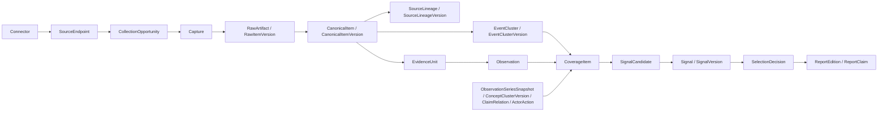

# 统一数据、时间与决策契约

- 版本：v0.1-m0-baseline
- 日期：2026-08-05
- 状态：M0 有条件冻结的语义权威；M1 机器 schema 化中

## 1. 权威范围

本文统一项目中对象名称、ID 所有权、时间语义、处理权限、报告归属、回放模式和删除行为。

发生冲突时：

1. 本文决定对象与时间语义；
2. 《全球信息覆盖矩阵》决定覆盖政策与唯一曝光预算；
3. 《弱信号定义与评分规范》决定检测、证据、生命周期和信号解释；
4. 《规范验收测试计划》决定发布门禁。

机器可执行数据库 schema 可以在下一步生成，但字段语义不能延后决定。

## 2. 统一对象链



事件只是信号输入的一种。价格序列、招聘变化、语义迁移、关系变化和“在健康观测下持续未出现”不得被强行伪装成事件。

## 3. 来源与采集对象

| 对象 | 稳定 ID | 定义 | 关键约束 |
|---|---|---|---|
| `Connector` / `ConnectorVersion` | `connector_id` / `connector_version_id` | 稳定采集实现身份及一次不可变代码、依赖和配置快照 | 不能作为来源多样性单位；Capture 必须引用确切版本 |
| `SourceEndpoint` / `SourceEndpointVersion` | `endpoint_id` / `endpoint_version_id` | 稳定访问地址身份及 URL、协议、法域和描述性 `source_declared_update_cadence` 快照 | 执行分母只由 CollectionPlanManifest 的 `planned_poll_cadence` 决定；二者差异需审计 |
| `PublisherAccount` / `PublisherAccountVersion` | `publisher_account_id` / `publisher_account_version_id` | 稳定发布者身份及地区、语言、社会角色和平台属性快照 | 一个端点可承载多个账号；后来的角色分类不能回填过去 |
| `OwnerGroup` / `OwnerGroupVersion` | `owner_group_id` / `owner_group_version_id` | 稳定控制方身份及所有权关系快照 | 未知时显式记录 `owner_unknown`；后来收购不能回写历史独立性 |
| `SourceRegistrySnapshot` | `source_registry_snapshot_id` | 某一 system as-of 的来源、账号、所有权、rights 与计划版本 ID 清单 | 必须物化不可变 ID 清单，不是可重跑查询 |
| `CollectionOpportunity` | `opportunity_id` | 由冻结 CollectionPlanManifest 确定性派生的一次不可变采集义务 | 分母从 manifest 推导并与实例行对账；整窗漏建仍记失败 |
| `CollectionOpportunityStateEvent` | `collection_opportunity_state_event_id` | 机会错过、预注册排除或终止的追加式状态 | 继承 EventBase；Capture 成功与 state event 共同投影 terminal state |
| `ContentCursor` / `ContentCursorCheckpoint` | `cursor_id` / `cursor_checkpoint_id` | 稳定游标身份及一次不可变的分页、增量 token、时间水位或序号检查点 | 保存 previous checkpoint、transition reason 与受控 sequence；HTTP 成功但游标断裂仍不完整；推进、回退和重建不能覆盖旧 checkpoint |
| `Capture` | `capture_id` | 对一次采集机会的实际执行 | 保存请求、响应、重定向、状态、资源限制和采集器版本 |

覆盖可用性不能用 `endpoint` 个数简单计算。端点拆成多个栏目或多个账号折叠进一个 API 后，发布者、谱系、计划采集机会和内容完整性指标必须保持语义不变。

CollectionPlanManifest 必须在首个受影响计划窗前冻结 `planned_poll_cadence`、时区、cursor/schedule 规则、确定性 opportunity ID 派生、允许排除与权重。机会分母由 manifest 展开并与预先物化的 CollectionOpportunity 对账；调度器整窗宕机而漏建行时，仍补建对应 obligation、追加 CollectionOpportunityStateEvent 并记录 `COLLECTION_OPPORTUNITY_MISSED`。SourceEndpointVersion 的 `source_declared_update_cadence` 只描述来源自报/观察节奏，不能直接改变执行分母；二者偏离必须生成计划依据和敏感性报告。

## 4. 内容、溯源与证据对象

| 对象 | 稳定 ID | 定义 | 基数与删除行为 |
|---|---|---|---|
| `RawArtifact` | `artifact_id` | 按许可保存的原始 payload、文件、许可片段或元数据指针 | 一个 Capture 可产生多个 artifact；受许可与隐私删除控制 |
| `StorageBlob` | `blob_id` | 可选的物理字节对象，用于内部去重和完整性保存 | 不是来源/证据身份；不得把裸内容 hash 暴露为公开 ID |
| `ArtifactBlobBinding` / `ArtifactBlobBindingVersion` | `artifact_blob_binding_id` / `artifact_blob_binding_version_id` | RawArtifact 与 StorageBlob 的用途、法源、加密域和授权状态快照 | 物理去重不得合并法律身份；撤权新增版本与事件 |
| `RawItem` | `item_id` | 来源侧稳定内容身份，例如一篇文章、一条公告或一个帖子 | 一个 item 有多个版本 |
| `RawItemVersion` | `item_version_id` | 在某次捕获中观察到的具体内容版本 | 追加版本；合法删除时可只留非内容墓碑 |
| `CanonicalItem` | `canonical_item_id` | 跨来源版本聚合后的稳定规范内容身份 | 内容快照由 `CanonicalItemVersion` 承载；映射版本化 |
| `CanonicalItemVersion` | `canonical_item_version_id` | 某一系统时点可用的规范文本、结构、语言与去重映射 | 多个 raw version 可映射同一规范版本；不得覆盖旧快照 |
| `SourceLineage` | `source_lineage_id` | 共同原稿、通讯社稿、PR、翻译转载或协调分发的稳定谱系身份 | 成员关系由 `SourceLineageVersion` 承载；不等于独立事实支持 |
| `SourceLineageVersion` | `source_lineage_version_id` | 某一系统时点可用的传播谱系成员与依赖快照 | 合并、拆分和依赖修订不得覆盖旧快照 |
| `EventCluster` | `event_cluster_id` | 指向同一有边界现实事件的稳定身份 | 仅用于可事件化输入 |
| `EventClusterVersion` | `event_cluster_version_id` | 某一系统时点的事件成员、边界与状态快照 | 合并/拆分保留映射历史 |
| `EvidenceUnit` | `evidence_unit_id` | 独立产生、依赖可追溯的记录、测量、直接观察或调查报道 | `evidence_role` 取 primary_record、direct_observation、independent_report、derived_measurement 或 source_claim；匿名依赖标 unknown |
| `EvidenceScope` | `evidence_scope_id` | 支持某命题的精确段落、表格单元、时间区间、字段或测量范围 | 只给整篇链接不满足事实门禁 |
| `RightsGrant` / `RightsGrantVersion` | `rights_grant_id` / `rights_grant_version_id` | 稳定授权依据及一次不可变、可撤销的法源/用途/法域/期限决定 | 与内容语义证据分离；后续收窄或撤回新增版本/事件 |
| `AuthorizedContentScope` | `authorized_content_scope_id` | 某资源版本获准处理的字段、byte/span、最大展示量、处理方、transform、derivative type 与 retention | PurposeAuthorization 必须引用；不得以 EvidenceScope 代替许可范围 |

传播规模、来源独立性和事实支持是三个不同对象：

- 转载、帖子和互动可以增加传播规模；
- 不同 `SourceLineage` 可以增加传播起点多样性；
- 只有独立 `EvidenceUnit` 且语义支持兼容，才能增加事实支持。

依赖关系未知时保存 `dependency_unknown`，同时计算独立性下界与上界；不得为了保守而破坏性合并来源身份。来源也不得拥有跨主题、跨时间永久有效的单一“真相分”，证据质量必须按具体主张、证据角色、时间和可复核性判断。

`RawArtifact.storage_mode` 是有条件必填的判别联合类型：

| storage_mode | 必填 | 禁止/限制 | 可恢复性表述 |
|---|---|---|---|
| `full_bytes` | `artifact_blob_binding_id`、byte length、checksums、encryption key ref、`preservation_manifest_version_id` | 受全文许可与隐私约束 | 可按 manifest 验证和恢复原始字节 |
| `licensed_excerpt` | 同上，另加 `authorized_content_scope_id` 与获准字节/span 范围 | 不得暗示保存全文；EvidenceScope 不能充当许可 | 只能恢复许可片段 |
| `metadata_only` | 规范元数据、来源 URL、metadata record checksum 与 `preservation_policy_version` | source-content blob binding 必须为空 | 只能恢复元数据，不能恢复来源正文 |
| `external_pointer` | 捕获时的不可变外部 URI/provider record key | 本地正文、excerpt checksum/key/binding 及可变 last_verified/status 必须为空 | `recoverability=external_uncontrolled`；当前可达性只由 ExternalPointerCheckEvent 投影 |

## 5. 派生知识与信号对象

| 对象 | 稳定 ID | 定义 | 必备关系 |
|---|---|---|---|
| `Entity` / `EntityVersion` | `entity_id` / `entity_version_id` | 稳定实体身份及某时点可用的别名、属性和消歧快照 | 不能把后来别名用于更早 as-known 回放 |
| `ConceptCluster` / `ConceptClusterVersion` | `concept_cluster_id` / `concept_cluster_version_id` | 稳定概念身份及主题/叙事簇快照 | 模型升级必须双跑和保留映射 |
| `ClaimRelation` / `ClaimRelationVersion` | `claim_relation_id` / `claim_relation_version_id` | 稳定关系身份及来源主张、观察关联或因果假设快照 | 保存 assertion type、主体、否定、限定与证据范围 |
| `ActorAction` / `ActorActionVersion` | `action_id` / `action_version_id` | 可去重的稳定行动身份及意向、承诺、执行、取消或结果快照 | 同一行动的转载不能反复升级阶段；阶段变化新增版本 |
| `Observation` / `ObservationVersion` | `observation_id` / `observation_version_id` | 稳定观察身份及由证据支持的结构化陈述或测量快照 | 关联 EvidenceUnit、EvidenceScope 和断言类型 |
| `ObservationSeries` / `ObservationSeriesSnapshot` | `series_id` / `series_snapshot_id` | 稳定序列身份及某个 as-of 的不可变测量切片 | 保存分母、采样政策、健康状态和方法版本 |
| `TranslationArtifact` / `TranslationArtifactVersion` | `translation_artifact_id` / `translation_artifact_version_id` | 稳定翻译任务身份及具体源版本、目标语言、模型和译文快照 | `system_available_at` 晚于 as-of 时不可见；新模型翻译不覆盖旧译文 |
| `RevisionAssessment` / `RevisionAssessmentVersion` | `revision_assessment_id` / `revision_assessment_version_id` | 对 RawItemVersion 差异类型与 reportability 的追加式判断 | 保存 decision available time、规则/模型、理由与被取代 assessment；不得改 raw version |
| `CoverageItem` | `coverage_item_id` | L2/L3 分配的规范候选输入 | 联合类型，见下文 |
| `PropositionFamily` / `PropositionFamilyRuleVersion` | `proposition_family_id` / `proposition_family_rule_version_id` | 稳定命题族及揭盲前冻结的归并/发射规则 | 后验合并拆分不能改 family；规则版本变更不回填 |
| `SignalCandidate` | `candidate_id` | 某检测器对变化命题的高召回触发 | 冻结 `candidate_emission_key` 与 family，并关联输入、检测器、基线和选择前特征 |
| `Signal` | `signal_id` | 跨时间稳定的变化命题身份 | 与候选、版本和生命周期事件分离 |
| `SignalVersion` | `signal_version_id` | 某时点的命题、分项向量、解释和置信快照 | 不覆盖旧版；受合规删除投影控制 |
| `SignalEvidenceLink` | `signal_evidence_link_id` | 信号与支持、反驳、背景或不确定证据的关系 | 保存关系、证据范围、算法/人工主体和版本 |
| `CandidateTriggerEvent` | `candidate_trigger_event_id` | 同一 emission key 被新检测器、重试或新证据再次触发的追加记录 | 继承 EventBase；不得生成第二个 candidate 或扩大评价分母 |
| `SignalStateEvent` | `signal_state_event_id` | 生命周期转换、合并、拆分、复活或降级事件 | 只追加，不直接改写历史 |
| `CandidateGenerationUnit` | `generation_unit_id` | 由冻结 scope、pipeline key、CoverageItem 与 DetectorVersion 确定性派生的一次候选生成义务 | 相同输入只能得到同一 ID；先物化 unit，不能靠实际任务行反推分母 |
| `CandidateGenerationDecision` | `candidate_generation_decision_id` | 对一个 CandidateGenerationUnit 的 candidate/no-candidate/failed 唯一 terminal 决定 | `UNIQUE(generation_unit_id)`；无输出也必须有理由，缺行表示阶段未完成而非“没有信号” |
| `CandidateSelectionUnit` | `selection_unit_id` | 由冻结 selection scope/run、candidate、surface 与 allocation context 确定性派生的一次选择义务 | 相同输入只能得到同一 ID；先物化 unit，不能只保存入选项 |
| `SelectionDecision` | `selection_decision_id` | 一个 CandidateSelectionUnit 是否展示及其完整原因 | `UNIQUE(selection_unit_id)`；已展示与未展示均保存 |
| `PreDetectionExplorationUnit` | `pre_detection_exploration_unit_id` | 对合格但 unknown/OOD 的 CoverageItem 在 detector 之前进入 random_exploration 子池的一次确定性义务 | 不依赖 candidate 是否生成；不是第五条 allocation lane，也不改变 prevalence |
| `PreDetectionExplorationDecision` | `pre_detection_exploration_decision_id` | 一个 PreDetectionExplorationUnit 的 selected/not_selected/failed 唯一终态 | `UNIQUE(pre_detection_exploration_unit_id)`；selected 只表示“未解释探索材料”，不冒充弱信号 |
| `PreDetectionExplorationEligibilityUnit` / `PreDetectionExplorationEligibilityDecision` | `pre_detection_exploration_eligibility_unit_id` / `pre_detection_exploration_eligibility_decision_id` | 冻结 scope 中每个 CoverageItem 的 detector 前探索资格义务及唯一终态 | 全量 terminal 为 eligible/ineligible/failed；不能先看内容再只为赢家建探索 unit |
| `ClaimGenerationUnit` | `claim_generation_unit_id` | 由冻结 presentation context、claim-slot schema 与 container 确定性派生的一次原子主张生成义务 | 每个可呈现的事实/来源主张/AI 推断 slot 都先物化 unit；自由文本不能绕过该分母 |
| `ClaimGenerationDecision` | `claim_generation_decision_id` | 一个 ClaimGenerationUnit 的 claim/not-applicable/failed 唯一 terminal 决定 | `UNIQUE(claim_generation_unit_id)`；outcome=claim 时恰有一个 ReportClaim，required slot 不得用空集合真空通过 |

运行、产品与治理对象同样属于本契约：

| 对象 | 稳定 ID | 定义 | 关键约束 |
|---|---|---|---|
| `AnalysisRun` | `analysis_run_id` | 一次不可变派生运行及其输入清单 | 保存 as-of、run mode、代码、模型、提示、策略、随机种子和输出 IDs |
| `ManifestSeries` / `ManifestActivationDecision` | `manifest_series_id` / `manifest_activation_decision_id` | manifest kind×canonical scope 的稳定配置系列及普通不可变 CAS record | decision 必填 typed target、role、有效区间、revision/predecessor；`UNIQUE(series,revision)`、同 series predecessor FK 与 authoritative `tstzrange` 排斥约束 |
| `SnapshotMembershipProfile` | `snapshot_membership_profile_id` | 每种 snapshot type 的 member subject kind/role、冻结 universe、projection oracle、unit ID 公式与 child schema | profile 在 snapshot 前激活；subject 可为 typed identity/record 或结构化 value，不假设都是 stable object |
| `SnapshotMembershipUnit` / `SnapshotMembershipDecision` | `snapshot_membership_unit_id` / `snapshot_membership_decision_id` | 按 profile 对每个 subject×role 的成员义务与唯一终态 | `UNIQUE(snapshot,subject,role)` 且 Decision `UNIQUE(unit)`；selected typed member、child rows、terminal units 与 projection result 四方集合相等 |
| `IngestDomain` | `ingest_domain_id` | 一个拥有本地单调 sequence 的受控写入域身份 | sequence 只在本域比较；跨域只认 EventCausalParent/队列 offset |
| `ServicePrincipal` / `ServicePrincipalCredentialVersion` | `service_principal_id` / `service_principal_credential_version_id` | 内部服务主体及其 audience/scope/expiry 受限凭据快照 | 每次鉴权检查 credential current state；轮换不改主体 ID，但旧 credential 只由 expected-head lifecycle 撤销/compromise |
| `ServicePrincipalCredentialStateEvent` | `service_principal_credential_state_event_id` | 内部凭据 active→revoked/compromised 的追加式排他状态事件 | 继承 EventBase；同 credential expected-head CAS，推进对应 RevocationDomain 并进入恢复 checkpoint |
| `ModelProvider` / `ModelProviderVersion` / `ModelArtifact` | `provider_id` / `model_provider_version_id` / `model_id` | 模型处理方稳定身份、合同/地域/retention 快照及具体模型/权重/服务版本身份 | provider 权限不能替代 model/purpose 授权；闭源退役仍保留可审计标识与合同快照 |
| `ProviderCallbackSigningKey` / `ProviderCallbackSigningKeyVersion` | `provider_callback_signing_key_id` / `provider_callback_signing_key_version_id` | provider callback 密钥稳定身份及算法/fingerprint/用途/有效期/issuer 版本 | 历史 receipt 可验；当前接受同时检查有效期与 PROVIDER_CALLBACK_KEY_STATE |
| `ModelOutputArtifact` | `model_output_artifact_id` | 一次模型调用的不可变原始输出、请求摘要、模型身份与用途 receipt | 派生结构可重算但不得冒充原始模型输出；删除/权限随输入传播 |
| `ModelTaskManifest` | `model_task_manifest_id` | 一类模型任务的 provider/model、purpose、工具/网络 allowlist、输出 schema、数据域与 egress policy | 未列工具/网络/凭据默认拒绝；模型输出永远是 tainted data，不是控制指令 |
| `OutboundPayloadManifest` | `outbound_payload_manifest_id` | 一次调用实际出站完整字节与每个 fragment 的 typed source/span/hash/PurposeAuthorization 清单 | egress proxy 的实际 payload hash/length 必须完全相等；派生文本不能洗白无权源 |
| `ModelInvocation` | `model_invocation_id` | 一次通过唯一 egress proxy 提交的不可变模型调用 | 只绑定提交时已存在的 task/provider/model/payload/context/domain 与 outbound receipt；异步 output 只能沿 ResponseReceipt→Invocation 反向挂接，Invocation 不存未来 output FK |
| `ProviderContextSnapshot` | `provider_context_snapshot_id` | provider thread/file/vector store/cache/batch handle 的递归有效输入与权利快照 | 公共任务 transitive private-lineage 必须为 0；未登记 remote handle 默认拒绝 |
| `ProviderResponseModeProfile` | `provider_response_mode_profile_id` | synchronous/callback/poll/download 每种 ingress 的必填字段、authenticated exchange/peer/signature 与 oneOf discriminator schema | mode profile 在 invocation 前激活；每种 mode 都有不可伪造的 request/job/nonce/channel 绑定，未知 mode 拒绝 |
| `ProviderResponseReceipt` / `ProviderCallbackReceipt` child | `provider_response_receipt_id` / 同一 PK | 统一外部响应对象及 callback 的无第二身份 typed child | base mode 与 child `IFF exactly one`；callback child 必须验签，其他 mode 绑定 captured exchange/mTLS 或授权 ingress attestation；accepted 后才可产 output |
| `ProviderResponseSetProfile` / `ProviderResponseSet` | `provider_response_set_profile_id` / `provider_response_set_id` | invocation 的单值/分页/分片/多文件/batch member universe、cardinality/continuation 规则及其唯一闭合集合 | invocation terminal 对 response set 唯一；多个 authenticated exchanges 归入同一 set，不能以单 receipt 代表完整 batch |
| `ProviderResponseMemberUnit` / `ProviderResponseMemberDecision` | `provider_response_member_unit_id` / `provider_response_member_decision_id` | 每个预期 page/shard/file/member 的确定性响应义务及 success/failed/missing 唯一终态 | expected units=terminal decisions=accepted artifacts∪explicit failures；continuation/page 未闭合时 invocation/downstream 非 terminal |
| `ProviderErasureObligation` / `ProviderErasureAttempt` / `ProviderErasureDecision` | `provider_erasure_obligation_id` / `provider_erasure_attempt_id` / `provider_erasure_decision_id` | 每个会产生远端保留副本的 egress/handle 的确定性删除义务、尝试与唯一终态 | 覆盖 thread/file/vector/cache/batch 全部资源、deadline、签名 receipt 与 post-delete verification；任一未闭合即阻断删除完成和后续敏感 egress |
| `ProviderErasureFence` | `provider_erasure_fence_id` | provider generation/sequence 高水位、producer cancel+drain 与删除后 tombstone 的不可变证明 | erased 只能引用 active fence；fence 后新资源自动阻断或重开 obligation，迟到 job/retry 不能重物化已删内容 |
| `ModelOutputValidationUnit` / `ModelOutputValidationDecision` | `model_output_validation_unit_id` / `model_output_validation_decision_id` | task manifest 要求的 output×schema×validator×field 验证义务及唯一终态 | attempts 不能充当终态；全部 required units 唯一通过后 typed field 才可下游使用 |
| `ModelOutputValidation` | `model_output_validation_id` | 对一个 validation unit 的不可变检查 attempt/诊断工件 | 不决定当前通过状态；只能由唯一 ModelOutputValidationDecision 选择 terminal attempt |
| `FeatureArtifact` | `feature_artifact_id` | 候选选择前冻结的分项特征工件 | 保存分母、缺失状态、基线、检测器与生成运行 |
| `CollectionPlanManifest` | `collection_plan_id` | endpoint/account 的唯一执行性 `planned_poll_cadence`、确定性 opportunity 派生规则与允许变更 | 分母从 manifest 展开；降低采频不能回写旧 cohort，且需与来源描述 cadence 做差异敏感性 |
| `SourceDiscoveryFrameManifest` | `source_discovery_frame_manifest_id` | 一次目录/query/sitemap/API snapshot 的完整来源发现候选框、分页 receipt 与去重规则 | frame 在读取候选前激活；publisher×logical-stream×version 的全部机会必须可确定性重建 |
| `SourceDiscoveryProgramManifest` | `source_discovery_program_manifest_id` | 地区×语言×渠道×query template 的 frame 批次、频率、随机种子与纳入概率根计划 | 在任何 frame 结果前激活；不能只为高准入格创建 frame |
| `SourceDiscoveryFrameOpportunity` / `SourceDiscoveryFrameDecision` | `source_discovery_frame_opportunity_id` / `source_discovery_frame_decision_id` | program 中每个应运行 frame 的确定性义务及 run/skipped/failed 唯一终态 | program opportunities 与 frame manifests/terminal decisions 全量相等；漏 frame 形成 discovery gap |
| `SourceDiscoveryOpportunity` | `source_discovery_opportunity_id` | frame 中每个可登记来源/逻辑流的一次准入义务 | 恰有一个 admit/reject/duplicate/failed SourceDiscoveryDecision；漏行形成 source-discovery gap |
| `RecruitmentCohort` | `recruitment_cohort_id` | 一批因预注册发现、随机留出、覆盖债务或 candidate-conditioned 查询而招募的来源版本清单 | 冻结 discovery cause/candidate/query causal parents；条件化来源不能确认触发它的 candidate |
| `SourceDiscoveryDecision` | `source_discovery_decision_id` | 一个来源发现机会为何准入、拒绝、去重或失败的唯一终态 | `UNIQUE(source_discovery_opportunity_id)`，绑定 recruitment cohort、规则、公共证据与 `discovery_conditioning`；来源招募不能无 lineage |
| `ConditioningAncestryClosure` | `conditioning_ancestry_closure_id` | candidate/family/query/recruitment/source/CoverageItem/后继 candidate 的冻结因果闭包 | 条件化来源不能跨 candidate/family 洗白；只有独立性 oracle 可解除排除 |
| `ClockSource` / `ClockHealthSnapshot` | `clock_source_id` / `clock_health_snapshot_id` | 受控时间源身份及按某 ClockPolicy 计算的一次不可变健康判断 | 节点自报不构成健康证明；保存观测、quorum、skew、TTL 和 sequence continuity |
| `ClockPolicyManifest` | `clock_policy_id` | 允许的时间源、偏移、quorum、TTL、holdover、回拨与恢复规则 | clock health 只能按该 manifest 计算，不能由节点自报 |
| `EventTypeRegistryManifest` / `EventTypeDefinition` | `event_type_registry_version` / `(event_type_registry_version, event_type)` | 不可变 registry header 及其 subtype、aggregate kind/type、state-machine 语义、typed payload schema 条目 | Definition 及其 state/transition/API-alias children 不拥有第二个全局 record ID；必须穷尽第 5.2 节类型，未知 type/transition/alias fail closed |
| `CoveragePolicyManifest` | `coverage_policy_version` | required cells、allocation lanes、comparison strata、容量与变更规则 | 覆盖比例和 required keys 的唯一所有者 |
| `CoverageStratum` / `CoverageStratumVersion` | `stratum_id` / `stratum_version_id` | 稳定比较分层身份及某一 system as-of 的地区、语言、媒介、角色和纳入谓词 | 分类修订新增版本；水位、分母和历史报告引用当时版本，不能把今天的边界回填过去 |
| `Detector` / `DetectorVersion` | `detector_id` / `detector_version_id` | 稳定检测器身份及不可变代码、特征、阈值和输出契约 | patch/minor 与实质变更规则明确；每次 decision 引用确切版本 |
| `DetectorManifest` | `detector_manifest_id` | 本阶段允许运行的检测器、基线需求和解锁条件 | 未列入 manifest 的检测器不得生成正式候选 |
| `BaselineEpoch` | `baseline_epoch_id` | 覆盖/方法连续的一段检测基线身份 | source/model/policy break 产生新 epoch，不回填旧候选 |
| `CandidateEmissionPolicy` | `emission_policy_version` | proposition family、窗口去重、重触发与 recurrence 规则 | 生成 candidate_emission_key，禁止重复发射 |
| `SequentialTestingUniverseManifest` | `sequential_testing_universe_manifest_id` | 一次数据访问中全部被评分/筛选的假设机会与全局 alpha wealth/分区规则 | family 是互斥/守恒子分区；不能只登记赢家或为赢家新建 sibling family |
| `MultiplicityProgram` | `multiplicity_program_id` | 跨 manifest/version/release/look 稳定的统计访问/能力声明根身份与 root alpha account | 仅换 manifest/release ID 不得重置 wealth；新 root 需 disjoint cohort/holdout 证明 |
| `HypothesisTestOpportunity` / `HypothesisTestGenerationDecision` | `hypothesis_test_opportunity_id` / `hypothesis_test_generation_decision_id` | 每个被读取数据并计算筛选分数或决定是否检验的机会及唯一终态 | 数据可读前冻结 logical order、threshold reservation 和 predecessor information set；scored、generation 与 ledger terminals 全量相等 |
| `TestStatisticInputSnapshot` | `test_statistic_input_snapshot_id` | 一次 p/e-value 的输入、抽样/停止 lineage、history filtration 与 dependence cluster 快照 | conditional-validity method 必须证明相对 history_<i 的 super-uniformity 或 e-process supermartingale；边际合法不足够 |
| `SequentialHypothesisFamilyManifest` | `sequential_hypothesis_family_manifest_id` | 连续/自适应扫描的全局检验族、假设 ID、窗口、alpha spending/online-FDR 与 reset 规则 | 动态新主题和 no-candidate tests 也入账；每轮重置 BH 禁止 |
| `SequentialHypothesisLedgerEntry` | `sequential_hypothesis_ledger_entry_id` | 检验族内一次有序 test/candidate/no-candidate 的 alpha wealth、p/e-value 前提与决定 | 前序 hash/序号连续；漏账时统计确认与能力声明使用 MULTIPLE_TESTING_UNCONTROLLED |
| `RankingRuleManifest` | `ranking_rule_id` | 分类型确定性比较与配额冲突规则 | 禁止隐藏总分；版本变更必须双跑 |
| `AttentionBudgetManifest` | `attention_budget_manifest_id` | 固定 K/阅读分钟、首屏/非折叠位置、viewport/channel、通知预算与实时—日报重复上限 | 不读点击；选择成功不等于在可达注意力预算内获得展示 |
| `ReportScheduleManifest` | `report_schedule_manifest_id` | 预先冻结的时区、tzdb、recurrence、例外日和确定性 slot 派生规则 | 必须在首个受影响窗口开始前生效；不能靠不创建 slot 缩小 SLO 分母 |
| `ReportPipelineManifest` | `report_pipeline_manifest_id` | 一期报告非空的 required stage×purpose×stratum-version keys、detector set 与 terminal 决定类型 | 必须含 candidate generation 与 selection；漏阶段不能让空集合 vacuous pass |
| `RadarPipelineManifest` | `radar_pipeline_manifest_id` | 一个实时雷达表面的 required stage×purpose×stratum-version keys、刷新/支配规则、selection surfaces 与 claim-slot schema | 必须冻结 scope epoch、current-head 兼容条件和完整性 oracle；不能从实际完成任务反推 |
| `PresentationTemplateManifest` / `UiBundleManifest` | `presentation_template_manifest_id` / `ui_bundle_manifest_id` | controlled template 与 static UI 的签名 key/text/hash/locale/channel child registry | ContentUnit 只能复合 FK 到登记 key；模板不得携带动态世界语义 |
| `DeliveryPolicyManifest` | `delivery_policy_manifest_id` | finite response、cache/CDN、Range、304、signed URL、SSE/WebSocket 和撤权后的交付规则 | v0.1 未明确建模的 stream/range/public CDN 全部 deny；禁止 stale-if-error |
| `PresentationSinkPolicyManifest` | `presentation_sink_policy_manifest_id` | channel×sink context 的编码、sanitizer、URL/MIME/公式策略与攻击语料版本 | typed/semantic validation 不能替代 sink-safe validation；未知 sink 默认拒绝 |
| `SLOConfig` | `slo_config_version` | 单期、滚动、slot 分母、quantile 和缺失处理规则 | provisional/production 版本分离，旧结果不回写 |
| `EvaluationProtocolVersion` | `evaluation_protocol_version` | cohort、指标、horizon、family 规则、anchor 与删失协议 | cohort 开始前冻结并锚定 |
| `EvaluationObligation` | `evaluation_obligation_id` | candidate×protocol×horizon 的确定性正式复核义务 | 同组合唯一；恰有一个及时 snapshot 或 missed 决定，以及一个正式 terminal result |
| `EvaluationSnapshotDecision` / `EvaluationResult` | `evaluation_snapshot_decision_id` / `evaluation_result_id` | 一个复核义务的 snapshot/missed XOR 终态及唯一正式结果 | 两者分别 `UNIQUE(evaluation_obligation_id)`；结果绑定同义务/协议/horizon/ledger |
| `ValidationEvidenceEligibilityUnit` / `ValidationEvidenceEligibilityDecision` | `validation_evidence_eligibility_unit_id` / `validation_evidence_eligibility_decision_id` | obligation×snapshot evidence×protocol role 的资格义务与 include-support/include-counterevidence/exclude/failed 唯一终态 | units、terminals、结果支持/反证集合与协议 evidence-package projection 四方相等；自由数组或漏反证阻断能力声明 |
| `ValidationEvidenceProducerExposureUnit` / `ValidationEvidenceProducerExposureDecision` | `validation_evidence_producer_exposure_unit_id` / `validation_evidence_producer_exposure_decision_id` | 入选验证证据的 producer/investigator/operator 对候选发布/交付的暴露义务与唯一终态 | 任一 exposed/possibly/unknown 或缺失不得标 independent validation，只能 system-induced/intervention echo |
| `EvaluationArmManifest` / `EvaluationArmGenerationUnit` / `EvaluationArmGenerationDecision` | `evaluation_arm_manifest_id` / `evaluation_arm_generation_unit_id` / `evaluation_arm_generation_decision_id` | system/hot/random/editor/champion/challenger 各 arm 的同 scope/K 输出生成规则、义务与唯一终态 | arm 在揭盲前激活；generation terminals、selected outputs、obligations、snapshot decisions/results 全量相等 |
| `EvaluationArmOutputSnapshot` | `evaluation_arm_output_snapshot_id` | 一个 arm 在冻结 scope/cutoff/K 下的完整有序输出集合 | 与其他 arm 共享输入/OutcomeFrame；漏输出或漏结果阻断比较能力声明/版本晋升 |
| `OutcomeFrameManifest` | `outcome_frame_manifest_id` | 独立隐藏现实结果框、outcome definition 与生成机会 universe | 绑定协议并在 cohort/首次 candidate data access 前锚定，candidate-lineage count=0；否则禁止报告 outcome coverage/recall |
| `OutcomeGenerationUnit` / `OutcomeGenerationDecision` | `outcome_generation_unit_id` / `outcome_generation_decision_id` | frame 中每个现实结果机会及 outcome/no-outcome/unknown 唯一终态 | OutcomeUnit 先由 frame 生成，再允许 CandidateOutcomeLink；漏机会阻断能力声明 |
| `OutcomeUnit` / `OutcomeUnitVersion` | `outcome_unit_id` / `outcome_unit_version_id` | 可被多个候选共享的一项现实验证结果身份及 as-of 版本 | 同一工厂开工/数据集不能被 50 个 candidate 当成 50 个独立 outcome |
| `OutcomeCluster` / `OutcomeClusterVersion` | `outcome_cluster_id` / `outcome_cluster_version_id` | 相关 outcome units 的共享生成过程/相关性簇及版本 | 能力指标按 cluster 计算 n_eff/cluster-robust CI，不按 links 数当独立样本 |
| `CandidateOutcomeLink` | `candidate_outcome_link_id` | candidate/evaluation obligation 与 OutcomeUnitVersion 的多对多关系 | 保存关系角色、独立性与 outcome cluster version；不得复制共享结果放大命中数 |
| `OutcomeInterventionExposureAssessment` | `outcome_intervention_exposure_assessment_id` | outcome actor/unit 对系统 delivery 或已知外部传播的暴露判断 | unexposed/possibly_exposed/exposed/unknown 唯一终态；纯预测能力只纳入预注册 shadow/holdout 或可证明 unexposed 的 outcome |
| `OutcomeActorExposureUnit` / `OutcomeActorExposureDecision` | `outcome_actor_exposure_unit_id` / `outcome_actor_exposure_decision_id` | OutcomeFrame 规则生成的 outcome causal actor/action×candidate 暴露义务与唯一终态 | actor units、terminal、delivery/publication lineage 和 link aggregation 全量相等；任一 exposed→link exposed，缺失/unknown 不得洗成 unexposed |
| `CapabilityClaimFamilyManifest` | `capability_claim_family_manifest_id` | 一次 release/version 可声明的 protocol×metric×horizon×subgroup universe 与 multiplicity 预算 | 重叠协议、重复 looks 和子群声明共享账本；不能只发布幸运 sibling |
| `CapabilityClaimUnit` / `CapabilityClaimDecision` | `capability_claim_unit_id` / `capability_claim_decision_id` | 每个预注册能力陈述机会及唯一 terminal publishable/not-supported/exploratory 决定 | 对外声明必须引用 decision 并披露 sibling results |
| `AnnotationProtocolVersion` | `annotation_protocol_version` | label 定义、盲法、双标、语言资质、冲突回避、一致性阈值与裁决规则 | immutable manifest；subjective outcome 在 cohort 前冻结，未裁决分歧不得计成功 |
| `EvaluationJudgment` / `AdjudicationDecision` | `evaluation_judgment_id` / `adjudication_decision_id` | 盲评员的一次不可变判断及独立裁决结果 | 绑定 protocol、snapshot、horizon 和受限 reviewer credential；不得覆盖原判断 |
| `RightsSnapshot` | `rights_snapshot_id` | 某一时点的资源、用途、法源、保留和 revocation epoch 清单 | 物化不可变决定输入，不是读取最新政策的查询别名 |
| `RevocationDomain` | `revocation_domain_id` | 一个需要全序撤权高水位的稳定权限域，例如全球展示或某 PersonalScope | 所有 PurposeAuthorization、view token、cache/export 和恢复 fence 引用 domain+连续 epoch head |
| `RevocationEpochEvent` | `revocation_epoch_event_id` | 对 RevocationDomain 从 epoch N 原子推进到 N+1 的唯一事件 | 继承 EventBase；同 domain expected-head CAS，所有触发 rights/deletion/key 事件在事务中引用 |
| `RevocationDependencySnapshot` | `revocation_dependency_snapshot_id` | 一项派生/交付依赖的完整有序 `(revocation_domain_id,epoch)` 集合与 set hash | 任一 domain head 变化即使 invocation/cache/token/callback/delivery 整体失效 |
| `PurposeAuthorization` | `purpose_authorization_id` | 针对资源版本、用途、处理方、AuthorizedContentScope 和 epoch 的一次限时授权决定 | 保存 grant/scope、checked/expires、rights snapshot 与允许/拒绝理由；allow 不等于无限处理 |
| `CorpusScopeSnapshot` | `scope_snapshot_id` | 某处理/比较运行实际纳入与排除的对象 ID 清单 | scope 变化可重放且可做敏感性，不是动态查询 ID |
| `ProcessingWatermark` | `processing_watermark_id` | stage×purpose×stratum-version 的连续到达前沿快照 | 关联 scope、gap、terminal states 与计算时间；不得以稳定 stratum_id 代替版本 |
| `WatermarkGap` | `watermark_gap_id` | 阻断连续前沿的缺失机会、输入或 terminal decision | 只由 WATERMARK_GAP_STATE 追加事件闭合；不得删除 gap 后直接推进水位 |
| `ReportScheduleSlot` | `report_schedule_slot_id` | 由已冻结 schedule manifest 预先物化的计划报告时点、名义窗口与 SLO 引用 | 行本身不可变；当前 slot 状态由事件投影；完全漏发或漏建行都不能从计划分母消失 |
| `ReportSlotStateEvent` | `report_slot_state_event_id` | slot 失败、取消、恢复等追加式状态事件 | 继承 EventBase；published 只能由成功 PublicationEvent 投影，取消默认仍在服务分母 |
| `PublicationAttempt` | `publication_attempt_id` | 对某 schedule slot 的一次生成/校验/提交尝试 | 失败、撤权阻断和耗时均追加记录 |
| `PublicationEvent` | `publication_event_id` | 某 schedule slot 首次 ReportEdition 原子成功提交的唯一事件 | 数据库对 report_schedule_slot_id 作唯一约束；fenced CAS 只允许一个 winner |
| `ReportEdition` | `report_edition_id` | 成功提交后的不可变选择与版次记录 | 文本是可撤销投影；必须一对一关联 PublicationEvent |
| `ReportAmendment` / `ReportAmendmentEvent` | `report_amendment_id` / `report_amendment_event_id` | 首次版后的追加式更正、说明或内容投影变更 | record 与 event 一对一并唯一；不创建第二个 initial PublicationEvent、不改首次 SLO；当前视图按事件投影 |
| `ReportableArrival` | `information_arrival_id` | 一个初次 item 或可报告 RevisionAssessmentVersion 的唯一逻辑信息到达身份 | 冻结 typed subject identity、arrival time、nominal slot 与语义版本；初始 item 指向 object，revision assessment 指向 record |
| `ReportItemPlacement` | `report_item_placement_id` | 某 arrival 在一次 Publication/ReportAmendment 展示事件中的不可变放置及 first/backfill 关系 | 展示事件内 arrival 与 item order 分别唯一；对 information_arrival_id 的 first placement 作唯一约束；补录引用 nominal slot |
| `ReportCardPlacement` | `report_card_placement_id` | 某个 selected CandidateSelectionUnit 在一次 Publication/ReportAmendment 展示事件中的不可变卡片放置 | 与原始资讯首发语义分离；绑定 selection unit/decision、candidate、surface、card order 与当时 SignalVersion；未选候选不能放置 |
| `ExplorationMaterialPlacement` | `exploration_material_placement_id` | selected PreDetectionExplorationUnit 在报告或雷达中的不可变“未解释材料”放置 | 必须显式 `not_a_signal=true`，绑定 CoverageItem/source refs 与 presentation event；不消耗/增加信号命中分母 |
| `AttentionPlacement` | `attention_placement_id` | 一张 card/探索材料/content unit 在冻结 channel/viewport/page/fold/notification 预算中的位置 | 与 selected 决定分开；证明用户无关的可达曝光，不能把探索项全部埋在折叠区 |
| `AttentionDeliveryOpportunity` | `attention_delivery_opportunity_id` | 冻结 surface/channel/viewport/audience cohort 的一次可交付机会 | 与 placement/delivery 对账；没有 delivery 只能称 slot allocation，不能称实际曝光 |
| `AttentionDeliveryFrameManifest` | `attention_delivery_frame_manifest_id` | 发布窗前冻结的 eligible-audience opportunity universe、invalid-traffic/dedup policy、cohort、权重与确定性 ID 规则 | opportunity key 绑定 audience unit×content/surface×bounded window×channel；机器人、预取、重放与超 cap 请求不得膨胀 unique eligible reach |
| `AttentionDeliveryDecision` | `attention_delivery_decision_id` | 每个 AttentionDeliveryOpportunity 的 delivered/not_delivered/unknown/failed 唯一终态 | 缺行形成 gap；delivery 指标读取 frame 全分母 |
| `ServiceSLOSnapshot` | `service_slo_snapshot_id` | 按冻结 slot 分母计算的滚动服务状态 | 只决定服务声明，不改写任何单期 edition |
| `ReportClaim` | `report_claim_id` | 日报或实时雷达中的一句原子事实、来源主张或推断 | 绑定 ClaimGenerationDecision、presentation event、typed claim container、容器内顺序，以及 EvidenceScope 或明确 inference inputs |
| `ClaimExpressionVariant` | `claim_expression_variant_id` | 一个 ReportClaim 面向特定 locale/channel/variant role 的不可变表达 | 绑定翻译/生成工件、文本 hash 与语义等价结果；视觉、ARIA、通知和导出不得客户端临时改写 |
| `ClaimCitation` | `claim_citation_id` | 一条 claim 与可显示来源标题、引文或上下文之间的不可变引用关系 | 保存 exact source version/field/span、EvidenceScope、AuthorizedContentScope、citation role、locale/hash；邻接不自动等于证据 |
| `RawSourceListingReference` | `raw_source_listing_reference_id` | 原始资料列表中一个 ReportItemPlacement 与可显示来源 metadata/title 的不可变引用 | 不绑定或暗示 ReportClaim；保存 exact source version/field、rights/scope、locale/hash，只能标“原始资料” |
| `PresentationRenderPlan` | `presentation_render_plan_id` | 一次日报/修订/雷达发布最终可见及辅助可访问内容单元的不可变渲染计划 | 枚举标题、正文、caption、tooltip、alt/ARIA、通知与导出中的每个动态语义单元；与最终输出双向对账 |
| `PresentationContentUnit` | `presentation_content_unit_id` | 渲染计划中的一个有序内容单元 | kind 只允许 claim_ref、source_text_ref 或无动态语义变量的受控模板/静态 UI；保存目标 channel/locale/container 与 rendered hash |
| `ComposedPresentationSnapshot` | `composed_presentation_snapshot_id` | 一次初始报告或 amendment 后可线性化读取的完整累计呈现快照 | 物化完整 placements/claims/variants/citations/raw-listing refs/content units 与 render hash；当前视图不在读时并行拼 delta |
| `RadarSurface` | `radar_surface_id` | 一个跨刷新稳定的公共实时雷达表面身份 | 只承载身份；排序、栏目、scope、刷新目标和 claim-slot schema 均由快照引用的版本化 manifest 冻结 |
| `RadarPublicationEvent` | `radar_publication_event_id` | 把一个完整 GlobalRadarSnapshot 原子设为某 RadarSurface 当前 head 的事件 | 继承 EventBase；expected-head CAS 只允许一个并发 winner，孤儿/预览 snapshot 不成为当前视图 |
| `GlobalRadarSnapshot` | `global_radar_snapshot_id` | 某次公共域候选、特征、选择、水位、卡片与主张的不可变实时快照 | 不含用户、当前问题、点击、记忆或个人 embedding；只有 RADAR_PUBLICATION head 可成为对外当前视图 |
| `RadarCardPlacement` | `radar_card_placement_id` | selected CandidateSelectionUnit 在一次 RADAR_PUBLICATION 中的不可变实时卡片位置 | 绑定 snapshot、selection unit/decision、candidate、surface section、order 与当时 SignalVersion；与日报 placement 分离 |
| `PresentationDelivery` | `presentation_delivery_id` | 一次有限响应/导出的物化 payload 与交付线性化记录 | 绑定 view token hash、audience、head/snapshot/epoch、payload hash/length、delivery mode；未建模 stream/range/CDN 默认拒绝 |
| `PresentationRepresentation` | `presentation_representation_id` | 从 committed snapshot/render plan 按 query/audience/serializer 确定性生成的 expected bytes 合同 | Delivery 的 hash/length 必须等于 representation，禁止“审计 A、交付 B” |
| `PresentationDeliveryEnvelope` | `presentation_delivery_envelope_id` | representation 的 HTTP status/安全响应头与 body 的原子交付合同 | 冻结 Content-Type/Encoding/Disposition、cache/Vary、CSP/CORS/nosniff 等 canonical header set 及 envelope hash |
| `SinkSafetyValidationUnit` / `SinkSafetyValidationDecision` | `sink_safety_validation_unit_id` / `sink_safety_validation_decision_id` | content unit×channel×sink context 的确定性安全编码义务及唯一终态 | 全部 required sink units 通过后才能生成 representation；HTML/URL/SVG/Markdown/通知/CSV 不能借 typed pass 绕过 |
| `EnvelopeSafetyValidationUnit` / `EnvelopeSafetyValidationDecision` | `envelope_safety_validation_unit_id` / `envelope_safety_validation_decision_id` | envelope×audience×delivery mode×policy/proxy profile 的 header 值与缓存语义验证义务及唯一终态 | 自洽但 public-cache/可执行 MIME/危险 Location/filename/重复合并 header 仍 fail；Delivery 只引用 passed decision |
| `PresentationQueryInstance` | `presentation_query_instance_id` | 一个请求的规范化参数值、requested member/order、cursor/export selection 与 token/head | 同 shape 不同 member 得到不同 canonical query instance hash |
| `TokenSigningKey` / `TokenSigningKeyVersion` / `PresentationCapabilityToken` | `token_signing_key_id` / `token_signing_key_version_id` / `presentation_capability_token_id` | 用途隔离的展示/continuation/export token 密钥与不可变 canonical token envelope | 签名覆盖 type/issuer/audience/kid/alg/iat/nbf/exp/jti/scope/owner/action/resource/dependency set；旧、compromised、跨类型或重放 token 在成员查询前拒绝 |
| `TokenUsePolicyManifest` | `token_use_policy_manifest_id` | 每个 token type/action 的 single-use 或受 head/query/cursor 约束的 multi-use 语义、次数/nonce/副作用规则 | token 签发前激活；不能用全局 replay 禁止合法分页，也不能让单次 capability 双花 |
| `TokenUseUnit` / `TokenUseDecision` | `token_use_unit_id` / `token_use_decision_id` | token×jti×action×request nonce 的使用义务与 serializable CAS 终态 | single-use 全局至多一个 winner；multi-use 必须保持 head/query scope 和 cursor 单调，决定先于首字节/作业副作用 |
| `CoverageDebt` | `coverage_debt_id` | 某覆盖格因容量、质量或权限未获曝光的追加式欠配额记录 | 保存政策、欠额、`opened_at`、原因和轮换时点；age 只按查询 as-of 投影，满足或豁免用事件闭合，不删历史 |
| `UserMemory` / `UserMemoryVersion` | `user_memory_id` / `user_memory_version_id` | 隔离的个人判断身份及追加式版本 | 全球雷达服务无读取权限 |
| `PersonalScope` / `PersonalScopeVersion` | `personal_scope_id` / `personal_scope_version_id` | 私有对象、作业、缓存、embedding、备份和供应商任务的稳定租户边界及 owner/authz epoch 快照 | 每个 private object 必须复合绑定 scope/owner/version；RLS 与 capability 不得只靠不可猜 ID |
| `PublicOnlyInputSnapshot` | `public_only_input_snapshot_id` | 经独立 validator 物化的仅公共 record/evidence ID 与零 private-lineage 证明 | 全球 CorrectionEvent、训练/晋升和公共模型任务只能消费该 snapshot 或其他纯公共输入 |
| `CorrectionProposal` | `correction_proposal_id` | 用户提交、尚未成为全局事实的隔离提议 | 只有公共证据审核可生成全局 correction event |
| `CorrectionEvent` | `correction_event_id` | 经公共证据流程接受的全局更正 | 只含公共命题、证据、审核规则和系统时间，不含提议者身份 |
| `DeletionEvent` | `deletion_event_id` | 合法删除、许可撤回或隐私处置的审计事件 | 驱动内容级联和可撤销投影，不删除非内容审计事实 |
| `PreservationManifest` / `PreservationManifestVersion` | `preservation_manifest_id` / `preservation_manifest_version_id` | 稳定保存身份及校验、加密、复制、保留和格式快照 | 状态变化新增版本/事件，不更新“最近检查”字段 |
| `PreservationPolicyManifest` | `preservation_policy_version` | RPO、RTO、复制域、scrub/恢复抽样、hash/key/格式迁移与删除优先级 | feasibility spike 后冻结；每次恢复测试引用确切版本 |
| `ComplianceRevocationLedgerCheckpoint` | `compliance_revocation_ledger_checkpoint_id` | 独立 WORM/时间锚上的 deletion、rights epoch、binding/key 与 personal deletion 单调高水位快照 | 与业务备份分离；回滚或不可达时恢复系统 deny-all |
| `TokenUseLedgerCheckpoint` | `token_use_ledger_checkpoint_id` | single-use token 核销的独立单调高水位/集合承诺 | 恢复时重放核销或推进 token-use epoch 使备份前 token 失效；不得因业务备份回滚再次消费 |
| `ComplianceCheckpointAuthorityManifest` | `compliance_checkpoint_authority_manifest_id` | authority/region 集、quorum、term/global sequence、fork 与最大 freshness 规则 | checkpoint 必须携带 quorum/witness certificate；lagging-valid 副本不能开服 |
| `ComplianceAuthorityEpochCheckpoint` | `compliance_authority_epoch_checkpoint_id` | 独立于业务备份的 authority-set 单调 epoch、交叉签名 transition chain 与外部 current pointer | authority 轮换须 old+new quorum 批准；RecoveryFence 先验证此根再查询业务撤权 checkpoint |
| `ComplianceServingLease` | `compliance_serving_lease_id` | RecoveryFence 获得的有期 global committed-head 服务许可 | lease 失效或失 quorum 后下一首字节/cache read 前 deny-all |
| `RecoveryFence` | `recovery_fence_id` | 一次恢复在开放网络/检索前取得 checkpoint、重放撤权、红删与销钥的不可变门禁决定 | 未到最新可验证高水位、ledger 回退或 canary 可取回时不得启动生产读取 |
| `SupersessionEvent` | `supersession_event_id` | 某版本被后继版本取代的追加式闭合事件 | 权威版本行不回写 `system_to`；当前视图由事件投影 |
| `EvaluationLedgerEntry` | `evaluation_entry_id` | 候选在冻结协议和正式复核时点的追加式结果 | 候选不得因失败或证据删失退出分母 |
| `EvaluationCorpusSnapshot` | `evaluation_corpus_snapshot_id` | 某 outcome_as_of 前已可用证据版本的不可变 ID 清单 | 不是延迟执行时重跑的查询；生成时间、anchor 与 inclusion proof 必填 |
| `ConversationTurn` | `conversation_turn_id` | 私有对话原始轮次及其保留策略 | 与全球域分库分权；可按用户策略删除正文 |
| `UserPrincipal` | `user_principal_id` | 个人域授权主体的内部身份 | 身份映射留在认证/个人域；不得进入全球候选、特征、选择、报告或长期日志 |
| `ReviewerPrincipal` / `ReviewerQualificationVersion` | `reviewer_principal_id` / `reviewer_qualification_version_id` | 治理域盲评身份及语言、领域、冲突回避资格快照 | 真实身份受限；评估输出只持有受控 pseudonymous FK |
| `MemoryCandidate` | `memory_candidate_id` | 从对话中提出、尚未成为长期记忆的候选 | 默认不参与后续解释，直至用户确认或明确启用的规则接受 |
| `PrivateQueryContext` / `QueryPlanRecord` | `private_query_context_id` / `query_plan_id` | 当前问题的私有原文及记忆盲检索计划 | 私有域保存；全球检索只接收去标识的临时 payload |
| `TestDefinition` / `TestDefinitionVersion` | `test_id` / `test_definition_version_id` | 稳定测试身份及一份签名、不可变、可编译的测试定义 | P0 applicability 固定 always；修改追加版本并保留审批、影响面和旧签名 |
| `TestWaiver` | `waiver_id` | 非不变量测试的一次有期、签名豁免决定 | P0 架构/安全/隐私不变量禁止引用；到期自动失效且不删除历史失败 |
| `TestCatalogManifest` | `test_catalog_manifest_id` | 针对目标 phase/gate 冻结的完整 definitions universe、适用/排除清单、依据、顺序与 hash | 适用与排除的并集必须等于完整 universe；删除定义或漏列历史测试会被对账发现 |
| `TestRun` / `TestResult` / `GateDecision` | `test_run_id` / `test_result_id` / `gate_decision_id` | 一次不可变执行、逐项结果及针对 phase/release/claim 的门禁决定 | result/actual/artifacts 不写回 Definition；gate 绑定 catalog、authoritative run universe、required set 与全部结果 |
| `GateEvaluationUnit` / `GateRunAttemptMembership` / `GateEvaluationClosureDecision` / `GateRunSelectionDecision` | `gate_evaluation_unit_id` / `gate_run_attempt_membership_id` / `gate_evaluation_closure_decision_id` / `gate_run_selection_decision_id` | gate target×catalog×input hash 的预注册 run slots、尝试成员、集合封闭与唯一结算 | closure 前不可决定，closure 后不可追加；GateDecision 复合引用 closed evaluation 的全量 runs/results，任一 blocking fail 或分歧均阻断 |
| `TestGovernancePolicy` | `test_governance_policy_version` | trust roots、quorum、不可降级字段、兼容性与审批规则 | earliest phase、P0/severity/blocking floor、oracle/fixture 不能靠新签名静默削弱 |
| `SigningKeyVersion` / `ApprovalDecision` | `signing_key_version_id` / `approval_decision_id` | 测试治理签名密钥快照及一次不可变变更审批 | 无权或过期密钥签名 fail closed；批准前旧强门禁持续有效 |

### 5.1 记录原型注册表

名称后缀不决定 schema。每个对象必须登记为以下四种原型之一；不得因为名字含 `Version` 或 `Snapshot` 就自动发明父 ID、双时间或闭合字段。

| 原型 | 本版登记对象 | 统一约束 |
|---|---|---|
| `stable_identity` | Connector、SourceEndpoint、PublisherAccount、OwnerGroup、ContentCursor、ArtifactBlobBinding、RawItem、CanonicalItem、SourceLineage、EventCluster、Entity、ConceptCluster、ClaimRelation、ActorAction、Observation、ObservationSeries、TranslationArtifact、RevisionAssessment、PropositionFamily、Signal、RightsGrant、CoverageStratum、Detector、ClockSource、ModelProvider、ProviderCallbackSigningKey、TokenSigningKey、MultiplicityProgram、ManifestSeries、IngestDomain、ServicePrincipal、PreservationManifest、RadarSurface、OutcomeUnit、OutcomeCluster、RevocationDomain、PersonalScope、UserMemory、UserPrincipal、ReviewerPrincipal、TestDefinition | 只保存全局唯一 identity、object type 和 identity created time；可变正文、成员、分类、权利或状态只能进入明确的 immutable record 或 event |
| `immutable_record` | ConnectorVersion、SourceEndpointVersion、PublisherAccountVersion、OwnerGroupVersion、SourceRegistrySnapshot、SnapshotMembershipUnit、SnapshotMembershipDecision、CollectionOpportunity、ContentCursorCheckpoint、Capture、RawArtifact、StorageBlob、ArtifactBlobBindingVersion、RawItemVersion、CanonicalItemVersion、SourceLineageVersion、EventClusterVersion、EvidenceUnit、EvidenceScope、RightsGrantVersion、AuthorizedContentScope、EntityVersion、ConceptClusterVersion、ClaimRelationVersion、ActorActionVersion、ObservationVersion、ObservationSeriesSnapshot、TranslationArtifactVersion、RevisionAssessmentVersion、CoverageItem、PropositionFamilyRuleVersion、SignalCandidate、SignalVersion、CandidateGenerationUnit、CandidateGenerationDecision、SignalEvidenceLink、CandidateSelectionUnit、SelectionDecision、PreDetectionExplorationEligibilityUnit、PreDetectionExplorationEligibilityDecision、PreDetectionExplorationUnit、PreDetectionExplorationDecision、ClaimGenerationUnit、ClaimGenerationDecision、AnalysisRun、ManifestActivationDecision、ServicePrincipalCredentialVersion、ModelProviderVersion、ProviderCallbackSigningKeyVersion、TokenSigningKeyVersion、ModelArtifact、ModelOutputArtifact、OutboundPayloadManifest、ProviderContextSnapshot、ProviderResponseSet、ProviderResponseReceipt、ProviderResponseMemberUnit、ProviderResponseMemberDecision、ProviderErasureObligation、ProviderErasureAttempt、ProviderErasureDecision、ProviderErasureFence、ModelInvocation、ModelOutputValidationUnit、ModelOutputValidationDecision、ModelOutputValidation、FeatureArtifact、SourceDiscoveryFrameOpportunity、SourceDiscoveryFrameDecision、SourceDiscoveryOpportunity、RecruitmentCohort、SourceDiscoveryDecision、ConditioningAncestryClosure、CoverageStratumVersion、DetectorVersion、BaselineEpoch、HypothesisTestOpportunity、HypothesisTestGenerationDecision、TestStatisticInputSnapshot、SequentialHypothesisLedgerEntry、ClockHealthSnapshot、RightsSnapshot、RevocationDependencySnapshot、PurposeAuthorization、CorpusScopeSnapshot、ProcessingWatermark、WatermarkGap、ReportScheduleSlot、PublicationAttempt、ReportEdition、ReportAmendment、ReportableArrival、ReportItemPlacement、ReportCardPlacement、ExplorationMaterialPlacement、AttentionPlacement、AttentionDeliveryOpportunity、AttentionDeliveryDecision、ServiceSLOSnapshot、ReportClaim、ClaimExpressionVariant、ClaimCitation、RawSourceListingReference、PresentationRenderPlan、PresentationContentUnit、ComposedPresentationSnapshot、GlobalRadarSnapshot、RadarCardPlacement、PresentationQueryInstance、PresentationRepresentation、PresentationDeliveryEnvelope、SinkSafetyValidationUnit、SinkSafetyValidationDecision、EnvelopeSafetyValidationUnit、EnvelopeSafetyValidationDecision、PresentationCapabilityToken、TokenUseUnit、TokenUseDecision、PresentationDelivery、CoverageDebt、PersonalScopeVersion、PublicOnlyInputSnapshot、CorrectionProposal、PreservationManifestVersion、ComplianceRevocationLedgerCheckpoint、TokenUseLedgerCheckpoint、ComplianceAuthorityEpochCheckpoint、ComplianceServingLease、RecoveryFence、EvaluationObligation、EvaluationSnapshotDecision、EvaluationResult、ValidationEvidenceEligibilityUnit、ValidationEvidenceEligibilityDecision、ValidationEvidenceProducerExposureUnit、ValidationEvidenceProducerExposureDecision、EvaluationArmGenerationUnit、EvaluationArmGenerationDecision、EvaluationArmOutputSnapshot、OutcomeGenerationUnit、OutcomeGenerationDecision、OutcomeUnitVersion、OutcomeClusterVersion、CandidateOutcomeLink、OutcomeInterventionExposureAssessment、OutcomeActorExposureUnit、OutcomeActorExposureDecision、CapabilityClaimUnit、CapabilityClaimDecision、EvaluationJudgment、AdjudicationDecision、EvaluationLedgerEntry、EvaluationCorpusSnapshot、ConversationTurn、MemoryCandidate、UserMemoryVersion、ReviewerQualificationVersion、PrivateQueryContext、QueryPlanRecord、TestDefinitionVersion、TestWaiver、TestRun、TestResult、GateEvaluationUnit、GateRunAttemptMembership、GateEvaluationClosureDecision、GateRunSelectionDecision、GateDecision、ApprovalDecision | 只有自己的 record ID；仅当对象表明确给出 parent identity 时才有 parent FK。行不可变，保存所属 time profile 的强制字段与 provenance/input list；不是所有 record 都有业务 valid time |
| `immutable_manifest` | CollectionPlanManifest、SourceDiscoveryProgramManifest、SourceDiscoveryFrameManifest、SnapshotMembershipProfile、ClockPolicyManifest、EventTypeRegistryManifest、CoveragePolicyManifest、DetectorManifest、CandidateEmissionPolicy、SequentialTestingUniverseManifest、SequentialHypothesisFamilyManifest、RankingRuleManifest、AttentionBudgetManifest、AttentionDeliveryFrameManifest、ReportScheduleManifest、ReportPipelineManifest、RadarPipelineManifest、PresentationTemplateManifest、UiBundleManifest、DeliveryPolicyManifest、PresentationSinkPolicyManifest、TokenUsePolicyManifest、ModelTaskManifest、ProviderResponseModeProfile、ProviderResponseSetProfile、SLOConfig、EvaluationProtocolVersion、EvaluationArmManifest、OutcomeFrameManifest、CapabilityClaimFamilyManifest、AnnotationProtocolVersion、PreservationPolicyManifest、ComplianceCheckpointAuthorityManifest、TestCatalogManifest、TestGovernancePolicy、SigningKeyVersion | manifest/version ID 本身就是该不可变配置身份；保存 schema version、hash/signature、`system_available_at`、`effective_from`、owner 和输入。新配置使用新 ID，不另行假设稳定父 ID；是否 authoritative 只由对应 ManifestSeries 的激活决定 |
| `event_subtype` | 第 5.2 节 EventType registry 中的全部类型 | subtype 的主键就是 `EventBase.event_id`；只追加，typed FK 与 payload 由 event type 决定，不允许裸多态 ID |

`ObservationSeriesSnapshot` 是显式例外：它属于 `immutable_record`，并按对象表引用 `series_id`；`SourceRegistrySnapshot`、`ClockHealthSnapshot`、`RightsSnapshot`、`CorpusScopeSnapshot`、`ServiceSLOSnapshot`、`GlobalRadarSnapshot`、`ComposedPresentationSnapshot` 和 `EvaluationCorpusSnapshot` 都是 standalone snapshot，只有自己的 snapshot ID，不得发明 `*_registry_id` 或第二个父 ID。`ProviderCallbackReceipt` 是 ProviderResponseReceipt 的 mode-specific 同主键 child table，不拥有 GlobalIdentity/RecordIdentity 或独立 time profile；base row 的 mode 与 child 存在性由 deferred IFF 约束。

四种 archetype 只决定身份和可变性；时间字段由下列第二个、同样穷尽且互斥的 registry 决定。每个领域对象必须在 archetype registry 与 time-profile registry 中各出现恰好一次。`GlobalIdentityRegistry`、Object/Record identity 子表、EventBase、EventTypeDefinition、EventStateDefinition、EventStateTransitionDefinition 与 EventApiAlias 是第 5.2 节固定 schema infrastructure，不作为领域对象递归登记。

| time profile | 本版登记对象 | 强制时间字段 |
|---|---|---|
| `identity_time` | archetype registry 中 `stable_identity` 的全部对象 | `identity_created_at`、`system_available_at`；二者均为可信 UTC，前者不得晚于后者 |
| `raw_item_version_time` | RawItemVersion | 第 7.1 节的 `version_observed_at`、`captured_at`、可空 `version_available_at` 及来源时间；`version_available_at` 是该类型下游查询所用的 `system_available_at` 语义别名，不另存两份值；不发明双时间闭合 |
| `bitemporal_version_time` | ConnectorVersion、SourceEndpointVersion、PublisherAccountVersion、OwnerGroupVersion、ArtifactBlobBindingVersion、CanonicalItemVersion、SourceLineageVersion、EventClusterVersion、EntityVersion、ConceptClusterVersion、ClaimRelationVersion、ActorActionVersion、ObservationVersion、TranslationArtifactVersion、RevisionAssessmentVersion、PropositionFamilyRuleVersion、SignalVersion、RightsGrantVersion、CoverageStratumVersion、DetectorVersion、ModelProviderVersion、ProviderCallbackSigningKeyVersion、TokenSigningKeyVersion、PreservationManifestVersion、OutcomeUnitVersion、OutcomeClusterVersion、PersonalScopeVersion、UserMemoryVersion、ReviewerQualificationVersion、TestDefinitionVersion | 第 7.2 节完整双时间字段；闭合只由事件投影 |
| `standalone_snapshot_time` | SourceRegistrySnapshot、ObservationSeriesSnapshot、ClockHealthSnapshot、RightsSnapshot、RevocationDependencySnapshot、ProviderContextSnapshot、ConditioningAncestryClosure、TestStatisticInputSnapshot、CorpusScopeSnapshot、ProcessingWatermark、ServiceSLOSnapshot、GlobalRadarSnapshot、ComposedPresentationSnapshot、PublicOnlyInputSnapshot、ComplianceRevocationLedgerCheckpoint、TokenUseLedgerCheckpoint、ComplianceAuthorityEpochCheckpoint、EvaluationCorpusSnapshot、EvaluationArmOutputSnapshot | `snapshot_frozen_at`、`system_available_at`、`as_of` 和物化成员/输入 ID 清单；无稳定 snapshot parent 与闭合字段 |
| `derived_record_time` | CoverageItem、SnapshotMembershipUnit、SnapshotMembershipDecision、SignalCandidate、CandidateGenerationUnit、CandidateGenerationDecision、SignalEvidenceLink、CandidateSelectionUnit、SelectionDecision、PreDetectionExplorationEligibilityUnit、PreDetectionExplorationEligibilityDecision、PreDetectionExplorationUnit、PreDetectionExplorationDecision、ClaimGenerationUnit、ClaimGenerationDecision、AnalysisRun、ModelOutputArtifact、ModelOutputValidationUnit、ModelOutputValidationDecision、ModelOutputValidation、FeatureArtifact、ProviderResponseMemberUnit、ProviderResponseMemberDecision、SourceDiscoveryFrameOpportunity、SourceDiscoveryFrameDecision、SourceDiscoveryOpportunity、SourceDiscoveryDecision、HypothesisTestOpportunity、HypothesisTestGenerationDecision、SequentialHypothesisLedgerEntry、ReportEdition、ReportAmendment、ExplorationMaterialPlacement、AttentionPlacement、AttentionDeliveryOpportunity、AttentionDeliveryDecision、ReportClaim、ClaimExpressionVariant、ClaimCitation、RawSourceListingReference、PresentationRenderPlan、PresentationContentUnit、PresentationQueryInstance、PresentationRepresentation、PresentationDeliveryEnvelope、SinkSafetyValidationUnit、SinkSafetyValidationDecision、EnvelopeSafetyValidationUnit、EnvelopeSafetyValidationDecision、EvaluationObligation、EvaluationSnapshotDecision、EvaluationResult、ValidationEvidenceEligibilityUnit、ValidationEvidenceEligibilityDecision、ValidationEvidenceProducerExposureUnit、ValidationEvidenceProducerExposureDecision、EvaluationArmGenerationUnit、EvaluationArmGenerationDecision、OutcomeGenerationUnit、OutcomeGenerationDecision、CandidateOutcomeLink、OutcomeInterventionExposureAssessment、OutcomeActorExposureUnit、OutcomeActorExposureDecision、CapabilityClaimUnit、CapabilityClaimDecision、EvaluationJudgment、AdjudicationDecision、EvaluationLedgerEntry、MemoryCandidate、QueryPlanRecord | `recorded_at`、`system_available_at`、`as_of`、`run_mode`、不可变 input record IDs；`recorded_at <= system_available_at` |
| `operational_record_time` | CollectionOpportunity、ContentCursorCheckpoint、Capture、RawArtifact、StorageBlob、EvidenceUnit、EvidenceScope、AuthorizedContentScope、ManifestActivationDecision、ServicePrincipalCredentialVersion、ModelArtifact、OutboundPayloadManifest、ProviderResponseSet、ProviderResponseReceipt、ProviderErasureObligation、ProviderErasureAttempt、ProviderErasureDecision、ProviderErasureFence、ModelInvocation、RecruitmentCohort、BaselineEpoch、PurposeAuthorization、WatermarkGap、ReportScheduleSlot、PublicationAttempt、ReportableArrival、ReportItemPlacement、ReportCardPlacement、RadarCardPlacement、PresentationCapabilityToken、TokenUseUnit、TokenUseDecision、PresentationDelivery、CoverageDebt、CorrectionProposal、ComplianceServingLease、RecoveryFence、ConversationTurn、PrivateQueryContext、TestWaiver、TestRun、TestResult、GateEvaluationUnit、GateRunAttemptMembership、GateEvaluationClosureDecision、GateRunSelectionDecision、GateDecision、ApprovalDecision | `recorded_at`、`system_available_at`，另加对象表规定的业务时间；`recorded_at <= system_available_at`，任何 as-known 读取均按后者过滤 |
| `manifest_time` | archetype registry 中 `immutable_manifest` 的全部对象；EventTypeDefinition 继承其 header | `system_available_at`、`effective_from`、schema version、hash/signature；不得在生效后覆盖 |
| `event_time` | 第 5.2 节全部 event subtype | EventBase 的 `event_system_available_at`、valid-time status、ingest domain/sequence；subtype 不另造系统时间 |

DDL 生成器必须逐对象对账两个 registry，不能用 `*Version/*Snapshot` 通配规则；重复、遗漏或落入两个 time profile 都是 schema 编译错误。所有 immutable record 至少有一个规范 `system_available_at` 或由 profile 明确注册的同义可用时间；因此 T 时点查询不得读到 T 后创建的 EvidenceUnit、SignalEvidenceLink、授权、placement 或其他后见记录。RawItemVersion 的别名为空表示从未获准供下游读取，只能由受限审计路径按 captured_at 查看墓碑/拒绝记录。

immutable manifest 的签名与 `effective_from` 不会自动使其成为权威配置。`ManifestActivationDecision` 是普通不可变 CAS record，不继承 EventBase；必填 `manifest_series_id`、typed target manifest kind/ID、`activation_role=authoritative|shadow`、`effective_from/effective_until`、`aggregate_revision` 和同 series 的 `predecessor_decision_id`。数据库建立 `UNIQUE(manifest_series_id,aggregate_revision)`、revision-1 predecessor 复合 FK，并对 authoritative `(manifest_series_id,tstzrange)` 建排斥约束；expected-head CAS 决定并发 winner。shadow 禁止进入正式 denominator、watermark、current head、gate 或 capability result；恢复和 as-of 查询都从 activation decisions 投影，不能任选一个签名合法版本。

standalone snapshot 的 hash 只证明清单未改，不能证明清单正确。每种 snapshot type 先绑定 `SnapshotMembershipProfile`，冻结 member subject kind/role、typed identity/record 或结构化 value schema、universe owner、projection oracle、deterministic unit-ID 公式与 child schema；不把所有 snapshot 成员误设为 stable object。每个 `SnapshotMembershipUnit(snapshot_id,subject_kind,subject_key,member_role)` 在该 snapshot 内唯一，且只有一个 `SnapshotMembershipDecision(selected|absent|disputed)`；selected typed member 复合 FK 命中 profile 允许的对象/value。snapshot child rows、terminal units、selected members 与 projection result 四方集合相等后才能 commit；旧新版本双收、只收 superseded 版本、漏对象或额外对象均失败。

snapshot 不能任选历史上曾激活的 membership profile。snapshot header 必填 `(snapshot_type,canonical_scope_key,snapshot_membership_profile_id,authoritative_activation_decision_id)`，复合 FK 证明该 activation 的 series/type/scope/target 与 profile 完全一致，且 authoritative effective range 同时覆盖 snapshot linearization point 与规范要求的 as_of；shadow、过期或未来 profile 在生成 membership units 前失败。

### 5.2 追加事件与双时间闭合

为使多态引用仍可建立数据库约束，schema 必须先有一个全局 ID 所有者，再有互斥子类：

- `GlobalIdentityRegistry(global_identity_id, identity_kind, concrete_type)`：`global_identity_id` 为全库主键，`identity_kind=object|record|event`；同一个值不能跨 kind 或 concrete type 重用；
- `ObjectIdentityRegistry(object_identity_id, object_type)`：PK 同时 FK 到 kind=object 的 GlobalIdentityRegistry；每个 stable identity 在创建具体行的同一事务中登记；
- `RecordIdentityRegistry(record_identity_id, record_type, parent_object_identity_id?, parent_object_type?)`：PK 同时 FK 到 kind=record 的 GlobalIdentityRegistry；每个 immutable record/manifest 在创建具体行的同一事务中登记，parent 若存在则以 `(id,type)` 复合 FK 指向 ObjectIdentityRegistry；
- `EventBase`：`event_id` 同时是 FK 到 kind=event 的 GlobalIdentityRegistry；event subtype 只是 EventBase 的 1:1 extension，不再取得第二个全局 ID；
- `EventTypeRegistryManifest(event_type_registry_version, ...)` 是一个 immutable manifest header；`EventTypeDefinition(event_type_registry_version, event_type, subtype_table, allowed_aggregate_identity_kinds, allowed_aggregate_types, state_machine_family, state_semantics, payload_schema_hash)` 是 header 下的 child，复合主键为 `(event_type_registry_version,event_type)`，不单独进入 GlobalIdentityRegistry；`EventStateDefinition`、`EventStateTransitionDefinition` 与 `EventApiAlias` 均以 registry version + event type 为复合父键。

GlobalIdentityRegistry 必须另有 `UNIQUE(global_identity_id, identity_kind, concrete_type)` 供所有 typed composite FK 引用；ObjectIdentityRegistry 与 RecordIdentityRegistry 同样各有 `(id,type)` 唯一键。Global registry、kind 子表和具体领域表必须在同一事务中创建。具体表以 `(id,type)` 复合外键反向约束 kind registry；Global registry 行也必须由 deferred constraint/trigger 证明存在恰好一个匹配 kind 子表和恰好一个该类型具体行。对 kind=event，“具体行”固定表示一个 EventBase 加 EventTypeDefinition 指定的恰好一个 subtype extension；缺 subtype 或同时出现在两个 subtype 表都失败。EventBase 还必须以 `(event_type_registry_version,event_type)` 复合 FK 指向 EventTypeDefinition。这样数据库本身禁止一个 UUID 同时冒充 object、record、event 或两个 concrete type，而不是只依赖生成器命名约定。

`EventApiAlias(event_type_registry_version, api_object_name, api_id_alias, event_type, subtype_table)` 的 PK 是 `(event_type_registry_version,api_object_name)`，并对 `(registry_version,event_type,api_id_alias)` 唯一。每个文档/API 中出现的 `PublicationEvent.publication_event_id`、`ReportAmendmentEvent.report_amendment_event_id`、`RadarPublicationEvent.radar_publication_event_id`、`SupersessionEvent.supersession_event_id` 等 typed 名都必须有 alias entry，生成的 view/API 强制 `api_id_alias = EventBase.event_id`；alias 绝不是第二列身份或第二个 registry 行。未登记别名、别名指错 event/subtype 或同时映射两个 event type 时 schema 编译失败。

所有状态、闭合和观测事件实现统一 `EventBase`：

| 字段 | 语义 |
|---|---|
| `event_id/event_type/event_type_registry_version` | 不可变事件身份及其 EventTypeDefinition 复合 FK；subtype 表以同一 `event_id` 作 PK/FK |
| `aggregate_identity_id/aggregate_identity_kind/aggregate_concrete_type` | 指向 GlobalIdentityRegistry 的复合 FK；允许 kind/type 由 EventTypeDefinition 冻结，因此 immutable record 也可合法成为事件 aggregate |
| `event_system_available_at` | 事件进入系统并可被查询的交易时间，使用可信时钟 |
| `valid_effective_at/valid_time_status` | 事件在世界/业务上开始生效的时间，可早于发现时间；未知/不适用必须显式标记 |
| `ingest_domain_id/ingest_sequence` | 同一写入域内的确定性顺序；IngestDomain 是注册的 object identity |
| `actor_identity_id/actor_identity_kind/actor_concrete_type` | 可空 GlobalIdentityRegistry 复合 FK；人、服务、具体 ModelArtifact 或治理主体均可精确引用，不能用裸 `actor_or_rule_id` |
| `rule_record_identity_id/rule_record_type` | 可空复合 FK；指向实际 manifest/rule record；actor 与 rule 至少一个存在 |
| `reason_code/idempotency_scope/idempotency_key` | 受控理由及作用域内唯一重试键 |
| `state_machine_family/aggregate_revision/predecessor_event_id` | 仅排他状态机必填；family 与 EventTypeDefinition 一致，revision 从 1 连续递增，predecessor 必须是同 family、同 aggregate 的 revision-1 |

跨域 happens-before 使用不可变 `EventCausalParent(event_id,parent_event_id,edge_system_available_at,queue_proof_id?)` 连接表，两列都 FK 到 EventBase；对象 JSON 可投影为 `causal_parent_event_ids[]`，但数组不是权威 FK。连接表使用 `PRIMARY KEY(event_id,parent_event_id)`、`CHECK(event_id <> parent_event_id)`，并以 serializable 写入、deferred recursive trigger 或事务内 ancestor-closure 锁拒绝自环、二节点环、长环和两个并发事务的反向边；至多一个并发冲突事务可提交。parent 的 `event_system_available_at` 不得晚于 child；同 ingest domain 的 parent sequence 必须更小，跨域必须引用已登记 queue proof。默认边与 child EventBase 在同一事务创建且提交后不可追加；若某 adapter 必须迟到补边，则 `edge_system_available_at` 必填且所有 as-known 查询按它过滤，不能改写旧时点的因果图。合法图必须能按固定 tie-break 稳定拓扑回放。

EventTypeDefinition 的 `state_semantics` 只能是：`exclusive_transition|append_observation|immutable_fact|conflict_tolerant_closure`。对 `exclusive_transition`，写入事务必须持有 aggregate+family fence，以 expected-head CAS 验证 predecessor，写入 `aggregate_revision=head+1`；数据库以 `UNIQUE(state_machine_family, aggregate_identity_id, aggregate_revision)` 防止双 winner，并由 deferred trigger 验证 predecessor 的 aggregate、family 和 revision。初始事件 revision=1 且 predecessor 为空；其他事件不得跳号。Publication 与 REPORT_SLOT_STATE 共用 `REPORT_SLOT_LIFECYCLE` family，ReportAmendment 以 base edition 为 aggregate 使用 `REPORT_AMENDMENT_CHAIN` family，RADAR_PUBLICATION 以稳定 RadarSurface 为 aggregate 使用 `RADAR_SURFACE_HEAD` family。idempotency key 只负责重试，不能替代状态 CAS。`conflict_tolerant_closure` 只用于允许 disputed projection 的 Supersession/merge-split；其冲突不会被静默丢弃。

EventType registry 首版必须穷尽以下 subtype；每个 subtype PK 都是同一 `EventBase.event_id`，并使用表中列出的 typed payload，不能只在自然语言中出现一个事件名：

| event_type | subtype 必填 typed payload |
|---|---|
| `SUPERSESSION` | aggregate identity、`target_record_identity_id/type`、`successor_record_identity_id/type`；二者 parent aggregate 必须相同 |
| `AGGREGATE_MERGE_SPLIT` | `source_object_identity_ids/types`、`target_object_identity_ids/types` 与不可变 member mapping；全部以 typed composite FK 指向 ObjectIdentityRegistry，不得复用普通 supersession 假装一对一 |
| `SIGNAL_STATE` | signal_id、from/to state、signal version/evidence refs |
| `CANDIDATE_TRIGGER` | candidate_id、AnalysisRun/FeatureArtifact/EvidenceUnit refs；不生成新 candidate |
| `COLLECTION_OPPORTUNITY_STATE` | opportunity_id、terminal state、deadline 与 capture refs |
| `REPORT_SLOT_STATE` | report_schedule_slot_id、from/to state；published 只允许 PublicationEvent 产生 |
| `PUBLICATION` | report_schedule_slot_id、report_edition_id、initial composed_presentation_snapshot_id、publication_committed_at、rights epoch/fence；slot 上唯一 |
| `REPORT_AMENDMENT` | report_amendment_id、base report_edition_id、previous amendment/event/composed snapshot ref、new composed_presentation_snapshot_id |
| `RADAR_PUBLICATION` | radar_surface_id、global_radar_snapshot_id、`previous_global_radar_snapshot_id`（仅 revision=1 可空）、publication_committed_at、rights epoch/fence、snapshot cutoff/status；以 RadarSurface 为 aggregate |
| `CORRECTION` | 公共命题、EvidenceScope、审核 protocol 与 `corrected_record_identity_id/type` 复合 FK；不得含提议者身份 |
| `DELETION` | `target_identity_id/target_identity_kind/target_concrete_type`、scope、法源、revocation epoch 与不可逆暴露摘要 |
| `REVOCATION_EPOCH` | revocation_domain_id、from_epoch、to_epoch、触发 rights/deletion/key event refs 与 checkpoint receipt；`to_epoch=from_epoch+1` |
| `PROVIDER_CALLBACK_KEY_STATE` | provider_callback_signing_key_id/version、active/revoked/compromised from/to state、生效时间、provider/issuer 与受影响 callbacks |
| `SERVICE_PRINCIPAL_CREDENTIAL_STATE` | service_principal_credential_version_id、active/revoked/compromised from/to state、audience/scope/expiry、原因、revocation domain/epoch 与 checkpoint receipt |
| `RIGHTS_GRANT_STATE` | rights_grant_id/version、from/to state、AuthorizedContentScope 与 epoch |
| `BINDING_REVOCATION` | artifact_blob_binding_id/version、blob_id、rights epoch |
| `BLOB_DELETION` | blob_id、零授权 binding proof、key deletion receipt ref |
| `EXTERNAL_POINTER_CHECK` | artifact_id、`pointer_checked_at`、`pointer_observation_status`、HTTP/provider code、resolved URI/redirect chain/failure payload 与 time quality；不更新 RawArtifact |
| `FIXITY_CHECK`、`REPAIR`、`CHECKSUM_MIGRATION`、`KEY_ROTATION`、`RESTORE_TEST`、`FORMAT_MIGRATION` | preservation manifest/version、artifact/blob、policy version及各类型专属 before/after/结果字段 |
| `COVERAGE_DEBT_STATE` | coverage_debt_id、from/to state、偿还/豁免依据；age 由 opened_at 投影 |
| `WATERMARK_GAP_STATE` | watermark_gap_id、open/closed/superseded from/to state、resolution record/evidence；只有 closed/superseded 才允许水位越过该 gap |
| `MEMORY_CANDIDATE_DECISION` | memory_candidate_id、accept/reject/revoke、actor 与 policy；接受时引用 user_memory_version_id，revoke 必须引用此前有效 accept event |
| `CORRECTION_PROPOSAL_DECISION` | correction_proposal_id、accept/reject/withdraw；接受时以 `correction_event_id` 引用公共 CORRECTION EventBase，withdraw 必须引用此前未撤回决定 |
| `SIGNING_KEY_STATE` | signing_key_version_id、active/revoked/compromised from/to state、生效时间、治理依据与受影响签名范围；自然到期仍由 SigningKeyVersion.expires_at 判定 |

首版 EventTypeDefinition 的 state semantics/family 映射必须按下列全集生成，不能由实现者猜测：

- `conflict_tolerant_closure`：SUPERSESSION→`RECORD_SUPERSESSION`，AGGREGATE_MERGE_SPLIT→`AGGREGATE_TOPOLOGY`；
- `exclusive_transition`：SIGNAL_STATE→`SIGNAL_LIFECYCLE`，COLLECTION_OPPORTUNITY_STATE→`COLLECTION_OPPORTUNITY_LIFECYCLE`，REPORT_SLOT_STATE 与 PUBLICATION→`REPORT_SLOT_LIFECYCLE`，REPORT_AMENDMENT→`REPORT_AMENDMENT_CHAIN`，RADAR_PUBLICATION→`RADAR_SURFACE_HEAD`，REVOCATION_EPOCH→`REVOCATION_DOMAIN_HEAD`，PROVIDER_CALLBACK_KEY_STATE→`PROVIDER_CALLBACK_KEY_LIFECYCLE`，SERVICE_PRINCIPAL_CREDENTIAL_STATE→`SERVICE_PRINCIPAL_CREDENTIAL_LIFECYCLE`，RIGHTS_GRANT_STATE→`RIGHTS_GRANT_LIFECYCLE`，BINDING_REVOCATION→`ARTIFACT_BLOB_BINDING_LIFECYCLE`，BLOB_DELETION→`STORAGE_BLOB_LIFECYCLE`，COVERAGE_DEBT_STATE→`COVERAGE_DEBT_LIFECYCLE`，WATERMARK_GAP_STATE→`WATERMARK_GAP_LIFECYCLE`，MEMORY_CANDIDATE_DECISION→`MEMORY_CANDIDATE_LIFECYCLE`，CORRECTION_PROPOSAL_DECISION→`CORRECTION_PROPOSAL_LIFECYCLE`，SIGNING_KEY_STATE→`SIGNING_KEY_LIFECYCLE`；
- `append_observation`：CANDIDATE_TRIGGER、EXTERNAL_POINTER_CHECK、FIXITY_CHECK、REPAIR、CHECKSUM_MIGRATION、KEY_ROTATION、RESTORE_TEST、FORMAT_MIGRATION；
- `immutable_fact`：CORRECTION、DELETION。

每个 `exclusive_transition` type 必须有非空 `EventStateDefinition(registry_version,event_type,state_key,is_initial_state,is_terminal_state)` 与 `EventStateTransitionDefinition(registry_version,event_type,from_state_key,to_state_key,is_initial_transition,condition_schema_hash,typed_guard_function_version)` children。transition 的两端复合 FK 到该 type 的 state rows；初始 transition 使用注册的初始状态/aggregate bootstrap guard，不用空字符串猜测。EventBase subtype 的 from/to 必须命中恰好一个 transition child，且 guard function 对 typed payload、aggregate 与当前 head 返回 true；自然语言条件不能替代该 FK/trigger。append/immutable/conflict types 禁止偷偷登记 exclusive transition。

首版签名 transition 集合固定如下；未列 pair 一律拒绝：

- SIGNAL_STATE：initial state=candidate；candidate→watch/falsified；watch→active/fading/falsified；active→established/fading/falsified；established→fading/falsified；fading→archived/reactivated/falsified；falsified→archived；archived→reactivated；reactivated→active/fading/falsified。每个箭头的 evidence/coverage/cooling guard 引用第 11 节同版本规则；
- COLLECTION_OPPORTUNITY_STATE：initial state=scheduled；scheduled→succeeded/failed/excluded。成功也必须有该 subtype 并引用 Capture，不能与 event 之外的隐式 terminal state 混用；
- REPORT_SLOT_STATE：initial state=scheduled；scheduled→failed/cancelled。PUBLICATION 单独只允许 scheduled→published；attempt 失败不改变 slot head；
- REPORT_AMENDMENT：initial state=published；published→amended；amended→amended，每次 guard 要求 previous composed snapshot 与当前 head 相等；
- RADAR_PUBLICATION：initial state=unpublished；unpublished→published；published→published；
- REVOCATION_EPOCH：initial state=epoch；epoch→epoch；typed guard 要求 from_epoch 等于当前 domain head、to_epoch=from_epoch+1、aggregate_revision=to_epoch，且触发 rights/deletion/key events 与该事务的 to_epoch 一致；
- PROVIDER_CALLBACK_KEY_STATE：initial state=active；active→revoked/compromised；自然到期由 key version expires_at 投影，旧 receipt 仍可按签名时点审计但 acceptance-time 非 active 的新 callback 失败；
- SERVICE_PRINCIPAL_CREDENTIAL_STATE：initial state=active；active→revoked/compromised；自然到期由 credential expires_at 投影，非 active credential 在 RLS、cache、export、provider egress 与内部 RPC 鉴权前统一失败；
- RIGHTS_GRANT_STATE：initial state=active；active→revoked；自然到期由有效区间投影，不伪造 event pair；
- BINDING_REVOCATION：initial state=active；active→revoked；
- BLOB_DELETION：initial state=retained；retained→deleted；
- COVERAGE_DEBT_STATE：initial state=open；open→repaid/waived；
- WATERMARK_GAP_STATE：initial state=open；open→closed/superseded；
- MEMORY_CANDIDATE_DECISION：initial state=pending；pending→accepted/rejected；rejected→accepted；accepted→revoked；re-accept after revoke 必须新建 MemoryCandidate；
- CORRECTION_PROPOSAL_DECISION：initial state=pending；pending→accepted/rejected/withdrawn；accepted/rejected/withdrawn 均 terminal；
- SIGNING_KEY_STATE：initial state=active；active→revoked/compromised；自然到期由 expires_at 投影，revoked/compromised 禁止回到 active。

aggregate 对象创建时由 registry 的唯一 `is_initial_state=true` 行给出 bootstrap 投影，不额外伪造 event；revision=1 必须使用 `is_initial_transition=true`、其 from_state 等于该 initial state 且 predecessor 为空，后续 revision 禁止再次使用 initial transition 标记。`RADAR_SURFACE_HEAD` revision=1 的 previous snapshot 为空；后续刷新要求 revision-1 predecessor 与其 snapshot，snapshot `as_of/snapshot_frozen_at` 前进，同一 scope/method epoch 的任何 frontier 或 `data_cutoff` 倒退都拒绝，跨 epoch 只能按第 13.1 节显式断序。若某 event type 未出现在上述恰好一个 state-semantics 集合、一个 type 同时落入多个集合、exclusive type 无完整 state/transition children，或 transition guard hash/function 未登记，EventTypeRegistryManifest 编译失败。

`SupersessionEvent` 强制 target 与 successor 的 RecordIdentityRegistry 行属于同一稳定 aggregate，合并/拆分使用 `AGGREGATE_MERGE_SPLIT`。对于 T3 才发现、业务上自 T2 生效的后继版本：旧版的 projected `system_to=T3`、`valid_to=T2`，新版的 `system_from=T3`、`valid_from=T2`。as-known 查询只读取 `event_system_available_at <= query_system_as_of` 的事件，因此在 T2 仍看到旧知识，在 T3 之后才能看到“它自 T2 已改变”的修订视图。

若同一 target 出现冲突后继，按写入域 sequence 和版本化冲突规则产生 disputed projection；不能删除落败事件。命名对象如 `SupersessionEvent`、`CorrectionEvent`、`BlobDeletionEvent`、`ExternalPointerCheckEvent`、`WatermarkGapStateEvent`、`MemoryCandidateDecisionEvent`、`CorrectionProposalDecisionEvent`、`SigningKeyStateEvent` 等只是上述 subtype 的 typed API 名，不能拥有脱离 EventBase 的第二个事件 ID。

`CoverageItem.kind` 必须是以下联合类型之一：

- `event_cluster`：指向一个 `event_cluster_version_id`；
- `observation_series_snapshot`：指向一个 `series_snapshot_id`；
- `concept_cluster_delta`：保存 `from_concept_cluster_version_id/to_concept_cluster_version_id`；
- `claim_relation_delta`：保存冻结的 before/after `claim_relation_version_id`；
- `actor_action`：指向一个 `action_version_id`。

每个 CoverageItem 必须先计算规范 `coverage_projection_key = canonical(scope_snapshot_id, coverage_policy_version, projection_semantics_version, kind, typed_input_refs, primary_stratum_version_ids, projection_role)`，再以 `coverage_item_id = UUIDv5(COVERAGE_ITEM_NAMESPACE, coverage_projection_key)` 取得身份。数据库既验证重算 ID，也对完整 projection key 建 `UNIQUE`；客户端自带随机 UUID、字段顺序差异或相同输入的并发写入不能制造第二个 item。允许同一输入产生多个业务投影时，`projection_role` 必须是 CoveragePolicyManifest 预登记 child；scope/policy/semantics/role 的真实变化才生成新 ID。冻结 scope 中漏物化或重复该 key 均创建 WatermarkGap，并阻断 coverage/generation 分母与报告完整性门禁。

一个 `SignalCandidate` 可以关联多个 coverage items 和多个信号类型，但必须指定一个 `primary_coverage_item_id`、一个 `primary_coverage_cell` 和一个互斥的 `allocation_lane`，因此每次选择只消耗一次主预算。

### 5.3 连续检测、来源招募与开放世界义务

连续或自适应扫描不能把每个滚动窗口当成新的独立多重检验。每个 canonical scope/cohort/estimand 先绑定稳定 `MultiplicityProgram`，其 identity 跨 manifest、代码版本、release 与 repeated look 不变，并拥有唯一 root alpha account/head。任何组件只要读取同一数据并计算筛选分数、p/e-value 或决定是否创建 test，就必须由该 program 的 `SequentialTestingUniverseManifest` 确定性物化 `HypothesisTestOpportunity`，并写入唯一 `HypothesisTestGenerationDecision(scored|not_scored|failed)`；`scored_opportunity_ids = generation_terminal_ids = ledger_terminal_ids` 是硬门禁。每个 family 是 program 的互斥子分区并从同一 root wealth 借记；manifest 迁移用 expected-head CAS 携带累计 debit、members 与 predecessor hash。仅换 manifest/release ID、并列 root、重叠 scope、动态 sibling 或 reset 不得重置 wealth；新 program 必须在首个 look 前用 disjoint-cohort/independent-holdout oracle 证明。评分后只登记赢家、为赢家新建 program/family、漏 opportunity 或无有效 selective-inference 校正时只能探索并使用 `MULTIPLE_TESTING_UNCONTROLLED`。

在线程序还要求可预测性，而不只是机会全量与财富守恒。每个 HypothesisTestOpportunity 在任何当前统计量可读前冻结 `logical_test_order`、`threshold_reservation`、`predecessor_information_set_hash` 和 method version；ledger 的 `alpha_i/e_threshold_i` 必须由验证器仅按 `history_<i` 重算。异步完成仍按预注册逻辑顺序结算；按当前/未来 p/e-value 重排、给小 p 临时提高阈值或在观察结果后交换 reservation，即使总 debit 不变，也标 `MULTIPLE_TESTING_UNCONTROLLED`。

阈值对历史可预测不等于当前 p/e-value 对同一 filtration 有效。每项 test 绑定 `TestStatisticInputSnapshot`，冻结原始输入、抽样/停止 lineage、允许的 `history_<i` sigma-field、dependence cluster 与 conditional-validity method；验证器必须证明 `P(p_i<=a | history_<i)<=a`，或所用 e-process 在同一 filtration 下满足 supermartingale 条件。共享数据、结果依赖采样或 `p1=U,p2=1-U` 等仅边际合法但条件失效的构造统一标 `MULTIPLE_TESTING_UNCONTROLLED`。

对每个合法 family，manifest 在首个窗口前登记假设身份生成规则、重叠窗口、alpha-spending/online-FDR 方法、有效 p/e-value 前提、动态新增主题和允许的 reset 条件；每次 test、candidate、no-candidate 与 failed outcome 都以连续序号和 predecessor hash 写入 `SequentialHypothesisLedgerEntry`。漏账、重复序号、回滚 wealth 或每小时重置 BH 时，相关 candidate 不得进入统计确认、能力声明或版本晋升。

所有新来源/端点都必须由 `SourceDiscoveryDecision` 说明为何进入目标宇宙，并绑定不可变 `RecruitmentCohort`、公共证据、发现规则及 candidate/query causal parents。每次运行物化 `ConditioningAncestryClosure`，覆盖触发 candidate、proposition family、发现 query/proposition、recruitment cohort、source versions、CoverageItems 与所有因果后继 candidate/family。`discovery_conditioning=candidate_conditioned` 的来源及其转载、观察和派生谱系不能用于闭包内任何后继的确认、扩散或流行度；只比较 `conditioning_candidate_id != evaluated_candidate_id` 不合格。只有 cohort 开始前冻结的独立随机/留出框、与闭包无关的覆盖债务招募，或预登记 oracle 明确证明条件独立时才可贡献。

来源进入目标宇宙之前也必须有机会分母。每次目录、query、sitemap 或 API 枚举先冻结 `SourceDiscoveryFrameManifest`、原始/分页 receipts、canonical publisher×logical-stream 去重规则及分层，再为 frame 的每个候选生成 `SourceDiscoveryOpportunity` 和唯一 admit/reject/duplicate/failed terminal。`frame_opportunity_ids = decision_opportunity_ids` 是硬门禁；只为易接入来源落决定、截断分页或忽略拒绝项会形成 source-discovery gap。覆盖声明同时报告各分层候选数、准入率、失败率和拒绝原因，不能从已进入 U 的来源反推发现完整性。

frame 批次本身也有上层分母。`SourceDiscoveryProgramManifest` 在任何 frame 结果前冻结地区×语言×渠道×query template、频率、随机种子和 inclusion probability，并展开 `SourceDiscoveryFrameOpportunity`；每项只有 run/skipped/failed terminal，run 必须复合绑定唯一 SourceDiscoveryFrameManifest。program frame opportunities 与 manifests/terminals 全量相等，选择性地只为高准入格创建 frame 形成 discovery gap，阻断跨格来源发现覆盖/多样性声明。

开放世界保护发生在 detector 之前。冻结 scope 中每个 CoverageItem 都先物化 `PreDetectionExplorationEligibilityUnit`，保存资格谓词、质量/权限证据和 detector terminal IDs，并以 `UNIQUE(unit_id)` 写入 `PreDetectionExplorationEligibilityDecision(eligible|ineligible|failed)`；缺任何资格终态形成 gap。只有 eligible 才按冻结随机框确定性物化 `PreDetectionExplorationUnit` 与唯一 selected/not-selected/failed decision。selected 项只能通过 `ExplorationMaterialPlacement` 显示为 `not_a_signal=true` 的“未解释探索材料”，不能升级 prevalence、独立验证或弱信号命中；先看内容再只为赢家创建资格/unit 不得靠空集合通过探索预算门禁。

## 6. 决策字段禁止混名

以下字段语义固定：

- `signal_types[]`：语义类别，可多选，例如 emergence、diffusion、real_world_action；
- `allocation_lane`：覆盖矩阵定义的四选一曝光预算；
- `surface_sections[]`：热点、弱信号、扩散、探索等产品展示位置，可多选；
- `ranking_rule_id`：当前类别的确定性比较规则；
- `selection_reason_codes[]`：入选、未选或降级原因；
- `coverage_policy_version`：唯一允许改变 allocation 比例的政策版本。

任何文档中的“通道”若不能明确对应上述字段，均属不合格表述。

每个 `ranking_rule_id` 必须冻结：

1. 该 signal type 使用的 2–3 个 Pareto 核心维度；
2. 数据质量、反证、操纵和权限的约束优先级；
3. 配额冲突时的求解顺序与无法满足原因码；
4. 完全同分时以稳定 `candidate_id` 排序的最终 tie-break；
5. 输入集合、策略、特征工件与随机种子。
6. `required_comparison_keys[]` 及关键分层注册表；删除慢分层 key 属于策略变更，必须生成降级状态与排名敏感性。

确定性复现只重放冻结工件上的选择算法，不重新调用第三方生成模型。

## 7. 统一时间模型

### 7.1 来源与原始版本时间

| 字段 | 语义 |
|---|---|
| `registered_at` | 来源、发布者账号或端点第一次进入注册表的系统时间 |
| `source_published_at` | 来源声明的首次发布时间，可未知或不可信 |
| `source_updated_at` | 来源声明的更新时间，可未知 |
| `event_time` | 事件发生的业务时间，可为区间或推断值 |
| `item_first_seen_at` | 系统第一次成功观察并登记该 item 身份的时间，不得由发布时间回填 |
| `version_observed_at` | 系统第一次捕获到该具体内容版本的时间 |
| `captured_at` | 该版本原始快照安全落盘的时间 |
| `version_available_at` | 该版本通过许可与安全门禁、可供下游读取的时间 |

在 identity-time profile 中，SourceEndpoint、PublisherAccount 与 OwnerGroup 的 `registered_at` 是 `identity_created_at` 的对象语义别名；RawItem 的 `item_first_seen_at` 是其 `identity_created_at` 别名。实现只能存一个权威值或用 CHECK/generated column 保证相等，不能让两个时间漂移。RawItemVersion 的 `version_available_at` 则是 raw-item-version profile 的下游 `system_available_at` 语义别名；为空时该版本不进入普通 as-known 下游查询。

旧 item 的新版本不会改变 `item_first_seen_at`。新版本通过自己的 `version_observed_at/version_available_at` 进入当前处理周期。时间顺序必须满足 `item_first_seen_at <= version_observed_at <= captured_at`；若版本通过门禁可供下游读取，还必须满足 `captured_at <= version_available_at`。被安全或权利门禁拒绝的版本允许 `version_available_at = null`，但拒绝决定和时间必须可审计。

`RawItemVersion` 只保存不可变字节/元数据差异及其 hash，不保存会被分类器改判的最终语义。每个非初始版本拥有一个稳定 `RevisionAssessment`，其不可变 `RevisionAssessmentVersion` 保存：

- `revision_type`，取值为 `format_only|metadata_update|correction|retraction|substantive_addition|unknown_revision`；
- `reportability`，取值为 `non_reportable|reportable|unknown`；
- `decision_system_available_at`、assessment rule/model/run、reason、输入 diff 与被取代 assessment version。

其中 `format_only` 表示格式变化且不生成新事实；`metadata_update` 表示自报发布时间、作者、标签或其他元数据变化；`correction` 表示纠错；`retraction` 表示撤稿或撤回；`substantive_addition` 表示新增可能改变事件或信号的事实；`unknown_revision` 表示尚不能可靠分类。

`format_only` 必为 non-reportable；纠错、撤稿和实质新增必为 reportable；metadata update 不能一概忽略——例如改变此前报告时间线或作者归属时必须 reportable。unknown 按 reportable 保守进入更新流。后续重分类创建新 `RevisionAssessmentVersion` 和 SupersessionEvent，绝不修改 RawItemVersion 或旧 assessment。

### 7.2 派生对象双时间

只有第 5.1 节 time-profile registry 登记为 `bitemporal_version_time` 的 immutable records 使用完整双时间；该 registry 的对象清单是唯一所有者，本节不按名称后缀增删。它们必须保存：

- `valid_from` 与可选 `asserted_valid_until`：创建该版本时已知的世界/业务有效起点及声明终点；
- `system_from`：该对象版本开始成为系统当前知识的时间；
- `system_available_at`：该版本完成并可被查询的最早系统时间；
- `as_of`：本次分析允许读取信息的截止时间；
- `run_mode`：prospective、operational_replay、archive_replay 或 retrospective_reanalysis；
- 生成该对象的输入清单、模型/代码/提示/分类体系版本。

系统时间字段必填。版本行不保存事后才能知道的闭合字段；bitemporal 投影视图通过当时可见 EventBase 计算 `projected_system_to/projected_valid_to`。查询 T 时要求 `system_available_at <= T`、`system_from <= T < projected_system_to(T)`。世界有效时间确实未知或不适用时，`valid_from/asserted_valid_until` 可以为空，但必须保存 `valid_time_status=unknown|not_applicable`，不得复制来源发布时间制造虚假业务时间。

登记为 `derived_record_time` 的对象统一使用 `recorded_at/system_available_at/as_of/run_mode/input record IDs`；登记为 `operational_record_time` 的对象统一使用 `recorded_at/system_available_at` 和对象专属业务时间。二者都不拥有可被事后闭合的 `system_from`，除非未来通过 archetype 与 time-profile registry 的版本化变更显式升级。standalone snapshots 使用 `snapshot_frozen_at/system_available_at/as_of` 和物化成员，不拥有虚构的稳定 snapshot parent。RawItemVersion 继续只使用第 7.1 节时间。

权威 bitemporal version 与 snapshot 行都不可变。只有 bitemporal version 通过 SupersessionEvent 形成 projected ends；snapshot 被新 snapshot 替代时只由引用方选择新 ID，不给旧 snapshot 伪造 valid/system closure。允许为性能维护可重建投影索引，但它不是权威历史。计划→执行→取消必须产生三个 ActorActionVersion 及相应闭合事件，而不是更新同一 action 行。

所有关键系统时间使用 UTC，并保存 `clock_source_id`、`clock_skew_bound_ms`、`clock_health` 与写入域内单调递增的 `ingest_sequence`。序列只在自己的写入域内比较；跨域 happens-before 由不可变 `causal_parent_event_ids[]` 和队列 offset 证明，不能比较两个本地序列大小。`item_first_seen_at` 和 `version_observed_at` 由受控登记服务赋值，不能采用采集 worker 的任意本地时钟。时钟倒退、跨节点偏移超阈值、闰秒处理异常、重启后序列异常或时间源不可用时标 `time_quality=degraded`，隔离受影响输入并降级 edition；这些对象不得进入精确窗口归属、提前量或跨分层比较，直至按可审计规则恢复。来源自报时间永远不能修复系统时钟。

M0 `clock_policy_v1` 的 provisional oracle 固定为：允许的受控时间源清单；至少 2 个独立健康源形成 quorum；`max_skew_ms=5000`；health TTL 60 秒；无 quorum 的 holdover 最长 120 秒；任何 wall-clock rollback、sequence 重用或超界 skew 立即降级；恢复需 5 分钟内连续 5 次 quorum 健康检查并完成 sequence continuity 验证。闰秒/smear 策略和重启规则写入 manifest。M1 只能通过版本化变更和窗口归属敏感性测试调整这些数值，节点不能自行放宽阈值或把陈旧 health 缓存标 trusted。

`system_available_at` 晚于 T 的派生别名、翻译、聚类、证据关系或特征，在 T 的 as-known 查询中不可见。

## 8. 报告归属与迟到分类

初次内容创建唯一 `ReportableArrival(arrival_kind=initial_item)`，其 typed subject 指向 RawItem object，`information_arrival_at = item_first_seen_at`；后续 assessment 为 `reportability=reportable|unknown` 的版本创建唯一 `ReportableArrival(arrival_kind=content_revision)`，其 typed subject 指向 RevisionAssessmentVersion record，时间为 `version_observed_at`。non-reportable 版本不产生 content-revision arrival。唯一键由 subject identity/kind/type、arrival kind 与 arrival-semantics version 构成，决定信息所属的逻辑报告窗口，而不是靠报告行临时派生。

assessment 在后来由 unknown/reportable 改为 non-reportable，或反向升级时，原 ReportableArrival 与 `information_arrival_at` 不改；系统为新 assessment version 创建 `arrival_kind=assessment_correction`、时间为 `decision_system_available_at` 的追加 arrival，并使用 `REVISION_ASSESSMENT_CORRECTION` 说明先前入选依据、生成 amendment/placement 并重算当前投影。不得静默删除旧 edition 或把新分类倒填到旧运行。

实际展示还受版本和派生对象可用时间、`data_cutoff` 与处理水位约束。迟到情况必须分开：

- `discovery_delay`：来源较早发布，但系统本期才首次观察；按本期 arrival window 正常首发，同时显示发现延迟；
- `processing_backfill`：arrival 属于上一逻辑窗口，但必要版本或派生对象没有赶上该分层水位；下一期补录；
- `correction`：旧版本被纠错、撤稿或实质新增；按新版本到达时间进入更正/新增事实区；
- `SOURCE_TIME_CHANGE`：来源修改自报时间，不允许改写系统到达历史；若改变既有报告语义，则作为 reportable metadata update 进入更正区。

不得再用一个含混的 `late_backfill` 同时表示以上情况。

## 9. 分层处理水位与全局可比性

`processing_watermark` 不是“最后完成任务的时间”，也不是某个产物最大的 `system_available_at`。每个水位值是一个结构化记录：

- `pipeline_stage`、`purpose` 与 `stratum_version_id`；该版本以复合 FK 绑定 CoverageStratumVersion，稳定 `stratum_id` 只能用于跨版本谱系展示，不能作为完整度键；
- `frontier_at`：最大的连续输入到达前沿；对这个时间之前所有属于冻结 scope、具备对应用途资格的输入，均已有成功或显式排除/失败的 terminal state；
- `watermark_computed_at`：本次计算水位的系统时间；
- `scope_snapshot_id`、未闭合 gap、排除原因和完整度。

这里的输入到达时间使用第 8 节的 `information_arrival_at`。采集阶段还必须证明该前沿之前的计划采集机会和内容游标没有未知空洞；仅仅“没有看到新内容”不能推进水位。一个旧输入在当前时刻才处理完成，只能推进其旧的 arrival frontier，不能因为产物的 `system_available_at` 接近当前时间而伪装成新鲜数据。

报告保存 `processing_watermarks{pipeline_stage × purpose × stratum_version_id: watermark_record}`。ProcessingWatermark 的 scope、coverage policy 与 required pipeline key 必须引用同一个 `stratum_version_id`；旧版本水位不能满足新版本 key。全局比较使用：

```text
comparison_watermark = min(processing_watermarks[key].frontier_at
                           for key in required_comparison_keys)
```

每期另冻结一个 `ReportPipelineManifest`，其 `required_pipeline_keys[]` 必须非空，并至少覆盖该 edition scope 的 eligibility/normalization、candidate generation、selection 和 claim generation；每个 key 绑定 `stratum_version_id`、purpose、DetectorManifest、terminal record type 和 completeness oracle。SLOConfig 只能引用该清单，不能在运行时从“实际产生了哪些任务”反推 required keys。

manifest 展开 frozen scope 后，先物化所有 CandidateGenerationUnit：

```text
generation_unit_id = UUIDv5(GENERATION_UNIT_NAMESPACE,
  canonical(report_pipeline_manifest_id, scope_snapshot_id,
            required_pipeline_key, coverage_item_id, detector_version_id))
```

`canonical(...)` 的字段顺序、Unicode/空值编码和 UUID namespace 由 ReportPipelineManifest 冻结。数据库对上述决定因子建 `UNIQUE` 并验证重算 ID。每个 unit 必须恰有一个 `CandidateGenerationDecision(candidate_generation_outcome=candidate|no_candidate|failed)`，由 `UNIQUE(generation_unit_id)` 保证唯一 terminal；candidate outcome 必须引用 candidate_id，其他 outcome 禁止该 FK。重试和附加触发进入 run/attempt 或 CandidateTriggerEvent，不得插入第二个 terminal decision。

对每个进入 selection scope 的 candidate，再先物化 CandidateSelectionUnit：

```text
selection_unit_id = UUIDv5(SELECTION_UNIT_NAMESPACE,
  canonical(report_pipeline_manifest_id, report_schedule_slot_id,
            scope_snapshot_id, candidate_id, ranking_rule_id,
            allocation_lane, eligible_surface_context_hash))
```

每个 unit 恰有一个 `SelectionDecision(selection_outcome=selected|not_selected|failed)`，由 `UNIQUE(selection_unit_id)` 保证。eligible surface context 的规范序列和 hash 算法由 manifest 冻结，不能靠 worker 的实际输出决定。任务没运行、崩溃、漏建 unit 或漏写 decision 都保持 WatermarkGap；合法 no-candidate/not-selected 必须有可审计理由和输入。只有 generation 与 selection 两层的预期 unit 和 terminal decision 都连续完成，selection completeness frontier 才能推进。因 detector 零运行、重复冲突或空 candidate 输出而得到的空集不是数学上的完成，不能生成 normal 空报告或写入乐观 cutoff。

WatermarkGap 创建时状态固定为 open；只有同 aggregate 的 `WATERMARK_GAP_STATE` expected-head CAS 转换到 closed/superseded，且事件引用可验证 resolution record/evidence 后，新 ProcessingWatermark 才能越过它。删除 gap 行、只写后继 snapshot、或用没有 closure event 的“已修复”布尔值均不构成闭合。

热点规模、跨语言/地区扩散和任何跨层排名只能读取共同比较终点之前的数据。某个分层可以基于自身较新水位产生“局部分层快讯”，但该数据不得进入当前全局比较。

若排除严重落后分层，必须依据版本化降级规则产生 `degraded_edition`，公开被排除分层、原因和敏感性；不能静默比较不等长窗口。

## 10. 处理目的与权利边界

目标来源宇宙不等于所有处理目的都获准。采集用途先在 `CollectionOpportunity` 上依据来源、端点、法域与访问路径判断 `eligible_acquire`；捕获后，每个 artifact/version 再根据许可、隐私、地域和供应商约束分别判断：

- `eligible_extract`；
- `eligible_model_local`；
- `eligible_model_provider:{provider_id}`；
- `eligible_train:{model_id/purpose}`，默认 false；推理许可不自动包含训练/微调；
- `eligible_signal`；
- `eligible_display`；
- `eligible_prevalence`。

覆盖层据此形成以计划采集机会为单位的 `O_acquire`，以及以 artifact/version 或传播观察为单位的 `O_extract`、`O_model:*`、`O_train:*`、`O_signal`、`O_display` 和 `O_prevalence`。这些集合不可使用同一个分母相除。某版本可内部检索但禁止外部模型、训练或全文展示时，不能在相应下游覆盖率中被算作已处理。若模型不能执行合同要求的样本级删除/隔离，受限内容不得进入训练集。

上述 `eligible_*` 只是是否存在有效 grant 的索引投影，不是“无限允许”的布尔授权。每项允许决定必须落到一个 `RightsGrantVersion` 和至少一个 `AuthorizedContentScope`。scope 至少冻结：

- resource/record identity 与允许的字段、byte ranges、结构化 spans 或 `metadata_only`；
- `max_display_bytes/max_display_characters`、允许受众与是否必须带原链；
- 允许的 processor/provider/model、用途、地域和访问域；
- 允许的 transform、derivative types、embedding/index/export/training 行为；
- retention deadline、再授权限制、删除触发与 revocation epoch。

`AuthorizedContentScope` 的权威 owner/FK 固定为：

- `authorized_content_scope_id` 是记录主键；
- `rights_grant_version_id` 必填并 FK 到 record_type=RightsGrantVersion；
- `resource_record_identity_id/resource_record_type` 必填并以复合 FK 指向 RecordIdentityRegistry，许可范围永远绑定确切资源版本而不是裸稳定 identity；
- 数据库建立 `UNIQUE(authorized_content_scope_id, rights_grant_version_id, resource_record_identity_id, resource_record_type)`，供授权决定反向复合引用；
- byte range、结构化 span 与字段路径的坐标系/schema version 必填，范围必须落在该 resource record 的 byte length/结构边界内。

`PurposeAuthorization` 始终保存同一个 typed resource FK、purpose、processor/provider/model、decision、checked/expires 和 revocation epoch。`decision=allow` 时，`rights_grant_version_id` 与 `authorized_content_scope_id` 均必填，并以 `(authorized_content_scope_id, rights_grant_version_id, resource_record_identity_id, resource_record_type)` 复合 FK 指向同一个 AuthorizedContentScope；`decision=deny` 时二者可空但 deny reason 必填。这样不能把 Grant A 与 Grant B 的宽 scope 拼成一次 allow。一个操作若需要多个 scope，必须引用全部 PurposeAuthorization IDs 且逐个通过，不能把 scope union 暗中扩大。

内部全文建模和“最多展示 200 字”必须是两个不同 purpose/scope；`eligible_display=true` 不能绕过 max characters，`eligible_model_provider:X=true` 不能自动允许 provider retention/training。`licensed_excerpt` 在任何证据命题出现之前就依据 AuthorizedContentScope 保存许可片段；`EvidenceScope` 只在之后定位“哪段支持哪个命题”，不能形成采集许可的循环依赖。

权限检查不能只发生一次。采集、抽取、模型出站、派生持久化、候选选择、报告发布/渲染和用户检索各自都必须依据当时最新 policy 与 rights snapshot 重新授权，并保存 `purpose_authorization_id`、`rights_grant_version_id`、`authorized_content_scope_id`、`resource_record_identity_id/resource_record_type`、资源 record hash、目标处理方、`checked_at`、`expires_at` 和 `revocation_epoch`。每次展示和导出还要原子核对实际 byte/character/span/transform 不超过 scope。过期缓存决定不得继续使用；删除或撤权事件必须提高 epoch、取消或 taint 仍在途的旧 epoch 任务，发布提交前再以当前 epoch 原子校验，读时投影始终覆盖缓存。

外部模型调用只能通过唯一 egress proxy。`ModelTaskManifest` 先冻结 provider/model、purpose、数据域、工具/网络/凭据 allowlist、输出 schema 和 validator；每次调用再创建 `OutboundPayloadManifest`，逐 fragment 记录实际字节范围、typed source/span/hash 与有效 PurposeAuthorization，并由 proxy 证明实际 payload hash/length 与 manifest 完全相等，最后写入 `ModelInvocation` receipt。把受限原文先改写成派生文本不能洗白权利或 personal lineage。网页、文档及 provider 返回都视为 tainted data；只有通过 `ModelOutputValidation` 的 typed fields 可进入派生记录，任何模型输出都不能直接改变 rights、状态机、配置、工具参数、任意 URL 或 export 目标。未列字节、未列工具、私人 canary 外流或控制面写入均使调用/下游 gate 失败。

异步调用的 FK 方向固定为 `ModelInvocation <- ProviderResponseSet <- ProviderResponseReceipt/member decision <- ModelOutputArtifact`。Invocation 在发出请求前即可作为 pending immutable record 提交，只保存当时已存在的输入/outbound receipt，不含可空或必填的未来 output FK；后续只允许一个 closed response set 成为该 invocation 的 terminal，多个分页/分片 exchange receipts 复合归属该 set，output 再引用 success member 与对应 authenticated receipt。合法异步完成不得 UPDATE 任一 immutable row。

`provider_context_mode` 默认 stateless。任何 thread/session、remote file、vector store、remote cache 或 batch handle 必须引用不可变 `ProviderContextSnapshot`，递归物化 provider 实际可解引用的全部输入、内容 hash、PurposeAuthorization、PersonalScope/owner 和 RevocationDependencySnapshot；远端 handle 必须是不可变 version/etag，或 invocation 使用 copy-on-write context。invocation 承诺 context snapshot/effective hash，callback/receipt 还签名 `execution_provider_context_snapshot_id/execution_effective_context_hash` 并以复合 FK 强制相等；invocation 后 provider context 改动时不得生成 artifact。公共任务要求 transitive private-lineage count=0，不能用短 handle 绕过。

所有 ingress 由 active `ProviderResponseModeProfile` 的 JSON Schema oneOf 约束。ProviderResponseReceipt 是唯一有 GlobalIdentity 的 base；`mode=callback IFF exactly one ProviderCallbackReceipt child`，child 与 base 共用 PK、无第二 concrete identity，accepted callback 必须通过 provider key/signature/nonce 验证。sync/poll/download 各自必填 captured request/response exchange ID、provider job/version、authorized ingress principal 与 mTLS peer attestation 或等价不可伪造证明；自由文本 `transport_identity` 不合格。raw byte hash 必须等于受控 ingress 捕获的 exchange bytes。任一 mode 缺 required proof、callback 无 child、非 callback 挂 child或 synthetic DB-only receipt 时 output 增量为 0；所有 mode 共享 invocation/context/owner/revocation 复合 FK 和 terminal CAS。

响应真实性不能替代成员完整性。ProviderResponseSetProfile 在发送前冻结 single/paginated/sharded/multi-file/batch 的 expected root、cardinality、member/page/shard ID 生成规则与 continuation closure；随后确定性生成 ProviderResponseMemberUnit。每项只有 success|failed|missing terminal，success 必须复合绑定 authenticated receipt 与恰有一个 output/artifact，failed/missing 必填 provider proof/reason。只有 `expected units = terminal decisions = accepted artifacts ∪ explicit failures` 且所有 continuation tokens/pages closed 时 response set 才可 terminal；只保存成功 B、漏失败 A 或下一页时 downstream validation、erasure-complete 与 invocation terminal 均 blocked。

ServicePrincipalCredentialVersion 的 current state 由 SERVICE_PRINCIPAL_CREDENTIAL_STATE expected-head 投影。每次内部 RPC、RLS、cache、export、provider egress 与私域访问同时检查 audience/scope/expiry、current active state 和 credential revocation dependency；轮换为 C2 不会自动撤销 C1，必须提交 C1 revoked/compromised 事件并原子推进对应 RevocationDomain。credential lifecycle checkpoint 随合规高水位恢复；旧备份或隔离节点无法证明 current active 时 deny-all。

任何 egress 或 remote handle 只要可能在 provider 形成持久副本，就确定性生成覆盖 thread/file/vector/cache/batch/result/retry 全资源的 `ProviderErasureObligation`。撤权/删除先建立 `ProviderErasureFence`，绑定 provider generation/sequence high-water、所有 producer/job cancel+drain proof 与不可复活 tombstone；attempts 再绑定 resource version、deadline、签名删除 receipt 与 post-delete GET/enumeration verification。唯一 Decision 只有在 active fence 后才可为 erased；fence 后迟到 worker/retry 新建资源必须被 provider 拒绝或自动重开 obligation。无法验证稳定删除的 provider 不得接收会产生该义务的敏感数据，本地 epoch 失效不能冒充远端擦除。

ModelTaskManifest 把 output schema 展开为确定性 `ModelOutputValidationUnit(invocation_id,output_artifact_id,task_manifest_id,schema_hash,validator_version,field_path)` 全集；每个 unit 的检查过程写 ModelOutputValidation attempts，并建立 `UNIQUE(attempt_id,unit_id,attempt_outcome)`。唯一 `ModelOutputValidationDecision(unit_id UNIQUE,outcome,selected_attempt_id)` 以 `(selected_attempt_id,unit_id,outcome)` 复合 FK 指向同 unit/field/output/schema 的 attempt；下游 typed field 再复合引用 passed decision，且全部 required units 通过。跨 unit/field/output 借 pass、把 failed attempt 标 passed、漏 unit 或非 manifest validator 均失败。

单一 revocation epoch 不能代表复合 payload。每个 PurposeAuthorization 派生、ModelInvocation/output、provider context/job/callback、capability、cache/export、view token、PresentationDelivery 和 RecoveryFence 都绑定不可变 `RevocationDependencySnapshot` 的有序去重 `(revocation_domain_id,epoch)` 集合与 set hash；持久化、callback 接受、缓存读取和首字节前在一致性事务中比较全部 domain heads，任一不匹配即 cancel/taint/unavailable。若实现使用派生复合域，必须证明所有上游 domain 变化都会无遗漏、原子推进派生 head。

若权利在外部模型请求已经发送后才撤回，系统不能声称撤销已经发生的数据传输；它必须阻断后续持久化与展示，执行供应商删除/不保留流程并记录不可逆暴露范围。`provenance_ref` 可以指向获准全文、许可片段、元数据加外链、受控审计 receipt 或删除墓碑；任何卡片均不得强制违法保存原文。

## 11. 断言与证据支持

每个 Observation、ClaimRelation 和 ReportClaim 必须标记：

- `assertion_type`：speech_act、direct_measurement、external_world_state、source_causal_claim、ai_inference、ai_causal_inference；
- `evidence_scope_ids[]`；
- `evidence_relation`：supports、contradicts、context、uncertain；
- 主体、谓词、客体、数值、单位、否定、条件、时间和适用范围；
- 自动语义检查结果与人工复核状态。

`entailment_result` 的唯一枚举是 `entailed|not_entailed|uncertain|not_applicable`：`speech_act|direct_measurement|external_world_state|source_causal_claim` 不得使用 `not_applicable`；两类 AI 推断必须使用 `not_applicable`，转由推断门禁处理。`inference_support_status` 的唯一枚举是 `supported|unsupported|uncertain`。跨证据冲突属于独立的 `epistemic_status=asserted|disputed|retracted|unknown`，不得把 `supported`、`confirmed_fact` 等自然语言标签混入上述字段。

第一手来源只能直接证明其证据角色允许的命题。例如公司公告可以证明“公司作出某项声明或承诺”，不能仅凭自述证明外部性能已经实现。门禁矩阵如下：

| assertion_type | 必须通过 | 不允许越界 |
|---|---|---|
| `speech_act` | 证据蕴含“该主体作出这项表述” | 不证明表述中的外部事实为真 |
| `direct_measurement` | 数值、单位、方法、时间和范围蕴含 | 不外推未测总体 |
| `external_world_state` | 证据角色兼容且命题被证据范围蕴含 | 不把自述升级为已实现 |
| `source_causal_claim` | 证据蕴含“来源声称 A 导致 B” | 不证明 A 实际导致 B |
| `ai_inference` | premise-support、反证与替代解释门禁 | `entailment_result=not_applicable`，不得标事实 |
| `ai_causal_inference` | 除一般推断门禁外，必须记录时序、混杂、机制以及干预/准实验/独立因果证据的适用情况 | 只有同期相关时最多输出 `observed_association`，不得写“A 导致 B” |

`ai_inference` 与 `ai_causal_inference` 不得伪装成被原文蕴含的事实。它们使用 `entailment_result=not_applicable`，但必须保存可定位的 `inference_input_scope_ids[]`、推理规则或模型运行、反证检索、适用范围、替代解释和 `inference_support_status`；若前提不支持结论或遗漏已知强反证，则阻断该推断。发布门禁按 assertion type 分开：

1. 引用位置存在且版本可访问；
2. 对事实或来源主张，证据范围在主体、数值、单位、否定和限定条件上语义蕴含当前命题；对 AI 推断则通过独立的 premise-support 门禁；
3. assertion type 与证据角色兼容；
4. 冲突来源未被摘要成无争议事实。

## 12. 回放与重分析模式

| 模式 | 可读取对象 | 能否证明提前发现 |
|---|---|---|
| `prospective` | 当时真实到达且已完成的版本 | 可以进入前瞻能力评估 |
| `operational_replay` | 上线后真实保存、`system_available_at <= T` 的系统工件 | 可复现当时系统状态，不替代前瞻评估 |
| `archive_replay` | 具有独立同时代捕获时间证据的历史档案 | 仅作历史机制诊断；无可靠捕获时间不得算提前量 |
| `retrospective_reanalysis` | 今天用新工具重新分析旧原始资料 | 只表示“今天如何重看”，不能冒充当时发现 |

来源发布时间不能替代历史可用时间。现代模型参数可能含未来知识，即使输入语料已截断，也只能按相应诊断模式报告。

## 13. 报告、概览与可撤销投影

`ReportScheduleManifest` 必须在首个受影响名义窗口开始前冻结，保存 recurrence、`Asia/Shanghai` 时区、tzdb 版本、例外日、窗口边界、SLO 引用和确定性 slot ID 派生规则。计划分母从 manifest 推导，并与预先物化的 `ReportScheduleSlot` 对账；系统在整个窗口内宕机而漏建 slot，仍计一次失败，不能通过缺行消失。

每个计划时点预先创建不可变 `ReportScheduleSlot`，保存 `report_schedule_manifest_id`、`nominal_window_start/end`、`scheduled_publish_at`、`slo_config_version` 和计划冻结时间。`slot_status=scheduled|published|failed|cancelled` 是截至查询 as-of 的事件投影，不是可更新字段：成功 `PublicationEvent` 投影为 published，失败或取消由 `ReportSlotStateEvent` 追加表达。完全漏发只有 failed slot/state event 和可选的 PublicationAttempt，不得伪造 ReportEdition 或 PublicationEvent；cancelled 默认仍留服务分母，只有窗口开始前已由 manifest 预注册且不可由运行方临时触发的排除规则，才能在主指标之外另报 excluded cohort。

每次尝试生成 `PublicationAttempt`。首次发布事务必须同时执行：对 slot 获取 fence、以 CAS 验证尚未发布、复核最新 rights epoch、验证全部 generation/selection/claim-generation unit 的唯一 terminal decision、写入一对一 `PublicationEvent`/`ReportEdition`、该次展示的完整原始资讯 `ReportItemPlacement` 集合、全部 selected units 的 `ReportCardPlacement` 集合、完整 ReportClaim/ClaimExpressionVariant/ClaimCitation/RawSourceListingReference 集合、单一 PresentationRenderPlan 与其全部 PresentationContentUnit，以及包含这些完整成员的 initial ComposedPresentationSnapshot。数据库以 `UNIQUE PublicationEvent(report_schedule_slot_id)`、`UNIQUE ReportEdition(publication_event_id)`、`UNIQUE ReportEdition(report_schedule_slot_id)` 和 `UNIQUE ComposedPresentationSnapshot(initial_publication_event_id)` 决出唯一 winner；不同 idempotency key 的两个 worker 也不能各自成功。失败 worker 只追加失败 attempt。

同一事务中的 deferred constraint 必须分别证明：Edition 冻结的 ordered information-placement ID 清单与引用该 PublicationEvent 的 ReportItemPlacement 行在 ID、arrival、顺序和数量上完全相等；ordered card-placement ID 清单与 `selection_outcome=selected` 的 CandidateSelectionUnit/SelectionDecision 在 candidate、surface、顺序和数量上完全相等；ordered claim-generation unit/decision 清单与 ReportPipelineManifest 的 claim-slot schema、所有选中 container 及栏目概览在 ID、required predicate、terminal outcome 和数量上完全相等；ordered claim/expression/citation/raw-listing-reference ID 清单与该 presentation event 下的 typed records 在 unit、container、locale/channel、citation role、placement、顺序和数量上一一相等；render plan 的 ordered content-unit 清单与全部用户可见、辅助可访问、通知和导出文本单元在 channel、locale、container、order、kind、引用和 hash 上双向相等；initial ComposedPresentationSnapshot 的全部成员/顺序/hash 又与上述集合相等。不得先提交 Edition/Event 后补 placement/claim/render/snapshot，也不得存在无 Edition 的 placement/claim/plan。任何 first-placement、card-placement、claim-unit、claim-container、expression/citation/listing-ref、content-unit、render 或 composed hash 冲突使整个发布事务回滚并重算，不能留下已提交但错误、漏卡、漏句或旁路文本的 Edition。

后续纠错使用 `ReportAmendment`/`REPORT_AMENDMENT`，以 base edition 为 aggregate 做 expected-head CAS。每个 amendment 可以保存相对前一 composed snapshot 的审计 delta，但同一事务必须重新物化一份完整 `ComposedPresentationSnapshot`，列出当前全部 placements、claims、expression variants、citations、raw-listing references、content units、render-plan hash、rights epoch 与来源 head；REPORT_AMENDMENT payload 同时引用 previous/new composed snapshot。数据库建立 `UNIQUE ReportAmendment(report_amendment_event_id)`、`UNIQUE REPORT_AMENDMENT(report_amendment_id)` 与 `UNIQUE ComposedPresentationSnapshot(report_amendment_event_id)`。当前呈现只从 initial PUBLICATION 或最新连续 REPORT_AMENDMENT head 所引用的完整 composed snapshot 读取，绝不在请求时并行拼 base+多个 delta。不得创建第二个 initial PublicationEvent，也不重算首次准时 SLO。

ReportEdition 至少保存：

- `report_schedule_slot_id`、`publication_committed_at` 与唯一 `publication_event_id`；预览、数据库 `created_at` 或失败 attempt 不等于发布；
- `report_pipeline_manifest_id`、`configured_data_cutoff`、全部 required processing watermark IDs、`required_processing_frontier`、`selection_completeness_frontier`、`data_cutoff`、`comparison_watermark`、generation/selection/claim-generation unit 与 decision IDs、ordered information-placement IDs、ordered card-placement IDs、ordered report-claim/expression/citation/raw-listing-reference IDs、`presentation_render_plan_id`、ordered content-unit IDs 与 `initial_composed_presentation_snapshot_id`；
- `publication_lag_minutes`、`cutoff_lag_minutes`、单期采集/解析/provenance 实际值；
- `edition_status=normal|degraded`、`edition_reason_codes[]`、`slo_config_version` 与发布时的 `service_slo_snapshot_id`；
- coverage/ranking policy、rights snapshot、revocation epoch 和非内容审计 receipt。

其中必须可重算：

```text
required_processing_frontier = min(ProcessingWatermark.frontier_at
                                   for every required_pipeline_key)
data_cutoff = min(configured_data_cutoff,
                  required_processing_frontier,
                  selection_completeness_frontier)
cutoff_lag_minutes = scheduled_publish_at - data_cutoff
```

`selection_completeness_frontier` 表示此前所有冻结 scope 的预期 CandidateGenerationUnit 已全部物化并各有唯一 terminal CandidateGenerationDecision，所有进入 selection scope 的 CandidateSelectionUnit 也各有唯一 terminal SelectionDecision；只挑选到 06:00、detector 零运行、unit 漏建或只保存入选项时不能宣称 cutoff 为 07:59。`edition_status` 只由单期 hard limits 与完整性门禁决定；`ServiceSLOSnapshot` 的滚动准时率和 cutoff-lag P95 只决定 `service_slo_status=warming_up|meeting|breached`，不能把严重陈旧报告伪装成正常版，也不能因服务历史 breach 把当前合格 edition 反向降级。发布提交在同一门禁核对最新删除 epoch。

每个初次 item 或 reportable/unknown RevisionAssessmentVersion 生成唯一 `ReportableArrival`，保存 `subject_identity_id/subject_identity_kind/subject_concrete_type`、`information_arrival_at`、nominal slot 和 arrival semantics version；初始 item 的 subject kind=object/type=RawItem，内容修订的 subject kind=record/type=RevisionAssessmentVersion。数据库对 `(subject_identity_id, subject_identity_kind, subject_concrete_type, arrival_kind, arrival_semantics_version)` 建唯一键。每次把它放进报告都创建 `ReportItemPlacement`，必填 `report_edition_id`、`presentation_event_id`（只能是该 edition 的 PUBLICATION 或 REPORT_AMENDMENT）、`information_arrival_id`、`item_order`、actual slot、`is_first_publication`、可选 `backfill_of_report_schedule_slot_id` 与原因。数据库建立 `UNIQUE(presentation_event_id, information_arrival_id)`、`UNIQUE(presentation_event_id, item_order)`，并使用 partial unique key `UNIQUE(information_arrival_id) WHERE is_first_publication` 保证每个 arrival 最多一条首发；presentation event 与 edition 的归属由复合 FK/deferred trigger 验证。连续两期、重试或补录不能重复宣称首发。首次漏期后在下一期展示仍是唯一 first placement，同时带原 nominal slot 的 backfill FK；actual slot 不等于 nominal slot 时该 FK 必填。

每个 selected CandidateSelectionUnit 在对应 presentation event 中恰有一个 `ReportCardPlacement`，必填 `report_edition_id`、`presentation_event_id`、`selection_unit_id`、`selection_decision_id`、`candidate_id`、`surface_section`、`card_order` 及渲染所用 `signal_version_id`（候选尚未形成 Signal 时可空并显式 `candidate_only=true`）。数据库建立 `UNIQUE(presentation_event_id, selection_unit_id)` 和 `UNIQUE(presentation_event_id, surface_section, card_order)`，复合 FK/trigger 验证 unit、decision、candidate、surface 一致且 `selection_outcome=selected`；not_selected/failed unit 不得有卡片。卡片重复展示由每期新的 selection unit/placement 表达，不复用原始资讯的 `is_first_publication` 或 backfill 语义，也不能为了展示卡片伪造 ReportableArrival。

ReportPipelineManifest 为每类 presentation container 冻结 `claim_slot_schema`：slot key、assertion role、required predicate、允许的 assertion type、`min_occurs/max_occurs` 及不可适用条件。系统为一次提交预分配 `presentation_event_id`，但 EventBase、units 与内容只在最终原子事务一起可见；失败 attempt 不留孤儿 unit。对每个已求值 container/slot 确定性物化 ordinals `1..max_occurs`：`ClaimGenerationUnit = H(presentation_event_id, container_identity_id/kind/type, claim_slot_key, claim_slot_ordinal, schema_owner_manifest_id/type/hash)`；不得引用未登记的裸 `claim_policy_version`。每个 unit 以 `UNIQUE(claim_generation_unit_id)` 保存唯一 terminal `ClaimGenerationDecision(outcome=claim|not_applicable|failed)`。predicate 为真时前 `min_occurs` 个 ordinal 必须 outcome=claim，超过 min 的 ordinal 可 not_applicable，总 claim 数不得超过 max；predicate 为假时只能按 manifest 规则 not_applicable。outcome=claim 时恰有一个 ReportClaim，failed、缺决定或数量越界阻断发布。每个 ReportCardPlacement 至少有一个 `min_occurs>=1` 的 slot；ReportEdition 的世界概览亦至少一个。

每个栏目 `candidate_count=0` 时，ReportPipelineManifest/RadarPipelineManifest 必须激活同一 edition/snapshot container 下的 `section_empty_state:<surface_section>` required claim slot。该 claim 绑定 selection completeness、watermarks、coverage/rights 状态、观测四态与原因码，区分真实合格零候选、覆盖缺口、管线未完成和撤权重算；后两者若 manifest 禁止发布则返回 unavailable/failed，而不是世界空态。只有导航、按钮、纯布局与服务错误码外壳可用 controlled-template/static-ui；动态选择一句“没有值得关注的信号”本身是世界主张，不能用签名模板绕过 ClaimGenerationUnit。

每个 ReportClaim 必填 `claim_generation_decision_id`、`presentation_event_id`、`claim_container_identity_id/claim_container_kind/claim_container_type`、`claim_order`、结构化 canonical proposition payload/hash 与 canonical expression text/hash。日报 container 只允许同一 edition 的 ReportEdition（世界概览/栏目说明）或 ReportCardPlacement（卡片内句子）；数据库对 `(presentation_event_id, claim_container_identity_id, claim_order)` 和 `claim_generation_decision_id` 分别唯一，并以 GlobalIdentityRegistry typed composite FK/deferred trigger 验证 unit、决定、容器、slot 与 presentation event 归属。card claim 缺卡片、跨 edition 引用、同一顺序双句、自由文本无 unit 或 edition 冻结 unit/claim 清单漏项均使整笔 publication/amendment 失败。这样“有卡片但没有可审计句子”、零 claim 真空通过或把另一候选的 claim 挂到当前卡片都不能成为成功发布。

每个实际 channel/locale/variant role 使用 `ClaimExpressionVariant(report_claim_id, locale, channel, variant_role, translation_artifact_version_id?, expression_text_hash, semantic_equivalence_status, semantic_equivalence_analysis_run_id)`；数据库对 `(report_claim_id, locale, channel, variant_role)` 唯一。原文以外表达必须绑定获准 TranslationArtifactVersion/ModelOutputArtifact，且 equivalence gate 保留 canonical proposition 的 assertion type、主客体、否定、模态/不确定性、来源归属、AI-inference 标记、数值/单位/分母及时间/地区/人口范围。视觉正文、屏幕阅读器、tooltip、通知和导出需要 manifest 所列的各自 variant；客户端临时翻译、删掉“可能”或改数值，即使 hash 自洽也以 `CLAIM_EXPRESSION_NOT_EQUIVALENT` 阻断。

任何在 claim 附近展示的来源标题、metadata field 或 quote 必须通过 `ClaimCitation(report_claim_id, source_record_identity_id/type, source_field_or_evidence_scope_id, authorized_content_scope_id, purpose_authorization_id, citation_role, locale, displayed_text_hash)`。`citation_role=entails|source_asserts|context|contradicts`；只有前两类可以渲染“证据/来源主张支持”标签，context/contradicts 必须显式标注。复合 FK/语义门禁证明 entails/source_asserts 引用同一 claim 的 EvidenceScope/SignalEvidenceLink；把合法但无关的 B 标题/引文邻接 A claim，或把 context 标成 evidence，返回 `CITATION_CLAIM_MISMATCH`。

原始资料列表不伪造 claim，而使用 `RawSourceListingReference(presentation_event_id,report_item_placement_id,source_record_identity_id/type,source_metadata_field,authorized_content_scope_id,purpose_authorization_id,locale,displayed_text_hash)`；placement/source/version/rights 必须复合一致，只能渲染“原始资料”标签，禁止 evidence/support 文案。ClaimCitation.report_claim_id 永不为空，RawSourceListingReference 也永不含 report_claim_id；二者 XOR。来源标题不得作为 controlled template 的动态变量。

每个 presentation event 恰有一个 `PresentationRenderPlan(presentation_event_id UNIQUE, ordered_content_unit_ids, plan_hash, render_attestation_hash)`；event 只能是 PUBLICATION、REPORT_AMENDMENT 或 RADAR_PUBLICATION。每个 `PresentationContentUnit` 必填 `presentation_render_plan_id`、`container_identity_id/kind/type`、channel、locale、unit_order、kind 与 rendered_text_hash，并建立 `UNIQUE(plan_id,channel,locale,container_identity_id,container_type,unit_order)`；plan ID 清单与 child rows deferred 双向相等。container 使用 GlobalIdentityRegistry typed composite FK，且必须属于 plan 的 presentation event。

kind 使用互斥的 1:1 typed child：`ClaimRefContentUnit(content_unit_id,claim_expression_variant_id)`、`SourceTextRefContentUnit(content_unit_id,claim_citation_id XOR raw_source_listing_reference_id)`、`TemplateContentUnit(content_unit_id,template_manifest_id/template_key/template_hash)` 或 `StaticUiContentUnit(content_unit_id,ui_bundle_manifest_id/ui_key/bundle_hash)`；父行不得再保存裸 `referenced_identity`，deferred XOR constraint 要求恰好一个与 kind 相符的 child，SourceTextRefContentUnit 内也恰好一个 source-ref FK。claim variant/citation/raw-listing ref 的 presentation event、container、channel/locale 必须与父 unit 一致；template/static key 以复合 FK 指向签名 manifest child，且不得携带模型生成或可改变命题含义的动态自由变量。标题、摘要、why-now、caption、tooltip、alt/ARIA、折叠文本、Markdown/HTML 隐藏内容、推送通知和导出均在枚举范围内。发布前对最终 DOM/序列化输出生成 render attestation；其 `(content_unit_id, kind, typed child ref, rendered_text_hash)` 集合必须与 plan 双向相等，跨 event ref、第二 plan、额外或缺失文本均以 `UNAUDITED_PRESENTATION_CONTENT` 阻断。

当前报告读取先解析 base edition 的 `REPORT_AMENDMENT_CHAIN` 最新连续 head；无 amendment 时使用 initial PUBLICATION 所引用的 ComposedPresentationSnapshot，有 amendment 时只使用 head event 的 new snapshot。服务签发短期 `ReportViewToken(report_edition_id, presentation_head_event_id, head_revision, composed_presentation_snapshot_id, revocation_epoch, render_plan_hash, query_shape_hash, expires_at, signature)`，先完整物化响应并在首字节前重验。续页使用签名 `ReportContinuation(view_token_hash,composed_snapshot_id,presentation_head_event_id,query_shape_hash,cursor_state)`；详情、分页、缓存和导出 selection 的每个成员必须复合属于 token snapshot/head，S2 token 请求 S1 member/cursor 或改变 query shape 返回 `REPORT_VIEW_TOKEN_SCOPE_MISMATCH`。token 失配或旧 epoch 时整体重取/暂不可用，不能把 base、多个 amendment delta、红删投影或缓存并行拼接。撤权/删除需要以新 epoch 生成完整 redacted composed snapshot 并通过 REPORT_AMENDMENT CAS 前移；在此之前当前内容视图不可用，非内容审计历史仍可按权限读取。

`slo_config_version` 必须同时冻结计划 edition 分母、滚动窗口边界与时区、quantile estimator/舍入及缺失/取消 edition 的处理；未生成的计划 edition 仍留在准时率分母，不能通过删行改善服务状态。

M0 冻结的是用于 M1/M2 试验的 `provisional_slo_v1`；M1 可行性数据只能通过版本化变更门禁生成 `production_slo_v1`，不得回写旧试验结果。进入 production SLO 前，所有报告明确标为 shadow，不作对外服务承诺。

每句概览或卡片事实使用独立 `ReportClaim`：

- 文本及 claim type；
- 证据范围、冲突与覆盖范围；
- AI 推断标记；
- 生成模型、提示和输入版本；
- 摘要遗漏审计状态；
- 内容访问投影状态。

选择与审计历史默认追加，但内容访问是可撤销投影。发生合法删除时：

- 删除正文、excerpt、embedding、缓存、可识别关系和包含受限信息的模型输出；
- 旧 edition 仍可保留项目 ID、原顺序、不含内容的随机 receipt/HMAC、删除原因与时间；低熵内容不得使用可公开枚举的裸 hash；
- 当前报告查看只有在新 rights epoch 的 REPORT_AMENDMENT 已原子发布完整 redacted ComposedPresentationSnapshot 后，才显示 `content_projection_status=content_removed_by_policy` 墓碑；在此之前内容视图 unavailable，不能以读时逐项替换形成混合旧渲染；
- 当前信号移除该证据后重新计算；
- 前瞻台账保留候选占位并标记 `EVIDENCE_CENSORED`，不得从评估分母静默消失。

内容寻址去重只发生在物理存储层。两个相同 payload 的 RawArtifact 仍保留各自 provenance、retention basis、rights snapshot 与 `ArtifactBlobBinding`。撤销 A 时必须立即切断 A 的绑定和所有派生访问；只有 B 仍有独立合法依据且加密/法域策略兼容时，底层 StorageBlob 才可继续为 B 保留。最后一个授权绑定消失，或删除政策要求跨绑定清除同一受保护内容时，blob/key 必须进入级联删除。不得以“另一来源字节相同”为由让已删除 artifact ID、缓存或向量继续取回内容。

### 13.1 实时雷达的原子 current-head

`RadarSurface` 是跨刷新稳定的公共表面 aggregate；客户端不得用 `MAX(snapshot_frozen_at)`、最新 candidate/feature/selection 行或缓存时间自行拼出“当前”。`RadarPipelineManifest` 预先冻结 required pipeline keys、scope/method epoch、selection surfaces、claim-slot schema、render channels、刷新目标、同 epoch 的 head dominance 比较器和跨 epoch 断序规则。每个准备中的 `GlobalRadarSnapshot` 至少冻结：surface/manifest、scope/source/rights/ranking/coverage 版本、全部 processing watermark IDs、comparison/selection frontiers、最终 `data_cutoff`、generation/selection/claim-generation units 与 decisions、FeatureArtifact IDs、完整有序 RadarCardPlacement/ReportClaim/PresentationContentUnit IDs、render-plan hash、`radar_snapshot_status=normal|degraded`、原因码及 `revocation_epoch`。

只有 `RADAR_PUBLICATION` EventBase subtype 能把 snapshot 设为当前。提交以 RadarSurface 为 aggregate 获取 `RADAR_SURFACE_HEAD` fence，执行 expected-head CAS，并在一个 serializable 事务内写入/验证唯一 snapshot、完整 RadarCardPlacement、ClaimGenerationUnit/Decision、ReportClaim、ClaimExpressionVariant、ClaimCitation、PresentationRenderPlan/PresentationContentUnit 与 RADAR_PUBLICATION；subtype 对 `global_radar_snapshot_id` 唯一。deferred constraints 对 selected units、卡片顺序、required/empty-state claim slots、claim/expression/citation containers 和最终 render units 做双向集合相等。崩溃前只写出的预览或孤儿 snapshot 不可由公共读路径寻址；两个 worker 并发时只有 `aggregate_revision=head+1` 的一个 winner，旧 worker、不同 idempotency key、ABA 重放或晚到提交不能回退 head。

同一 `scope_method_epoch` 内，新 head 的 `as_of` 与 `snapshot_frozen_at` 必须严格前进，rights epoch、每个同 key 的连续 processing frontier、comparison frontier、selection frontier 和 `data_cutoff` 均不得倒退；新 snapshot 至少在一个前沿或冻结时间上严格支配当前 head。scope、stratum、模型口径或 required keys 不可桥接变化时必须先启用新 RadarPipelineManifest 与 `scope_method_epoch`，用 `COVERAGE_SHIFT` 明确断开旧序列并重新暖机，不能拿不可比较前沿冒充支配。任何 epoch 下，缺 required terminal decision、缺卡/claim/render unit、开放 WatermarkGap、陈旧 rights epoch 或失败门禁都不得发布 current head。

每个 RadarCardPlacement 必填 `global_radar_snapshot_id`、`presentation_event_id`（只允许该 snapshot 的 RADAR_PUBLICATION）、`selection_unit_id/selection_decision_id/candidate_id/surface_section/card_order` 及当时 `signal_version_id` 或显式 `candidate_only=true`。数据库建立 `UNIQUE(presentation_event_id, selection_unit_id)` 和 `UNIQUE(presentation_event_id, surface_section, card_order)` 并验证 outcome=selected。实时 ReportClaim 的 container 只允许同一 RADAR_PUBLICATION 下的 GlobalRadarSnapshot（表面概览/空态说明）或 RadarCardPlacement；`report_edition_id` 为空、`global_radar_snapshot_id` 必填。日报与雷达两种 owner 必须恰有一个，跨 snapshot/card、跨 presentation event 或同时归属两者均失败。

撤权 epoch 变化后，任何旧 epoch 的 current head 立即不再具有可展示资格；v0.1 保守地令该 RadarSurface 返回 `RADAR_VIEW_RECOMPUTING` 或 `RADAR_VIEW_UNAVAILABLE`，直到在最新 epoch 完整重算并原子发布新 head，而不是保留旧排序后逐卡红删、补墓碑或让旧 epoch worker重新成为 head。后续若优化为只失效受影响 head，必须有 snapshot→resource 的完整 dependency index 和零漏项证明；没有该证明仍按全局 epoch 失效。

一次读取先在同一一致性事务中解析唯一 head event、snapshot、epoch 和 render plan，签发短期 `RadarViewToken(surface_id, head_revision, snapshot_id, presentation_event_id, revocation_epoch, render_plan_hash, query_shape_hash, expires_at, signature)`。服务先完整物化本次响应并在首字节前重验 head+epoch；缓存键必须包含整个 token。续页 cursor 是签名 `RadarContinuation(view_token_hash, snapshot_id, presentation_event_id, query_shape_hash, cursor_state)`；详情、导出 selection 与 continuation 中的每个 RadarCardPlacement/PresentationContentUnit 必须通过复合 FK/查询断言证明同时属于 token 的 snapshot 和 presentation event。用 S2 token 请求 S1 card/cursor/export selection，或修改 query shape，统一返回 `RADAR_VIEW_TOKEN_SCOPE_MISMATCH`，不得只验证 token 签名。分页、详情、导出和异步卡片请求失配时整次响应失败并要求重取，不得从新 head 补几张卡或逐卡读取“最新”权利形成跨 snapshot/epoch 混合视图。应用层可交付结果只能是线性化点之前获准的完整旧 snapshot、完整新 snapshot，或明确 recomputing/unavailable；不存在旧排序加新墓碑、跨版本 feature/selection 或部分 render-plan 的第三种结果。

选择成功不等于实际获得探索曝光。AttentionBudgetManifest 在发布窗口前冻结位置预算；独立 `AttentionDeliveryFrameManifest` 又在 delivery 前冻结 request/push-audience opportunity universe、surface/channel/viewport/audience cohort、权重/纳入概率和确定性 opportunity ID。manifest/不可变 ingress 或 schedule receipt 展开全部 AttentionDeliveryOpportunity，每项恰有一个 `AttentionDeliveryDecision(delivered|not_delivered|unknown|failed)`；缺行形成 gap，不能从成功 Delivery 反推分母或事后收窄 cohort。每个 card/material/content unit 的 AttentionPlacement、opportunity/decision 与 PresentationDelivery 双向对账，分别报告 slot allocation、delivered opportunity 和 actual reading；不采集阅读行为时禁止使用“实际阅读/认知曝光”。100 个机会仅 1 次 delivery 时指标为 1/100，不能只建一行报 1/1。

delivery frame 的 opportunity identity 还必须绑定 `eligible_audience_unit × content/surface × bounded_window × channel`，并在观察请求结果前冻结 audience eligibility、invalid-traffic/dedup policy、device/token/session cap。机器人、headless prefetch、健康检查、重放和超 cap 重复请求写为 invalid/duplicate，不增加 unique eligible reach；分别报告 raw deliveries、unique eligible reach 与 unknown。没有可靠 audience identity 时只能报告原始传输次数，不能称为曝光兑现。

`eligible_audience_unit` 的现实统计单位不是默认“人”。AttentionDeliveryFrameManifest 必填 `audience_unit_type(account|device|token|household|person|organization)`、identity namespace、linkage method/version、误合并/漏合并验证集与不确定区间；所有 reach ReportClaim/CapabilityClaim 复合引用同一 unit type。没有 person-level oracle 时只能称 unique account/device/token deliveries，跨 namespace 无法解析者进入部分识别区间，禁止用未限定的“unique audience/people reach”点值。

所有交付由 DeliveryPolicyManifest、PresentationQueryInstance、PresentationRepresentation 和不可变 PresentationDelivery 约束。query instance 冻结规范化参数值、requested member IDs/order、cursor/export selection、view-token hash/head，并生成 `canonical_query_instance_hash`；相同 shape 的 card=A/card=B 必须不同。representation 从 committed snapshot/render plan 和 query instance 确定性生成，冻结 event/snapshot/render plan、shape+instance hashes、audience/serializer/content encoding、ordered content-unit set 与 expected payload hash/length；Delivery request receipt/representation 以复合 FK 绑定同一 query instance，A 请求不得选 B sibling。发送事务只能读取 committed graph，Delivery bytes 完全等于 representation；调用方自报 A+B 新 hash 或选错已审计 sibling 均失败。未建模 Range/CDN/304/stale/stream/export 默认拒绝；有限响应绑定完整 token/head/RevocationDependencySnapshot，首字节前重验全部 heads。

交付相等覆盖完整 envelope，不只覆盖 body。`PresentationDeliveryEnvelope` 冻结 HTTP status、canonical header set 与 body representation：至少含 Content-Type/Encoding/Disposition、Cache-Control/Pragma/Expires/Vary、CSP、CORS 和 nosniff。发送 receipt 原子绑定 `envelope_hash + body_hash`；删改 private/no-store、Vary: Authorization、安全 MIME 或把 attachment 改 inline，即使 body 不变，也必须在首字节前失败。

envelope 自洽也必须先获政策授权。每个 envelope×audience×delivery mode×active DeliveryPolicyManifest/proxy profile 生成 EnvelopeSafetyValidationUnit 与唯一 Decision，验证规范化多值 header、重复/合并规则、private/no-store/Vary、MIME/Disposition、CSP/CORS/nosniff，以及 Location/filename 等动态值的 CRLF、obs-fold、quoted-string、filename*、H2→H1 降级语义。PresentationDelivery 复合引用 passed decision；public-cache、可执行 MIME、危险 header 注入或代理语义扩权即使 envelope hash 正确也不得产生首字节。

typed/semantic validation 不能证明字符串对具体 sink 安全。PresentationSinkPolicyManifest 为 HTML text/attribute、typed URL、SVG、Markdown、tooltip、通知及 CSV/XLSX 等 sink 冻结 contextual encoder/sanitizer 与攻击语料；每个 content unit×channel×sink context 生成 SinkSafetyValidationUnit 和唯一 passed/failed Decision。全部 required units 通过后才能生成 representation；浏览器/表格解析器 oracle 必须证明脚本、网络、导航、凭据访问和公式执行增量为 0。

ReportViewToken、RadarViewToken、continuation、export 与个人 capability 都物化为 `PresentationCapabilityToken`，使用用途隔离的 TokenSigningKeyVersion。canonical envelope 签名覆盖 token version/type、issuer、audience、kid/alg、issued/not-before/expires、nonce/jti、scope/owner/action/resource 与完整 dependency set；个人 token 另绑定当前认证主体或 PoP。验签先检查 key lifecycle、domain separation、audience/type、replay 与撤权，再查询 member；旧或 compromised key 新签、跨 token type/audience、算法混淆和重放既不授权也不泄露对象存在性。

replay 语义由 active TokenUsePolicyManifest 按 token type/action 明确：export/restore/个人高权限 capability 默认 single-use，serializable TokenUseDecision 对 jti 只允许一个 CAS winner，且决定提交先于首字节、作业或 provider side effect；view/pagination 可为 multi-use，但每次 use 绑定 token/head/query shape/action/request nonce，并执行 cursor 单调与次数上限。全局 consumed-jti 不能误杀合法分页，multi-use 也不能被盗用到新 head/query/action；并发 100 次 single-use 最多一个副作用。

single-use 核销必须跨恢复保持单调。每次 successful TokenUseDecision 进入与业务备份分离的 TokenUseLedgerCheckpoint/WORM commitment；RecoveryFence 在开服务前重放所有核销，或原子推进 token-use/signing epoch 使备份线性化点前签发的 single-use tokens 全部失效。无法证明 checkpoint 最新时 deny-all；恢复核销前备份后再次使用同 jti，跨原运行与恢复运行的总副作用仍至多 1。

## 14. 个人记忆、查询和纠错边界

`PersonalScope` 是所有私有对象的强制租户根，`PersonalScopeVersion` 冻结 `owner_user_principal_id` 与 authz/revocation epoch。ConversationTurn、PrivateQueryContext、QueryPlanRecord、MemoryCandidate、UserMemory/Version、CorrectionProposal，以及相关 embedding、缓存、分页/导出任务、备份、provider job 和 capability token，必须通过 `(personal_scope_id,personal_scope_version_id,owner_user_principal_id)` 复合 FK/RLS 归属同一租户；不可猜 ID 不能代替所有权。任何 cursor/view/export/restore/provider callback 都绑定 scope+owner+epoch，跨租户请求既不泄露内容也不泄露对象存在性。

全球 CorrectionEvent、公共训练/评价集、版本晋升和公共模型任务只能消费 `PublicOnlyInputSnapshot` 或同等纯公共 typed input manifest；validator 必须证明成员均来自公共域且 private-lineage count=0。个人 CorrectionProposal 可以触发公共审核工作项，但其身份、附件、私有命题和只在个人域出现的 canary 不能转写为全局 event、日志、模型 payload 或报告。

neutralization 必须在个人域内完成。它把当前问题拆成私有的 `private_query_context` 与送给全球检索的 `neutral_query`；后者必须同时去除用户立场、直接标识符、秘密和不影响公共证据检索的私有细节。若去除后无法保持问题语义，查询留在私有编排层，外部模型传输按个人数据策略单独授权，不得把原问题伪装成公开语料。记忆盲检索阶段只接收临时 `neutral_query` 和公开全局配置，不接收：

- 历史聊天文本；
- `user_principal_id`；
- 用户观点、点击、关注或个人 embedding；
- 个性化缓存或此前 query expansion。

完整 `QueryPlanRecord`、当前问题、私有回答、ConversationTurn、MemoryCandidate 和 UserMemoryVersion 全部属于个人域，即使只剩 evidence IDs 也不能写入全球长期日志。全球检索服务只保留短期、无用户 ID 的执行状态和受控审计 receipt。支持、反驳、替代解释和数据不足分别检索；第二阶段才可读取个人记忆解释与旧观点的关系。

隔离约束同时覆盖离线和跨版本路径。用户点击、停留、收藏、对话、QueryPlanRecord、MemoryCandidate/UserMemory、个人“是否新颖”反馈及其任何可链接聚合，不得进入全球 acquisition、coverage、Detector/Model/RankingRule 的训练、评价集、阈值调优、policy 变更或 champion/challenger 晋升。固定配置的在线 A/B 输出相同但下一版本由个人数据驱动，仍是隔离失败。全局版本晋升 GateDecision 必须冻结训练/评价数据 lineage，并通过个人域 canary=0 的阻断测试；个人产品质量研究只能留在隔离域，不能自动生成生产全局配置。

默认只把 AI 提取结果放入不可变 `MemoryCandidate`；每次接受、拒绝、撤销或规则自动决定都追加 `MemoryCandidateDecisionEvent`，接受事件引用新建的 UserMemoryVersion，拒绝后再次接受也不能覆盖拒绝史。长期判断只有在有效接受决定后才进入后续解释。个人域必须提供逐项查看、更正、导出、保留期和删除；删除覆盖私有原文、query plan、embedding、缓存、派生回答、备份生命周期和获准供应商副本，只可留下不含主题与身份的操作墓碑。个人数据传给外部模型必须有独立用途授权，不能沿用公开语料的模型许可。

用户“纠错”先进入个人域内隔离的不可变 `CorrectionProposal` 队列，每次接受、拒绝或撤回追加 `CorrectionProposalDecisionEvent`。只有经与所有用户一致的公共证据审核规则接受后，才生成只含公共证据和公共命题的全局 CorrectionEvent，并由决定事件引用；用户身份、兴趣、立场和私有附件不进入全局特征、日志或排序。未接受提议遵循个人域保留/删除策略。

## 15. 冷启动与检测器解锁

每个特征和检测器保存 `baseline_status`：

- `warming_up`；
- `available`；
- `baseline_unavailable`；
- `coverage_shift`。

30 天影子运行只能验收实时/日级管道、报告、权限和安全机制。需要 13 周或 12 个月基线的检测器，只有在累积足够真实观测龄，或存在有同时代可用时间证据的合规历史基线时才能解锁。

历史回填可以提供参考分布，但不能产生上线前“提前发现”成绩。基线不足时系统必须显示 warming 状态，不得由模型补写趋势。

## 16. 前瞻评估契约

每个候选在首次冻结时关联 `evaluation_protocol_version`、协议 hash、不可变 `candidate_id` 和按预注册规则得到的 `proposition_family_id`。`candidate_emission_key` 由 `proposition_family_id × emission_policy_version × baseline_epoch_id × nonoverlapping_detection_window` 确定；重叠窗口、任务重试或 detector 小版本只能给既有 candidate 追加 detector/evidence/state event，不能重新发射候选。正式复核时点统一为 7、30、90、180、365 和 730 天，结果只能追加。后续 merge、split、reactivate 或映射到另一 Signal 都不改变 candidate-level 分母；能力报告同时给 candidate-level 和预注册 family-level 结果，主要指标层级在协议中事先固定，不能失败时合并、成功时复制。

每个 horizon 固定 `outcome_as_of = candidate_frozen_at + horizon`。EvaluationCorpusSnapshot 必填 `evaluation_obligation_id/candidate_id/evaluation_protocol_version/horizon/outcome_as_of`，snapshot ID 由该复合 owner 和成员 hash 确定性派生，并对 obligation 唯一；EvaluationSnapshotDecision 以完整复合 FK 引用，P1 快照不能挂到 P2 obligation。复核作业可晚执行但只读该快照和协议工具；snapshot 保存 frozen time、receipt、anchor/inclusion proofs，错 owner、第二 snapshot 或超 deadline 统一失败/MISSED。

每个 `(candidate_id,evaluation_protocol_version,horizon)` 确定性生成唯一 `EvaluationObligation`。每个 obligation 恰有一个 `EvaluationSnapshotDecision(obligation_id UNIQUE,outcome=snapshot|missed,snapshot_id?,reason_code)`，CHECK 强制 snapshot/missed XOR；又恰有一个 `EvaluationResult(obligation_id UNIQUE,snapshot_decision_id,terminal_outcome,result_payload_hash,evaluation_ledger_entry_id UNIQUE)`。deferred constraints 证明 snapshot decision、result、协议、horizon、candidate 与 ledger 属于同一 obligation；并发 snapshot/missed 或相反结果至多一个提交，缺失/矛盾时 capability gate blocked，不能择取成功行。

EvaluationCorpusSnapshot 中所有按协议可能承担 validation role 的 EvidenceUnit 都先按 `(obligation,snapshot,evidence,protocol_role)` 生成 ValidationEvidenceEligibilityUnit，并写唯一 include-support|include-counterevidence|exclude|failed Decision。资格 units、terminal decisions、EvaluationResult 的支持/反证集合与协议 evidence-package projection 四方相等；exclude 必填可重算规则证据。只列支持数组、漏独立反证、自由挑选 evidence IDs 或未裁决 failed 项时能力声明 blocked。

验证证据的独立性还要求生产过程未被系统候选因果诱发。每项 included evidence 对 producer、investigator、measurement operator 生成 ValidationEvidenceProducerExposureUnit/Decision，并与候选 publication、AttentionDelivery 和已知传播 lineage 对账。任一 required actor exposed/possibly_exposed/unknown 或缺失时不得标 independent validation，只能标 `system_induced_validation|intervention_echo`；只有完整 producer/operator 集合均 unexposed 才进入纯发现能力指标。

公平基线必须闭合输出分母，不只共享输入配置。每个 system/hot/random/editor/champion/challenger arm 在揭盲前激活 EvaluationArmManifest，共享 scope/cutoff/rights/K/OutcomeFrame；manifest 确定性展开 EvaluationArmGenerationUnit 与唯一 selected/not_selected/failed Decision，并物化完整有序 EvaluationArmOutputSnapshot。每 arm 的 generation terminals、K 个 selected outputs、EvaluationObligations、snapshot decisions 与 results 集合相等；实际输出 10 项却只保存/评价 3 项，或任一 arm 漏结果，直接阻断比较能力声明和版本晋升。

现实结果分母独立于 candidate。OutcomeFrameManifest 复合绑定 EvaluationProtocolVersion，并在 cohort start 与首次 candidate data access 两者较早者之前冻结/外部锚定隐藏事件框、outcome definition、时间/分层 universe 和确定性机会生成规则；manifest 保存 candidate-lineage count=0 证明。只在看见候选后、outcome 揭盲前创建的完整 frame 仍属条件化 frame，阻断 capability gate。每个机会有唯一 OutcomeGenerationDecision(outcome|no_outcome|unknown|failed)。只有 outcome 可创建 OutcomeUnit/Cluster/Link；漏机会阻断 recall。unknown/failed 不能 complete-case 删除：强制报告 missing rate/reasons 与最坏—最好部分识别界；除非预冻结 missingness oracle/阈值足以识别 estimand，否则禁止 exact recall/capability point claim，只能保守 interval 或 DATA_INSUFFICIENT。unknown 后续改判使用锚定 adjudication/version lineage。50 candidates 共享一个结果不能算 50 次，1 outcome+9 unknown 也不能报 1/1；最坏下界≤0.1。

系统输出也可能改变被评价世界。每个 OutcomeUnit/CandidateOutcomeLink 对可能行动者与 AttentionDelivery、已知外部传播建立 lineage，并写唯一 `OutcomeInterventionExposureAssessment(unexposed|possibly_exposed|exposed|unknown)`。纯 discovery/prediction capability 只能使用预注册 shadow/holdout、盲化或可证明未暴露 outcome actor 的结果；possibly_exposed/exposed/unknown 进入最坏—最好界或单列 decision-support/intervention effect，不能把由本系统提醒触发的采购、报道或行动算作预测命中。

多行动者 outcome 不能任选一个“代表 actor”。OutcomeFrameManifest 冻结 causal actor/action 生成规则，并为每个 OutcomeUnit×actor/action×candidate 物化 OutcomeActorExposureUnit 与唯一 Decision；actor units、terminals、AttentionDelivery/公开传播 lineage 和 link aggregation 四方集合相等。聚合 fail closed：任一可归因 actor exposed 则 link exposed，任一 actor 缺失或 unknown 则 link 至少 unknown/possibly_exposed；只有全部 required actors 可证明 unexposed 才允许 link=unexposed。

能力陈述本身也有多重性。每个 CapabilityClaimFamilyManifest 必须绑定与检测或独立 claim program 相应的稳定 MultiplicityProgram；同 release/cohort/estimand 的版本/look 迁移 expected-head CAS 继承累计 debit 和 siblings，不能并列 manifest 重置。每项 CapabilityClaimUnit 有唯一 Decision(publishable|not_supported|exploratory)，对外文案/GateDecision 引用 decision 并披露 siblings。canonical proposition registry 标记 capability predicates，所有 ReportClaim/通知/导出增加 `claim_semantic_role`；role/predicate=capability 时 JSON Schema/复合 FK 强制引用字段完全匹配且 outcome=publishable 的 CapabilityClaimDecision，普通 claim slot、sibling decision 或 exploratory/not_supported 不能绕过。

协议、候选和每次结果写入带前序 hash 的追加式 ledger，并把批次 checkpoint 写入与实现服务分离的 WORM 存储或可信时间戳。评估协议必须在 cohort 开始前锚定；每个候选 commitment 保存 `anchored_at`、`anchor_deadline_at=candidate_frozen_at+5 分钟`、`reveal_at` 和 inclusion proof，且 `anchored_at <= anchor_deadline_at < 最早 outcome_as_of <= reveal_at`。整条链在结果已知后才一次性锚定，即使内部 hash 自洽也标 `LEDGER_ANCHOR_INVALID`。外部 checkpoint 只暴露批量 Merkle root 或受控 keyed commitment，不发布可枚举低熵命题的裸 hash；详细 ledger 保持访问控制。普通本地 hash 只能检查内容一致性，不能证明它在揭盲前已经存在。验签失败、超期锚定或时间锚缺失时，相关能力评价无效。

协议在揭盲前固定：

- eligible corpus、来源与权限快照；
- data cutoff、comparison watermark 和 K/注意力预算；
- 系统、热门、分层随机、传统编辑、champion 与 challenger 的相同输入条件；
- 主要广度/新颖指标及证据质量、认知负担的非劣门槛；
- 样本量、效应量、置信区间、删失处理和失败判定；
- 隐藏来源与近似漏报集合；
- detection evidence 与 validation evidence 的独立性规则；同一行动者或同一传播谱系重复自述只能标为持续主张，不能标“独立复现”。

凡 outcome 含主观判断，`EvaluationProtocolVersion` 必须引用已在 cohort 前冻结的 `annotation_protocol_version`。协议规定 label 定义、盲化材料、每种语言/领域的 reviewer qualification、利益冲突排除、独立双标比例、一致性指标/阈值、第三方裁决和 blind-integrity 检查。评审者不能看到候选来自系统还是基线、原始分数、期望方向或另一位评审结果；每条判断生成不可变 EvaluationJudgment，分歧生成 AdjudicationDecision，不能覆盖原标签。未达到资格、盲法破坏、应双标却缺失、分歧未裁决或一致性低于冻结阈值的结果只能标 `DATA_INSUFFICIENT`，不得计为成功。完全机器可判定的 outcome 可免双标，但豁免条件和 oracle 必须在 AnnotationProtocolVersion 中预注册。

若候选证据因合规要求删除，候选仍留在评估分母并标记信息性删失。只有锁定规则后的真实前瞻数据可以支持“发现能力提高”；历史或现代模型重分析只能说明机制或今天的解释能力。

## 17. 统一状态与原因码注册表

本文整体是 object/field/enum schema 的语义权威；本节只集中注册跨文档状态与 reason keys。面向用户的中文文案可变，但状态/原因 key 不得另造同义词。

| 类别 | machine keys |
|---|---|
| 观测四态 | `OBSERVED_ZERO`、`COLLECTION_MISSING`、`SOURCE_SILENT`、`NOT_OBSERVABLE` |
| 采集完整性 | `COLLECTION_OPPORTUNITY_MISSED`、`CURSOR_GAP`、`PAGINATION_INCOMPLETE` |
| 处理目的 | `PURPOSE_ACQUIRE_DENIED`、`PURPOSE_EXTRACT_DENIED`、`PURPOSE_MODEL_DENIED`、`PURPOSE_TRAIN_DENIED`、`PURPOSE_SIGNAL_DENIED`、`PURPOSE_DISPLAY_DENIED`、`PURPOSE_PREVALENCE_INELIGIBLE` |
| 信息到达 | `DISCOVERY_DELAY`、`PROCESSING_BACKFILL`、`CORRECTION`、`MATERIAL_UPDATE`、`RETRACTION`、`SOURCE_TIME_CHANGE`、`REVISION_ASSESSMENT_CORRECTION` |
| 时间与水位 | `CLOCK_UNTRUSTED`、`WATERMARK_INPUT_GAP`、`STRATUM_WATERMARK_LAG`、`COMPARISON_WATERMARK_REDUCED`、`DEGRADED_CUTOFF_LAG`、`DEGRADED_COVERAGE`、`LATE_PUBLICATION` |
| 统计与冷启动 | `BASELINE_WARMING_UP`、`SPARSE_SUPPORT`、`MULTIPLE_TESTING_UNCONTROLLED`、`CONFIRMATION_WINDOW_OVERLAP`、`COVERAGE_SHIFT` |
| 证据 | `EVIDENCE_NOT_LOCATABLE`、`EVIDENCE_NOT_ENTAILED`、`CLAIM_SCOPE_MISMATCH`、`INFERENCE_UNSUPPORTED`、`SOURCE_CONFLICT` |
| 治理 | `DELETED_BY_POLICY`、`EVIDENCE_CENSORED`、`MODEL_TRANSFER_FORBIDDEN`、`REVOCATION_RACE_BLOCKED` |
| 选择 | `QUOTA_INFEASIBLE`、`STABLE_TIE_BREAK`、`ALLOCATION_LANE_ASSIGNED`、`EDITORIAL_OVERRIDE` |
| 呈现一致性 | `CLAIM_COLLECTION_INCOMPLETE`、`CLAIM_EXPRESSION_NOT_EQUIVALENT`、`CITATION_CLAIM_MISMATCH`、`UNAUDITED_PRESENTATION_CONTENT`、`REPORT_VIEW_TOKEN_SCOPE_MISMATCH` |
| 实时雷达 | `RADAR_HEAD_CONFLICT`、`RADAR_VIEW_RECOMPUTING`、`RADAR_VIEW_UNAVAILABLE`、`RADAR_VIEW_TOKEN_SCOPE_MISMATCH` |
| 评价 | `DATA_INSUFFICIENT`、`MISSED_EVALUATION_SNAPSHOT`、`LEDGER_ANCHOR_INVALID` |

正式状态枚举包括：`content_projection_status=available|content_removed_by_policy`、`slot_status=scheduled|published|failed|cancelled`、`edition_status=normal|degraded`、`service_slo_status=warming_up|meeting|breached`、`radar_snapshot_status=normal|degraded`、`radar_view_state=published|recomputing|unavailable`、`time_quality=trusted|degraded`、`candidate_generation_outcome=candidate|no_candidate|failed`、`selection_outcome=selected|not_selected|failed`、`claim_generation_outcome=claim|not_applicable|failed`、`claim_expression_equivalence_status=equivalent|not_equivalent|not_applicable`、`citation_role=entails|source_asserts|context|contradicts`、`presentation_content_kind=claim_ref|source_text_ref|controlled_template|static_ui`、`watermark_gap_state=open|closed|superseded`、`memory_candidate_state=pending|accepted|rejected|revoked`、`correction_proposal_state=pending|accepted|rejected|withdrawn`、`signing_key_state=active|revoked|compromised|expired`、`link_state=reachable|unavailable|access_restricted|indeterminate`。`pointer_observation_status` 使用第 18 节唯一枚举。`EVIDENCE_CENSORED` 是评价原因码，不再另造 `evidence_deleted` 或 `legal_censoring` 同义状态。

## 18. 长期保存与可恢复性

“追加保存”不等于十年后仍能读取。`full_bytes` 与 `licensed_excerpt` RawArtifact 必须关联 `PreservationManifestVersion`，每个版本至少包含：

- 原始字节长度、媒体类型、编码/压缩、一个或多个带算法版本的 checksum；
- envelope-encryption key reference、密钥轮换状态、访问域及 artifact/blob binding；
- 独立存储副本 IDs、截至该版本已知的 fixity/恢复事件 IDs 和保留状态；
- 原始格式、解析器版本及任何格式迁移 derivative 的 provenance。

`metadata_only` 只对本地元数据记录做 row checksum、数据库备份和恢复验证；`external_pointer` 的 RawArtifact 只保存捕获时 URI/provider key，后续 200→404→200、重定向和失败分别追加 `ExternalPointerCheckEvent`，不能更新 `last_verified_at`，也不能声称可恢复来源内容。

`pointer_observation_status` 的唯一枚举是 `reachable|redirected|not_found|gone|access_forbidden|rate_limited|timeout|dns_error|tls_error|provider_missing|unknown`。对查询 as-of=T，只读取 `event_system_available_at <= T` 的检查事件；按 `(pointer_checked_at, event_system_available_at, event_id)` 字典序取最大事件，event_id 只作完全同时时的稳定 tie-break。`pointer_checked_at` 必须使用第 7 节可信时钟；若最新观察的 time quality degraded，则当前 `link_state=indeterminate`，不得悄悄回退到更早的成功记录。映射固定为：reachable/redirected→`reachable`，not_found/gone/provider_missing→`unavailable`，access_forbidden→`access_restricted`，其余失败与 unknown→`indeterminate`。redirected 事件必须保存完整受控 redirect chain 与 resolved URI。由此 200→404→200 的 as-of 投影唯一且可复现，并保留所有相反观察。

原始字节永不因格式升级被转码覆盖；为可读性生成的新格式是派生版本。摘要算法老化时创建新 PreservationManifestVersion 与 `ChecksumMigrationEvent`，并保留旧验证链，不能更换稳定 artifact ID。每次 scrub、修复、摘要迁移、密钥轮换、恢复演练和格式迁移分别追加 `FixityCheckEvent`、`RepairEvent`、`ChecksumMigrationEvent`、`KeyRotationEvent`、`RestoreTestEvent`、`FormatMigrationEvent`；“最近检查结果”只是这些事件的投影。发现位翻转后必须隔离损坏副本、从独立副本恢复并生成事件，不能把损坏内容送入分析。

ArtifactBlobBinding 的授权、撤销与加密域变化创建 `ArtifactBlobBindingVersion` 和 `BindingRevocationEvent`。撤销最后授权 binding 与生成 `BlobDeletionEvent` 必须在同一 serializable/fenced 事务中验证当前 rights epoch 和零授权引用；并发新增合法 binding 要么先提交并阻止删除，要么在删除后分配新 blob/key，不能复活已删除密钥或形成 stale binding。

备份只有经过恢复演练才算可用。RPO、RTO、复制域和恢复抽样频率属于 `PreservationPolicyManifest`，并在 feasibility spike 中冻结；每个 PreservationManifestVersion、备份和 RestoreTestEvent 必须引用确切 `preservation_policy_version`。恢复必须同时验证字节、ID/外键、权限、删除墓碑、双时间和 ledger 锚。删除事件继续优先于保存目标，过期备份和被撤销密钥不得成为恢复已删除内容的后门。

删除/撤权高水位不能只存在于业务备份。`ComplianceCheckpointAuthorityManifest` 冻结 authority/region 集、quorum、term/global sequence、previous-hash/fork 规则、witness certificate 与最大 freshness。每个 ComplianceRevocationLedgerCheckpoint 带 quorum certificate；签名有效但落后的 region head不等于全局 committed head。RecoveryFence 在开服务前取得 quorum 证明的最大 head、拒绝同 term/sequence 分叉，重放 deletion/rights/binding/key/personal events并生成有期 `ComplianceServingLease`。无 quorum、lagging head、fork、lease 失效、checkpoint 回退/不可达或 canary 可读时 deny-all；开服后在下一首字节/cache read 前重验 lease。

authority manifest 本身不能随业务备份回滚。独立 `ComplianceAuthorityEpochCheckpoint` 保存单调 authority epoch、外部 current pointer 与完整 transition chain；每次 authority-set 轮换必须由 old quorum 与 new quorum 交叉批准并锚定。RecoveryFence 先从该不可回滚根验证当前 authority epoch 和 transition chain，再查询该 epoch 的业务撤权 checkpoint；恢复旧 manifest、旧 keys 或旧 service discovery 后仍必须识别 authority epoch 落后并 deny-all。

authority epoch 也是在线 serving fence，不只在恢复时检查。ComplianceServingLease 签名绑定 authority epoch/root hash、ledger term/sequence 与 freshness；A→B current pointer 切换时所有 A lease 原子失效。token 验签、cache read、provider response acceptance 和每次首字节前都验证当前 authority pointer/有界 stapled freshness；旧 A quorum 自报 lease 未过期不能延长权限，隔离节点在新 epoch 不可证明时立即 deny-all。

## 19. 测试执行与治理契约

`TestDefinitionVersion` 只保存定义：introduced phase、run-on rule、P0 applicability、severity、blocking scope、fixture/oracle contract、配置依赖、签名和 predecessor。`actual/result/reason/artifacts` 只能进入 `TestResult`，不能写回定义。

每次 gate 先冻结 `TestCatalogManifest` 的全量 definition-version ID 清单与 hash，再创建 GateEvaluationUnit 与预注册 run slots；TestRun 保存目标 phase/release/capability、代码/配置/fixture、可信时间、applicability 求值和 required set，并通过 GateRunAttemptMembership 进入该 evaluation。每个 required definition 恰有一个 TestResult；`GateDecision` 只复合引用已 closed evaluation、全部 member runs/results 和 blocker 清单，不再引用可择取的单个 run。缺定义、缺结果、未知 applicability、签名失败或空 required set 一律 fail closed。

TestRun 不可变仍不足以阻止重跑择优。每个 gate target×catalog×code/config/fixture hash 的 GateEvaluationUnit 在结果前冻结有限 run slots/retry policy；每次 attempt 先占一个 slot 并写 GateRunAttemptMembership。唯一 GateEvaluationClosureDecision 在线性化点封闭集合：封闭前不能产生 GateDecision，封闭后同 evaluation 禁止新增 membership/TestRun。GateRunSelectionDecision 对 closed members 全量结算；任一 blocking fail 或 pass/fail 分歧为 blocked/flaky，不能只引用后来的 pass。修复代码、配置或 fixture 后必须产生新的 input hash 与 evaluation。

`SigningKeyVersion` 保存 key fingerprint、授权 signing scopes、`effective_from/expires_at` 与 issuer；它的当前可用状态只由期限和同 aggregate 的 `SIGNING_KEY_STATE` expected-head 事件投影，不能原地写 revoked。验签必须同时按签名产生时和 gate 执行时的 as-of 检查 key scope、期限、撤销/compromise 状态与治理 policy。没有状态事件却在配置中删掉 key，或只发布一个新 key，均不能撤销旧 key；revoked/compromised key 不得签署新的 Definition、Waiver、Catalog 或 ApprovalDecision。

`TestGovernancePolicy` 冻结 trust roots/quorum 和不可降级语义：

- `earliest_introduced_phase` 只能保持或提前；
- P0 的 severity floor、blocking scope 和 applicability=always 不得降低；
- oracle 不能改为恒真，fixture/mutation corpus 不能在无兼容性证明时缩小；
- 定义替换必须证明旧反例仍失败，签名有效不等于语义未弱化；
- SigningKeyVersion 过期、撤销、越权或 quorum 不足时 fail closed；
- 允许治理变更也必须有 ApprovalDecision、影响面和生效时间，在批准生效前旧强门禁持续适用。

`blocking=phase-exit` 的默认 scope 是 `all_future_phase_exits`：某测试从 introduced phase 起，在任一当前或未来阶段失败，都会阻断当次阶段退出，而不是因为它最初属于旧阶段便失效。release、normal-edition、service-claim、capability-claim 和 version-promotion 同理作用于所有后续适用 gate；只有定义中明确、更严格且经治理批准的作用域可以额外收窄非 P0 测试。

## 20. 待机器化字段

下一步从本文生成：

- JSON Schema / SQL schema；
- ID 与外键约束；
- bitemporal 查询模板；
- artifact 级权限策略；
- selection trace schema；
- report claim schema；
- 删除级联清单；
- enum/reason registry 与跨文档 identifier linter；
- preservation manifest、fixity/restore 夹具与 hash migration 规则；
- 自动验收夹具。

在这些机器契约生成前，不进入大规模来源接入。
